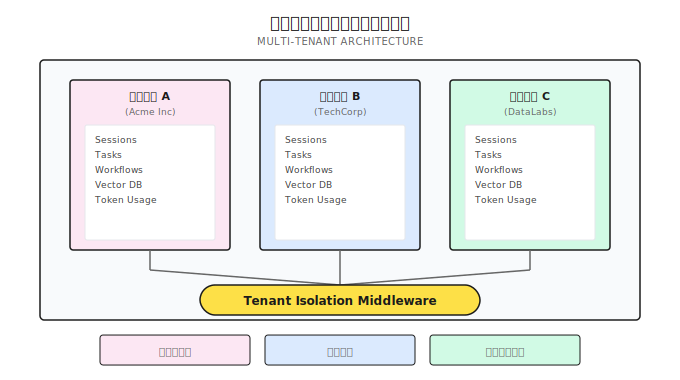
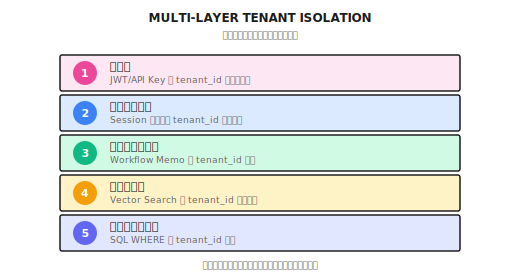

# 第 26 章：マルチテナント設計

> **マルチテナント分離は「WHERE 条件を 1 つ追加すれば終わり」という話じゃない。すべてのデータアクセス層でテナント検証が必要で、1 箇所の漏れが 1 回のデータ漏洩につながる。**

---

> **クイックパス（5 分で核心を把握）**
>
> 1. 3 つの分離モデル：行レベル（安い）、スキーマレベル（中間）、インスタンスレベル（最も高価で最も安全）
> 2. テナント ID は認証 Context から取得。ユーザー入力は絶対に信用しない
> 3. ベクトルデータベースは namespace で分離。テナント間でデータを物理的に分ける
> 4. すべてのデータアクセス層でテナント検証が必要。ミドルウェアは最初の防衛線に過ぎない
> 5. 分離テストには専用のクロステナントチェックを用意。CI に必ず含める
>
> **10 分パス**：26.1-26.3 → 26.5 → Shannon Lab

---

## まず実際の事故から

あなたのエージェント（Agent）システムが複数の企業顧客にサービスを提供し始めた。Acme Inc と TechCorp が使っていて、すべてがうまくいっているように見えた。

ある日、Acme の管理者がセッション一覧に奇妙なレコードを発見した。TechCorp の内部プロジェクトに関する議論だったんだ。

さらにまずいことに、好奇心でベクトル検索を試してみたら、TechCorp の技術文書が検索できてしまった。

事後分析で原因は単純だった。誰かがセッション一覧のクエリを書くとき、`WHERE tenant_id = ?` を忘れていたんだよ。

たった 1 行のコードの漏れで、クロステナントのデータ漏洩が発生した。

**これがマルチテナント設計の難しさだ。機能じゃなくて、すべてのデータアクセスを貫くシステム制約なんだよね。**

---

## 26.1 なぜマルチテナントが必要なのか？

### シングルテナントアーキテクチャの問題

まず「ナイーブな」アーキテクチャを見てみよう。すべてのユーザーが同じデータ空間を共有している：

```
┌──────────────────────────────────────┐
│           共有データベース             │
│  ┌──────┐ ┌──────┐ ┌──────┐         │
│  │ユーザーA│ │ユーザーB│ │ユーザーC│ ← 混在  │
│  │ データ │ │ データ │ │ データ │         │
│  └──────┘ └──────┘ └──────┘         │
└──────────────────────────────────────┘
```

何が問題か？

| 問題 | 影響 | なぜ深刻か |
|------|------|-----------|
| **データ漏洩リスク** | 1 つの API 脆弱性で全ユーザーのデータが露出する可能性 | コンプライアンス要件（GDPR、ISMS）が許さない |
| **個別課金不可** | 組織ごとのリソース使用量を集計しにくい | SaaS ビジネスモデルが成り立たない |
| **カスタム設定不可** | 全ユーザーが同じクォータ制限を共有 | 大口顧客と無料ユーザーがリソースを奪い合う |
| **コンプライアンス困難** | 組織単位でのデータ分離削除ができない | 「忘れられる権利」が実現できない |

### マルチテナントアーキテクチャの目標



3 つのコア保証：

1. **データ分離**：テナント A はテナント B のデータを一切見れない
2. **障害分離**：テナント A の異常がテナント B に影響しない（少なくともアプリ層では）
3. **クォータ分離**：各テナントに独立したリソース制限と課金

---

## 26.2 マルチテナント実装戦略

具体的な実装の話に入る前に、3 つの一般的なマルチテナント戦略を理解しておこう：

| 戦略 | 説明 | 分離度 | コスト | 適用シーン |
|------|------|--------|--------|----------|
| **テナントごとに独立 DB** | テナントごとに物理データベース | 最強 | 最高 | 金融、医療など強いコンプライアンス要件 |
| **共有 DB、独立スキーマ** | 同じ DB でテナントごとにスキーマ分離 | 中間 | 中間 | 大企業顧客向け |
| **共有 DB、共有スキーマ** | 全テナントがテーブルを共有、tenant_id 列で分離 | 最弱 | 最安 | SaaS、中小顧客向け |

**大半の SaaS は 3 番目を選ぶ**。コストが最も低く、スケーラビリティも最も柔軟だからね。ただし代償として、すべてのデータアクセス層で tenant_id フィルタリングを強制しなければならない。

1 箇所の漏れが 1 回の漏洩になる。

---

## 26.3 データモデル設計

### コアテーブル構造

典型的なマルチテナントのデータモデルを示す。ポイントは**すべてのビジネステーブルに tenant_id フィールドがある**こと。

```sql
-- テナントテーブル（組織）
CREATE TABLE auth.tenants (
    id UUID PRIMARY KEY,
    name VARCHAR(255),
    slug VARCHAR(100) UNIQUE,           -- ユーザーに見える識別子
    plan VARCHAR(50),                   -- free, pro, enterprise
    token_limit INTEGER,                -- 月間トークンクォータ
    monthly_token_usage INTEGER DEFAULT 0,
    is_active BOOLEAN DEFAULT TRUE,
    created_at TIMESTAMP DEFAULT NOW()
);

-- ユーザーテーブル（テナントに紐付け）
CREATE TABLE auth.users (
    id UUID PRIMARY KEY,
    email VARCHAR(255) UNIQUE,
    username VARCHAR(100) UNIQUE,
    password_hash VARCHAR(255),
    tenant_id UUID REFERENCES auth.tenants(id),  -- テナント紐付け
    role VARCHAR(50),                   -- owner, admin, user
    is_active BOOLEAN DEFAULT TRUE,
    created_at TIMESTAMP DEFAULT NOW()
);

-- セッションテーブル（テナント分離あり）
CREATE TABLE sessions (
    id VARCHAR(255) PRIMARY KEY,
    user_id VARCHAR(255),
    tenant_id UUID,                     -- テナント分離
    created_at TIMESTAMP,
    deleted_at TIMESTAMP,               -- 論理削除
    metadata JSONB
);

-- タスク実行テーブル（テナント分離あり）
CREATE TABLE task_executions (
    id UUID PRIMARY KEY,
    workflow_id VARCHAR(255) UNIQUE NOT NULL,
    user_id UUID,
    tenant_id UUID,                     -- テナント分離
    status VARCHAR(50),
    created_at TIMESTAMP
);
```

### 設計原則

1. **tenant_id は必須フィールド**：ビジネステーブルの tenant_id は NULL 不可
2. **論理削除が物理削除より優先**：DELETE じゃなく `deleted_at` を使う。監査とリカバリに便利
3. **slug はユーザー向けの場面で使用**：UUID は内部用、slug はユーザーに見せる用

---

## 26.4 5 層のテナント分離

これがマルチテナント設計の核心だ。データベース層に tenant_id を追加するだけじゃ足りない。すべての層でテナント所属を検証する必要がある。



各層を説明しよう。

### 第 1 層：認証層の分離

ユーザーがログインすると、tenant_id が JWT Token に埋め込まれる：

**実装参考 (Shannon)**: `go/orchestrator/internal/auth/jwt.go` - CustomClaims 構造体

```go
// JWT クレームに tenant_id を含める
type CustomClaims struct {
    jwt.RegisteredClaims
    TenantID string   `json:"tenant_id"`  // テナント分離の鍵
    Username string   `json:"username"`
    Email    string   `json:"email"`
    Role     string   `json:"role"`
    Scopes   []string `json:"scopes"`
}

func (j *JWTManager) ValidateAccessToken(tokenString string) (*UserContext, error) {
    token, err := jwt.ParseWithClaims(tokenString, &CustomClaims{}, func(token *jwt.Token) (interface{}, error) {
        if _, ok := token.Method.(*jwt.SigningMethodHMAC); !ok {
            return nil, fmt.Errorf("unexpected signing method: %v", token.Header["alg"])
        }
        return j.signingKey, nil
    })
    // ... 検証後に UserContext を返す
    return &UserContext{
        UserID:   userID,
        TenantID: tenantID,  // トークンからテナントを解析
        // ...
    }, nil
}
```

**設計ポイント**：tenant_id は認証時にコンテキストに紐付けられ、以降のすべての層はここから読み取る。ユーザー入力には依存しない。

### 第 2 層：セッション層の分離

Session クエリは必ず tenant_id でフィルタリングし、クロステナントアクセスはサイレントに失敗させる：

**実装参考 (Shannon)**: `go/orchestrator/internal/session/manager.go` - GetSession メソッド

```go
func (m *Manager) GetSession(ctx context.Context, sessionID string) (*Session, error) {
    // ... Redis から session をロード ...

    // 重要：テナント分離を強制
    if userCtx, err := authFromContext(ctx); err == nil && userCtx.TenantID != "" {
        if session.TenantID != "" && session.TenantID != userCtx.TenantID {
            // サイレント失敗で存在を漏らさない
            return nil, ErrSessionNotFound
        }
    }

    return &session, nil
}
```

**なぜ AccessDenied ではなく NotFound を返すのか？**

「Access Denied」を返すと、攻撃者はそのセッションが存在するが自分のものではないことがわかってしまう。「Not Found」を返せば何の情報も漏れない。これを「サイレント失敗」と呼ぶ。

### 第 3 層：ワークフロー層の分離

Temporal ワークフローは Memo を通じてテナント情報を伝達する：

```go
func (h *TaskHandler) SubmitTask(ctx context.Context, req *SubmitTaskRequest) (*SubmitTaskResponse, error) {
    userCtx, err := auth.GetUserContext(ctx)
    if err != nil {
        return nil, err
    }

    workflowOptions := client.StartWorkflowOptions{
        ID:        workflowID,
        TaskQueue: "shannon-tasks",
        Memo: map[string]interface{}{
            "tenant_id": userCtx.TenantID.String(),  // Memo に保存
            "user_id":   userCtx.UserID.String(),
        },
    }

    _, err = h.temporalClient.ExecuteWorkflow(ctx, workflowOptions, ...)
    // ...
}

func (h *TaskHandler) GetTaskStatus(ctx context.Context, taskID string) (*TaskStatus, error) {
    userCtx, err := auth.GetUserContext(ctx)
    if err != nil {
        return nil, err
    }

    wf := h.temporalClient.GetWorkflow(ctx, taskID, "")
    desc, _ := wf.Describe(ctx)

    // Memo からテナントをチェック
    var memoTenantID string
    if desc.WorkflowExecutionInfo.Memo != nil {
        if tid, ok := desc.WorkflowExecutionInfo.Memo.Fields["tenant_id"]; ok {
            memoTenantID = tid.GetStringValue()
        }
    }

    // テナント所有権を検証
    if memoTenantID != userCtx.TenantID.String() {
        return nil, ErrTaskNotFound  // サイレント失敗
    }
    // ...
}
```

**なぜ Memo を使うのか？**

Temporal Workflow は独自のストレージを持っていて、あなたのデータベースにはない。Memo は Workflow のメタデータフィールドで、こういったビジネスコンテキストを保存するために設計されている。

### 第 4 層：ベクトルストレージ層の分離

ベクトル検索には必ずテナントフィルタを追加する。そうしないとユーザーが他人のプライベートドキュメントを検索できてしまう：

**実装参考 (Shannon)**: `go/orchestrator/internal/vectordb/search.go` - FindSimilarQueries メソッド

```go
func (c *Client) FindSimilarQueries(ctx context.Context, embedding []float32, limit int) ([]SimilarQuery, error) {
    // コンテキストから tenant_id を抽出
    var filter map[string]interface{}
    if userCtx, ok := ctx.Value(auth.UserContextKey).(*auth.UserContext); ok &&
       userCtx.TenantID.String() != "00000000-0000-0000-0000-000000000000" {
        filter = map[string]interface{}{
            "must": []map[string]interface{}{
                {"key": "tenant_id", "match": map[string]interface{}{"value": userCtx.TenantID.String()}},
            },
        }
    }

    // 検索時にフィルタを強制
    pts, err := c.search(ctx, c.cfg.TaskEmbeddings, embedding, limit, c.cfg.Threshold, filter)
    // ...
}
```

**ここが最も見落としやすい層だ。** ベクトル検索は通常「類似度マッチング」なので、開発者は「権限フィルタリング」も必要だということを忘れがちなんだよね。

### 第 5 層：データベース層の分離

すべての SQL クエリに tenant_id 条件を付ける：

```go
func (r *TaskRepository) GetTask(ctx context.Context, taskID uuid.UUID) (*Task, error) {
    userCtx, err := auth.GetUserContext(ctx)
    if err != nil {
        return nil, err
    }

    var task Task
    err = r.db.QueryRowContext(ctx, `
        SELECT id, workflow_id, user_id, tenant_id, status, created_at
        FROM task_executions
        WHERE id = $1 AND tenant_id = $2  -- tenant フィルタを強制
    `, taskID, userCtx.TenantID).Scan(...)

    if err == sql.ErrNoRows {
        return nil, ErrTaskNotFound
    }
    return &task, err
}
```

---

## 26.5 認証ミドルウェア設計

マルチテナント分離の最初の防衛線は認証ミドルウェアだ。リクエストからユーザー ID を抽出し、tenant_id をコンテキストに注入する役割を担う。

### HTTP ミドルウェア

**実装参考 (Shannon)**: `go/orchestrator/internal/auth/middleware.go` - HTTPMiddleware メソッド

```go
func (m *Middleware) HTTPMiddleware(next http.Handler) http.Handler {
    return http.HandlerFunc(func(w http.ResponseWriter, r *http.Request) {
        // 開発モードでは認証をスキップ
        if m.skipAuth {
            ctx := context.WithValue(r.Context(), UserContextKey, &UserContext{
                UserID:   uuid.MustParse("00000000-0000-0000-0000-000000000002"),
                TenantID: uuid.MustParse("00000000-0000-0000-0000-000000000001"),
                Username: "dev",
                Role:     RoleOwner,
            })
            next.ServeHTTP(w, r.WithContext(ctx))
            return
        }

        // API Key を試す
        apiKey := r.Header.Get("X-API-Key")
        if apiKey != "" {
            userCtx, err := m.authService.ValidateAPIKey(r.Context(), apiKey)
            if err != nil {
                http.Error(w, "Invalid API key", http.StatusUnauthorized)
                return
            }
            ctx := context.WithValue(r.Context(), UserContextKey, userCtx)
            next.ServeHTTP(w, r.WithContext(ctx))
            return
        }

        // Bearer Token を試す
        authHeader := r.Header.Get("Authorization")
        if authHeader == "" {
            http.Error(w, `{"error":"API key is required"}`, http.StatusUnauthorized)
            return
        }

        token, err := ExtractBearerToken(authHeader)
        if err != nil {
            http.Error(w, "Invalid authorization header", http.StatusUnauthorized)
            return
        }

        userCtx, err := m.jwtManager.ValidateAccessToken(token)
        if err != nil {
            http.Error(w, "Invalid token", http.StatusUnauthorized)
            return
        }

        // ユーザーコンテキストを注入（TenantID を含む）
        ctx := context.WithValue(r.Context(), UserContextKey, userCtx)
        next.ServeHTTP(w, r.WithContext(ctx))
    })
}
```

### gRPC インターセプター

gRPC サービスにも同様の認証インターセプターが必要だ：

**実装参考 (Shannon)**: `go/orchestrator/internal/auth/middleware.go` - UnaryServerInterceptor メソッド

```go
func (m *Middleware) UnaryServerInterceptor() grpc.UnaryServerInterceptor {
    return func(ctx context.Context, req interface{}, info *grpc.UnaryServerInfo, handler grpc.UnaryHandler) (interface{}, error) {
        // ヘルスチェックは認証スキップ
        if strings.HasSuffix(info.FullMethod, "/Health") {
            return handler(ctx, req)
        }

        // 開発モードでは metadata 経由でユーザー情報を渡せる
        if m.skipAuth {
            userID := uuid.MustParse("00000000-0000-0000-0000-000000000002")
            tenantID := uuid.MustParse("00000000-0000-0000-0000-000000000001")

            if md, ok := metadata.FromIncomingContext(ctx); ok {
                if vals := md.Get("x-user-id"); len(vals) > 0 {
                    if parsed, err := uuid.Parse(vals[0]); err == nil {
                        userID = parsed
                    }
                }
                if vals := md.Get("x-tenant-id"); len(vals) > 0 {
                    if parsed, err := uuid.Parse(vals[0]); err == nil {
                        tenantID = parsed
                    }
                }
            }

            ctx = context.WithValue(ctx, UserContextKey, &UserContext{
                UserID:   userID,
                TenantID: tenantID,
                Username: "dev",
                Role:     RoleOwner,
            })
            return handler(ctx, req)
        }

        // 本番環境：API Key または JWT を検証
        md, ok := metadata.FromIncomingContext(ctx)
        if !ok {
            return nil, status.Error(codes.Unauthenticated, "missing metadata")
        }

        var userCtx *UserContext
        if apiKeys := md.Get("x-api-key"); len(apiKeys) > 0 {
            var err error
            userCtx, err = m.authService.ValidateAPIKey(ctx, apiKeys[0])
            if err != nil {
                return nil, status.Error(codes.Unauthenticated, "invalid API key")
            }
        }

        if userCtx == nil {
            return nil, status.Error(codes.Unauthenticated, "missing authentication")
        }

        ctx = context.WithValue(ctx, UserContextKey, userCtx)
        return handler(ctx, req)
    }
}
```

---

## 26.6 テナントクォータ管理

テナントによってリソースクォータが異なる。これが SaaS 価格設定の基盤だ。

### クォータ構造

**実装参考 (Shannon)**: `go/orchestrator/internal/auth/types.go` - Tenant 構造体

```go
type Tenant struct {
    ID                uuid.UUID  `json:"id" db:"id"`
    Name              string     `json:"name" db:"name"`
    Slug              string     `json:"slug" db:"slug"`
    Plan              string     `json:"plan" db:"plan"` // free, pro, enterprise
    TokenLimit        int        `json:"token_limit" db:"token_limit"`
    MonthlyTokenUsage int        `json:"monthly_token_usage" db:"monthly_token_usage"`
    DailyTokenLimit   *int       `json:"daily_token_limit,omitempty" db:"daily_token_limit"`
    DailyTokenUsage   int        `json:"daily_token_usage" db:"daily_token_usage"`
    RateLimitPerHour  int        `json:"rate_limit_per_hour" db:"rate_limit_per_hour"`
    IsActive          bool       `json:"is_active" db:"is_active"`
    // ...
}
```

### プランごとの差別化クォータ

```go
type TenantQuotas struct {
    MonthlyTokenLimit   int `json:"monthly_token_limit"`
    RateLimitPerMinute  int `json:"rate_limit_per_minute"`
    RateLimitPerHour    int `json:"rate_limit_per_hour"`
    MaxSessions         int `json:"max_sessions"`
    MaxVectorDocs       int `json:"max_vector_docs"`
}

var PlanQuotas = map[string]TenantQuotas{
    "free": {
        MonthlyTokenLimit:  100000,    // 10 万トークン/月
        RateLimitPerMinute: 20,
        RateLimitPerHour:   500,
        MaxSessions:        10,
        MaxVectorDocs:      1000,
    },
    "pro": {
        MonthlyTokenLimit:  1000000,   // 100 万トークン/月
        RateLimitPerMinute: 60,
        RateLimitPerHour:   2000,
        MaxSessions:        100,
        MaxVectorDocs:      50000,
    },
    "enterprise": {
        MonthlyTokenLimit:  -1,        // 無制限（従量課金）
        RateLimitPerMinute: 300,
        RateLimitPerHour:   10000,
        MaxSessions:        -1,
        MaxVectorDocs:      -1,
    },
}
```

### クォータチェック

```go
func (s *QuotaService) CheckQuota(ctx context.Context, quotaType string, amount int) error {
    userCtx, err := auth.GetUserContext(ctx)
    if err != nil {
        return err
    }

    tenant, err := s.tenantRepo.GetTenant(ctx, userCtx.TenantID)
    if err != nil {
        return err
    }

    quotas := PlanQuotas[tenant.Plan]

    switch quotaType {
    case "tokens":
        if quotas.MonthlyTokenLimit > 0 {  // -1 は無制限を意味
            usage, _ := s.usageRepo.GetMonthlyTokens(ctx, tenant.ID)
            if usage+amount > quotas.MonthlyTokenLimit {
                return ErrQuotaExceeded
            }
        }
    case "sessions":
        if quotas.MaxSessions > 0 {
            count, _ := s.sessionRepo.CountSessions(ctx, tenant.ID)
            if count >= quotas.MaxSessions {
                return ErrQuotaExceeded
            }
        }
    }

    return nil
}
```

---

## 26.7 API Key 管理

API Key はマルチテナントシステムの重要な認証方式だ。特定のユーザーとテナントに紐付けられる。

### セキュアな保存

API Key は元の値ではなくハッシュのみを保存する：

**実装参考 (Shannon)**: `go/orchestrator/internal/auth/types.go` - APIKey 構造体

```go
type APIKey struct {
    ID               uuid.UUID      `json:"id" db:"id"`
    KeyHash          string         `json:"-" db:"key_hash"`      // ハッシュのみ保存
    KeyPrefix        string         `json:"key_prefix" db:"key_prefix"` // sk_live_
    UserID           uuid.UUID      `json:"user_id" db:"user_id"`
    TenantID         uuid.UUID      `json:"tenant_id" db:"tenant_id"`
    Name             string         `json:"name" db:"name"`
    Scopes           pq.StringArray `json:"scopes" db:"scopes"`
    RateLimitPerHour int            `json:"rate_limit_per_hour" db:"rate_limit_per_hour"`
    LastUsed         *time.Time     `json:"last_used,omitempty" db:"last_used"`
    ExpiresAt        *time.Time     `json:"expires_at,omitempty" db:"expires_at"`
    IsActive         bool           `json:"is_active" db:"is_active"`
    // ...
}
```

### API Key の検証

```go
func (s *AuthService) ValidateAPIKey(ctx context.Context, key string) (*UserContext, error) {
    // フォーマット標準化：sk-shannon-xxx → sk_xxx
    if strings.HasPrefix(key, "sk-shannon-") {
        key = "sk_" + strings.TrimPrefix(key, "sk-shannon-")
    }

    // ハッシュで検索
    keyHash := sha256.Sum256([]byte(key))
    hashStr := hex.EncodeToString(keyHash[:])

    apiKey, err := s.apiKeyRepo.GetByHash(ctx, hashStr)
    if err != nil {
        return nil, ErrInvalidAPIKey
    }

    if !apiKey.IsActive {
        return nil, ErrAPIKeyRevoked
    }

    // 有効期限チェック
    if apiKey.ExpiresAt != nil && apiKey.ExpiresAt.Before(time.Now()) {
        return nil, ErrAPIKeyExpired
    }

    // 最終使用時刻を更新（非同期、リクエストをブロックしない）
    go func() {
        apiKey.LastUsed = &time.Time{}
        *apiKey.LastUsed = time.Now()
        s.apiKeyRepo.Update(context.Background(), apiKey)
    }()

    // ユーザー情報を取得して UserContext を構築
    user, err := s.userRepo.GetByID(ctx, apiKey.UserID)
    if err != nil {
        return nil, err
    }

    return &UserContext{
        UserID:   user.ID,
        TenantID: user.TenantID,  // テナントはユーザーから取得、Key からではない
        Username: user.Username,
        Email:    user.Email,
        Role:     user.Role,
        Scopes:   apiKey.Scopes,
        IsAPIKey: true,
        APIKeyID: apiKey.ID,
    }, nil
}
```

---

## 26.8 よくある落とし穴

マルチテナント実装でこれらのポイントで失敗するケースを何度も見てきた：

### 落とし穴 1：tenant_id フィルタの漏れ

これが最もよくある問題だ。コードレビューでは tenant_id のないクエリに特に注意する必要がある：

```go
// 間違い：tenant_id フィルタを忘れている
rows, _ := db.Query("SELECT * FROM sessions WHERE user_id = $1", userID)

// 正解：常に tenant_id でフィルタ
rows, _ := db.Query(`
    SELECT * FROM sessions
    WHERE user_id = $1 AND tenant_id = $2
`, userID, tenantID)
```

**防護策**：SQL 実行層に検知機能を追加して、tenant_id 条件のないクエリに警告を出すことを検討しよう。

### 落とし穴 2：ベクトルストレージの分離漏れ

ベクトル検索は最も見落としやすい。SQL のような WHERE 構文がないからね：

```go
// 間違い：クエリ時にテナントフィルタなし
searchResult, _ := v.client.Search(ctx, &qdrant.SearchPoints{
    CollectionName: "memory",
    Vector:         embedding,
    Limit:          10,
    // Filter がない！
})

// 正解：テナントフィルタを追加
filter := &qdrant.Filter{
    Must: []*qdrant.Condition{{
        ConditionOneOf: &qdrant.Condition_Field{
            Field: &qdrant.FieldCondition{
                Key: "tenant_id",
                Match: &qdrant.Match{
                    MatchValue: &qdrant.Match_Keyword{Keyword: tenantID},
                },
            },
        },
    }},
}

searchResult, _ := v.client.Search(ctx, &qdrant.SearchPoints{
    CollectionName: "memory",
    Vector:         embedding,
    Limit:          10,
    Filter:         filter,  // テナントフィルタを強制
})
```

### 落とし穴 3：Temporal Memo の漏れ

Workflow データはあなたのデータベースにはないので、tenant_id は Memo 経由で渡す必要がある：

```go
// 間違い：Memo にテナントを保存していない
workflowOptions := client.StartWorkflowOptions{
    ID: workflowID,
    // Memo が空！
}

// 正解：テナント ID を保存
workflowOptions := client.StartWorkflowOptions{
    ID: workflowID,
    Memo: map[string]interface{}{
        "tenant_id": tenantID,
        "user_id":   userID,
    },
}
```

### 落とし穴 4：開発モードが本番に漏れる

開発時は便宜上、認証をスキップすることがよくある。でもこの設定は絶対に本番に持ち込んではいけない：

```yaml
# 間違い：本番環境で skip_auth が有効
auth:
  skip_auth: true  # 危険！

# 正解：本番環境では必ず無効
auth:
  enabled: true
  skip_auth: false
```

**防護策**：本番環境の起動時に skip_auth をチェックして、true ならエラーで終了するようにしよう。

### 落とし穴 5：NotFound ではなく AccessDenied を返す

クロステナントアクセスは「権限なし」ではなく「存在しない」を返すべきだ：

```go
// 間違い：存在を漏らしてしまう
if task.TenantID != userCtx.TenantID {
    return nil, ErrAccessDenied  // 攻撃者はリソースの存在を知る
}

// 正解：サイレント失敗
if task.TenantID != userCtx.TenantID {
    return nil, ErrTaskNotFound  // 存在を漏らさない
}
```

---

## 26.9 セキュリティベストプラクティス

| プラクティス | 説明 | なぜ重要か |
|-------------|------|-----------|
| **JWT Secret の長さ** | 最低 32 文字 | ブルートフォース攻撃を防ぐ |
| **Token 有効期限** | Access 30 分、Refresh 7 日 | セキュリティと UX のバランス |
| **API Key の保存** | ハッシュのみ保存、元の値は保存しない | DB 漏洩でも Key は露出しない |
| **パスワードハッシュ** | bcrypt を使用 | レインボーテーブル攻撃を防ぐ |
| **HTTPS 強制** | 本番環境では必須 | 中間者攻撃を防ぐ |
| **クロステナントアクセス** | サイレントに NotFound を返す | データの存在を漏らさない |
| **監査ログ** | すべてのアクセス試行を記録 | コンプライアンスとインシデント調査 |

### 監査ログの例

```go
func (a *AuditLogger) LogAccess(ctx context.Context, event AuditEvent) {
    userCtx, _ := auth.GetUserContext(ctx)

    a.logger.Info("access_audit",
        zap.String("user_id", userCtx.UserID.String()),
        zap.String("tenant_id", userCtx.TenantID.String()),
        zap.String("action", event.Action),
        zap.String("resource", event.Resource),
        zap.String("resource_id", event.ResourceID),
        zap.Bool("allowed", event.Allowed),
        zap.String("ip_address", event.IPAddress),
        zap.Time("timestamp", time.Now()),
    )
}
```

---

## 26.10 フレームワーク比較

| 機能 | Shannon | LangGraph | Dify | Flowise |
|------|---------|-----------|------|---------|
| **JWT 認証** | ネイティブ対応 | ネイティブ対応 | ネイティブ対応 | ネイティブ対応 |
| **API Keys** | ネイティブ対応 | ネイティブ対応 | ネイティブ対応 | ネイティブ対応 |
| **マルチテナント分離** | 5 層完全分離 | 部分対応 | 完全対応 | UI 層のみ |
| **セッション分離** | Redis + tenant_id | 対応 | 対応 | 非対応 |
| **ベクトル分離** | Qdrant Filter | 非対応 | 部分対応 | 非対応 |
| **ワークフロー分離** | Temporal Memo | 対応 | 対応 | 該当なし |
| **監査ログ** | 完全対応 | 部分対応 | 完全対応 | 非対応 |

---

## この章のまとめ

核心は一言で言えばこうだ：**マルチテナント分離は 5 層で行う必要がある。認証、セッション、ワークフロー、ベクトルストレージ、データベース。すべての層で tenant_id を検証しなければならず、1 箇所の漏れがデータ漏洩につながる可能性がある。**

---

## 振り返り

1. **5 層分離**：認証/セッション/ワークフロー/ベクトル/データベース、各層で tenant_id を検証
2. **サイレント失敗**：クロステナントアクセスは AccessDenied ではなく NotFound を返す
3. **JWT 紐付け**：tenant_id は認証時にコンテキストに注入、以降の層はすべてここから読み取る
4. **ベクトルフィルタ**：ベクトル検索には必ずテナントフィルタを付ける。最も見落としやすい層
5. **クォータ管理**：プランごとに差別化クォータを設定して SaaS 価格モデルを実現

---

## Shannon Lab（10 分で始める）

このセクションでは、本章のコンセプトを Shannon のソースコードに対応させる。

### 必読（1 ファイル）

- `go/orchestrator/internal/auth/middleware.go`：HTTPMiddleware と UnaryServerInterceptor 関数を見て、tenant_id が Token から抽出されて Context に注入される仕組みを理解する

### 選読（興味に応じて 2 つ選択）

- `go/orchestrator/internal/session/manager.go`：GetSession メソッドのテナントチェックロジックを探して、なぜ ErrAccessDenied ではなく ErrSessionNotFound を返すのかを理解する
- `go/orchestrator/internal/vectordb/search.go`：FindSimilarQueries メソッドの filter 構築を探して、ベクトル検索がどのようにテナント分離を実装しているかを理解する

---

## 演習

### 演習 1：コード監査

以下のコードをレビューして、マルチテナント分離の問題を見つけよう：

```go
func (r *DocumentRepo) GetDocument(ctx context.Context, docID string) (*Document, error) {
    var doc Document
    err := r.db.QueryRowContext(ctx, `
        SELECT id, title, content, user_id
        FROM documents
        WHERE id = $1
    `, docID).Scan(&doc.ID, &doc.Title, &doc.Content, &doc.UserID)
    return &doc, err
}
```

### 演習 2：ベクトル分離の設計

ベクトル検索の分離方式を設計しよう：
- 各テナントのベクトルはどこに保存する？
- クエリ時にどうフィルタリングする？
- 「クロステナント共有ナレッジベース」をサポートするにはどう設計する？

### 演習 3（上級）：PostgreSQL RLS

PostgreSQL の Row-Level Security (RLS) 機能について調べよう：
- データベース層でテナント分離を強制できるか？
- アプリケーション層フィルタリングと比較して、メリットとデメリットは？
- Shannon はなぜ RLS ではなくアプリケーション層フィルタリングを選んだのか？

---

## 参考資料

- **PostgreSQL RLS**：[Row Security Policies](https://www.postgresql.org/docs/current/ddl-rowsecurity.html) - データベース層でのテナント分離
- **Multi-tenant SaaS Architecture**：AWS Well-Architected Framework のマルチテナントガイド
- **Shannon 認証ドキュメント**：[Authentication and Multitenancy](https://github.com/Kocoro-lab/Shannon/blob/main/docs/authentication-and-multitenancy.md)

---

## Part 8 完結

Part 8 エンタープライズ機能はここで完結だ。扱ってきた内容：

- トークン予算管理（第 23 章）
- OPA ポリシーガバナンス（第 24 章）
- WASI セキュリティサンドボックス（第 25 章）
- マルチテナント設計（第 26 章）

この 4 章は「エージェントを企業環境で安全に運用するにはどうするか」という問題に答えるものだ。

次の Part 9 では**フロンティア実践**に入る。Computer Use、Agentic Coding、Hooks システム、Plugin アーキテクチャ。2025-2026 年のエージェント分野で最もホットな領域だ。
