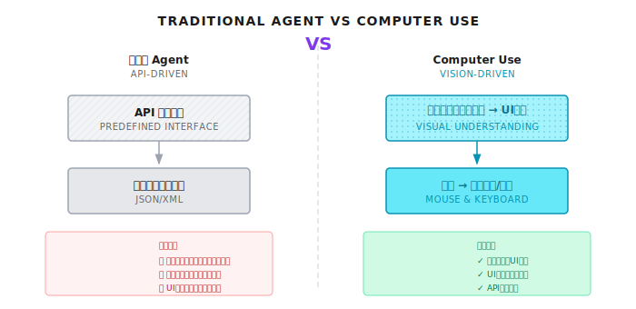
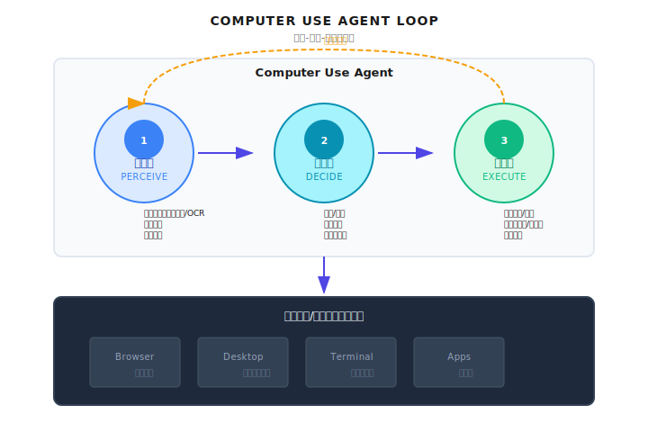
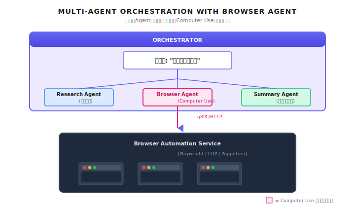

# 第 27 章：Computer Use

> **Computer Use は、エージェントに「目」と「手」を与える。人間と同じように画面を見て、マウスをクリックし、キーボードを叩く。API の壁を突破する究極の武器だけど、最も暴走しやすい能力でもある。本番環境では必ずサンドボックスと人間の承認ポイントを入れること。**

---

エージェントにユーザーの経費精算フォームを入力させたいとする。

問題は、このフォームが10年前のレガシーOAシステムにあること。APIなんてない。ウェブ画面だけ。開発チームはとっくに退職していて、バックエンドのコードに触れる人間は誰もいない。

従来のエージェントなら、こう言うしかなかった。「申し訳ありませんが、このシステムは操作できません。」

でも、Computer Use がルールを変えた。エージェントが人間のようにブラウザを開き、画面を見て、入力欄を見つけ、データを入力し、送信ボタンをクリックできるようになったんだ。

初めてこの機能を見たとき、正直ちょっと衝撃だったね。エージェントが本当に画面を「見て」いる。ログインボタンがどこにあるか、入力欄がどこにあるか、ドロップダウンメニューをどう操作するか、ちゃんと認識している。これはもうAPIを叩いているんじゃない。「パソコンを使っている」んだ。

もちろん、これは私が見てきた中で最も危険なエージェント能力でもある。考えてみてほしい。何でもクリックできるエージェントが、判断を間違えて「すべてのデータを削除」ボタンを押したらどうなる？だからこの章では、実装方法だけじゃなく、どう制御するかもしっかり話していく。

---

## 27.1 Computer Use とは何か

### API 呼び出しから画面操作へ

従来のエージェントは、あらかじめ定義されたAPIを通じて外部システムとやり取りしていた。検索インターフェースを呼び出し、データベースを読み取り、メッセージを送信する。すべての操作に明確な入出力形式があって、結果は予測可能だった。

でも現実世界では、APIを公開していないアプリケーションがめちゃくちゃ多い：

| シナリオ | 例 | なぜAPIがないのか |
|---------|-----|-----------------|
| レガシー企業システム | 10年前のOA/ERP | 開発チームが退職済み、触れる人がいない |
| デスクトップソフト | Excel、Photoshop | そもそもプログラムから呼び出される設計じゃない |
| サードパーティサイト | 競合他社のサイト、政府のサイト | 自動化されたくない |
| 社内ツール | 自社開発の小さなツール | API開発の予算がない |

Computer Use の本質は、**画面操作を「人間専用」から「エージェントもできる」に変える**ことだ。



### コア能力の分解

Computer Use は単一の能力じゃない。4つの能力の組み合わせだ：

| 能力 | 説明 | 技術的実装 | 典型的な失敗シナリオ |
|-----|------|-----------|-------------------|
| **視覚理解** | スクリーンショットを解析し、UI要素を識別 | マルチモーダルLLM | 要素が小さすぎる、コントラストが低い |
| **座標特定** | クリック/入力の正確な位置を決定 | バウンディングボックス検出 | 解像度/スケーリングの不一致 |
| **マウス・キーボード操作** | ユーザーの入力動作をシミュレート | ブラウザ自動化 | ページ読み込みが遅い、要素位置の変化 |
| **状態検証** | 操作結果が正しいか確認 | スクリーンショット比較 | 非同期読み込み、アニメーション効果 |

要するに、Computer Use はエージェントに「目と手の協調」能力を与えるってこと。何を見て、何をするか決めて、結果を確認する。

### 従来の自動化との違い

「それって Selenium や Playwright と同じじゃない？」と思うかもしれない。

まあ、完全に同じじゃない。従来の自動化は「スクリプト駆動」だ。`id=submit-button` をクリックするってハードコードする。ボタンのIDが変わったら、スクリプトは動かなくなる。

Computer Use は「視覚駆動」だ。エージェントは画面上に青い「送信」ボタンがあるのを見て、それをクリックする。ボタンの位置が変わっても、スタイルが変わっても、「送信」ボタンに見える限り、見つけられる。

| 特性 | 従来の自動化 (Selenium) | Computer Use |
|-----|----------------------|--------------|
| 位置特定方法 | CSS/XPath セレクタ | 視覚認識 |
| スクリプト依存 | 事前に書く必要あり | エージェントが自律的に判断 |
| 画面変更時 | スクリプトが壊れる | 自動的に適応 |
| 適用範囲 | DOMのみ操作可能 | 見える画面なら何でも |
| コスト | 低（ローカル計算） | 高（フレームごとに視覚モデル呼び出し） |

もちろん、この柔軟性にはコストがかかる。「画面を見る」たびにマルチモーダルモデルを呼び出すから、Selenium より2桁高い。

---

## 27.2 アーキテクチャ設計

### 知覚-判断-実行ループ

Computer Use の核心は継続的なループだ。ReAct パターンとよく似ているけど、「観察」が「画面を見る」に変わっただけ：



### 3層分離

本番システムでは、Computer Use を3層に分けることをお勧めする：

**エージェント層**：タスクを理解し、判断を下す。これが「脳」だ。

```
ユーザー: 「OAシステムで経費精算申請を出して」
エージェント:
1. OAシステムを開く
2. ログイン（ユーザー確認が必要かも）
3. 「経費精算申請」に移動
4. フォームを入力
5. 送信して結果を確認
```

**ツール層**：基本的なブラウザ操作能力を提供する。これが「手足」だ。

```python
# ツール定義
tools = [
    screenshot(),    # 現在の画面をキャプチャ
    click(x, y),     # 指定座標をクリック
    type(text),      # テキストを入力
    scroll(dir),     # ページをスクロール
    wait(seconds),   # 待機
]
```

**サンドボックス層**：実行環境を隔離し、権限越えを防ぐ。これが「ガードレール」だ。

```
実行環境:
- 独立したブラウザインスタンス
- ネットワーク隔離（ホワイトリストドメインのみアクセス可）
- ファイルシステム隔離
- タイムアウトとリソース制限
```

### マルチエージェントシステムでの位置づけ

Computer Use は通常、専用の「ブラウザエージェント」として存在し、Orchestrator によって調整される：



---

## 27.3 マルチモーダルモデル統合

### モデルに求められる能力

Computer Use にはマルチモーダルモデルが必要だ。画像を理解しつつ、構造化された命令を出力できないといけない。すべてのモデルができるわけじゃない。

Shannon のモデル設定では、どのモデルが視覚をサポートしているかをマークしている：

```yaml
# config/models.yaml より抜粋
model_capabilities:
  multimodal_models:
    - gpt-5.1
    - gpt-5-pro-2025-08-07
    - claude-sonnet-4-5-20250929
    - gemini-2.5-flash
    - gemini-2.0-flash
```

> **鮮度注意** (2026-01): マルチモーダルモデルの能力は急速に変化している。上記のリストは2025年末時点のもので、最新のサポート情報は各ベンダーの公式ドキュメントを確認してほしい。

### 視覚理解ツールの設計

ツール定義には、スクリーンショット、クリック、入力などの基本操作を含める必要がある。以下は概念的な例：

```python
# 概念例：Computer Use ツール定義

class ScreenshotTool(Tool):
    """現在の画面またはブラウザウィンドウをキャプチャ"""

    def _get_metadata(self) -> ToolMetadata:
        return ToolMetadata(
            name="screenshot",
            description="Capture current screen or browser window",
            category="computer_use",
            requires_auth=True,
            rate_limit=30,  # 1分あたり最大30回のスクショ
            timeout_seconds=5,
            dangerous=False,
            cost_per_use=0.01,  # 視覚モデル呼び出しコスト
        )


class ClickTool(Tool):
    """指定座標でマウスクリックを実行"""

    def _get_metadata(self) -> ToolMetadata:
        return ToolMetadata(
            name="click",
            description="Click at specified coordinates",
            category="computer_use",
            requires_auth=True,
            rate_limit=60,
            timeout_seconds=2,
            dangerous=True,  # 不可逆な操作を引き起こす可能性
            cost_per_use=0.0,
        )
```

`dangerous=True` のマークに注目してほしい。クリック操作は不可逆な副作用を引き起こす可能性があるから、追加のセキュリティチェックが必要だ。

### 視覚理解のプロンプト設計

マルチモーダルモデルに画面を理解させ、操作命令を出力させるには、丁寧に設計されたプロンプトが必要だ：

```python
# 概念例：視覚理解プロンプト

COMPUTER_USE_PROMPT = """
あなたはユーザーの画面操作タスクを手伝っています。

現在のタスク: {task}
操作履歴: {history}

現在のスクリーンショットを分析し、次のアクションを決定してください。

出力形式 (JSON):
{
    "observation": "現在の画面状態の説明",
    "reasoning": "なぜこの操作を選んだか",
    "action": {
        "type": "click|type|scroll|wait|done",
        "x": 100,  // clickの場合
        "y": 200,  // clickの場合
        "text": "入力するテキスト",  // typeの場合
        "direction": "up|down",  // scrollの場合
    },
    "confidence": 0.9,  // この操作への確信度 (0-1)
    "needs_confirmation": false  // ユーザー確認が必要か
}

注意:
- ログインページが見えたら、needs_confirmation=true に設定
- 「削除」「送信」「決済」などの重要なボタンが見えたら、needs_confirmation=true
- 操作位置に自信がなければ、confidence を低く設定
"""
```

---

## 27.4 ブラウザ自動化の実装

### Playwright + Vision LLM 実践

これは完全なブラウザ自動化ループだ。注意：これはコアとなる考え方を示す概念例だよ：

```python
# 概念例：視覚駆動のブラウザ自動化

from playwright.async_api import async_playwright
import base64

async def browser_agent(task: str, client, max_iterations: int = 20):
    """視覚駆動のブラウザ自動化エージェント"""

    history = []

    async with async_playwright() as p:
        browser = await p.chromium.launch(headless=False)
        page = await browser.new_page()

        for iteration in range(max_iterations):
            # 1. スクリーンショットを撮って base64 に変換
            screenshot_bytes = await page.screenshot()
            screenshot_b64 = base64.b64encode(screenshot_bytes).decode("utf-8")

            # 2. Vision LLM に送信
            response = await client.messages.create(
                model="claude-sonnet-4-5-20250929",  # 視覚対応モデル
                max_tokens=1024,
                messages=[
                    {
                        "role": "user",
                        "content": [
                            {
                                "type": "image",
                                "source": {
                                    "type": "base64",
                                    "media_type": "image/png",
                                    "data": screenshot_b64,
                                }
                            },
                            {
                                "type": "text",
                                "text": COMPUTER_USE_PROMPT.format(
                                    task=task,
                                    history=history[-5:]  # 直近5ステップのみ保持
                                )
                            }
                        ]
                    }
                ]
            )

            # 3. アクションをパースして実行
            action = parse_action(response)
            history.append(action)

            # 4. 人間の承認が必要か確認
            if action.needs_confirmation:
                confirmed = await request_human_confirmation(action)
                if not confirmed:
                    continue

            # 5. アクションを実行
            if action.type == "done":
                break
            elif action.type == "click":
                await page.mouse.click(action.x, action.y)
            elif action.type == "type":
                await page.keyboard.type(action.text)
            elif action.type == "scroll":
                await page.mouse.wheel(0, 300 if action.direction == "down" else -300)
            elif action.type == "wait":
                await asyncio.sleep(action.seconds)

            # 6. ページの安定を待つ
            await page.wait_for_load_state("networkidle")
            await asyncio.sleep(0.5)  # アニメーション用の追加待機

        await browser.close()
```

### 座標キャリブレーション：見落とされがちな大きな落とし穴

デバイスによって解像度とDPIスケーリングが違う。モデルが見ているのは 1920x1080 のスクリーンショットだけど、実際の画面は 2880x1620（Retinaディスプレイ）かもしれない。

この問題で失敗するプロジェクトをめちゃくちゃ見てきた。エージェントはボタンが (500, 300) に「見えている」のに、クリックすると隣をクリックしてしまう。

```python
# 概念例：座標キャリブレーション

class CoordinateCalibrator:
    """異なる解像度とスケール比率を処理"""

    def __init__(self, screen_width: int, screen_height: int, scale: float = 1.0):
        self.screen_width = screen_width
        self.screen_height = screen_height
        self.scale = scale  # DPI スケーリング

    def normalize(self, x: int, y: int) -> tuple[float, float]:
        """座標を正規化 (0-1)"""
        return (x / self.screen_width, y / self.screen_height)

    def to_screen(self, norm_x: float, norm_y: float) -> tuple[int, int]:
        """正規化座標を実際の画面座標に変換"""
        x = int(norm_x * self.screen_width * self.scale)
        y = int(norm_y * self.screen_height * self.scale)
        return (x, y)
```

ベストプラクティス：**エージェントと実行層の間では、常に正規化座標 (0-1) を使って位置情報を渡すこと**。実際のピクセル座標は実行層でのみ計算する。

---

## 27.5 セキュリティとリスク制御

この章で最も重要な部分だ。Computer Use はエージェントに巨大な能力を与えるけど、巨大なリスクも伴う。

### リスクマトリックス

| リスクタイプ | 説明 | 結果 | 緩和策 |
|------------|------|------|-------|
| **誤操作** | 間違ったボタンをクリック | データ削除、誤送信メール | 重要な操作は人間の承認 |
| **情報漏洩** | スクショに機密情報が含まれる | パスワード、個人情報の記録 | 機密領域のマスキング |
| **インジェクション攻撃** | 悪意のあるウェブページがエージェントを誘導 | 危険な操作の実行 | サンドボックス隔離、ホワイトリスト |
| **制御不能ループ** | エージェントが無限リトライに陥る | リソース枯渇、コスト暴走 | 最大イテレーション制限 |
| **権限越えアクセス** | 許可されていないシステムへのアクセス | セキュリティ監査問題 | ドメインホワイトリスト |

### 重要な操作には人間の承認が必要

Shannon の設計思想では、エージェントが自動的に実行すべきでない操作がある：

```python
# 概念例：人間の承認が必要な操作

DANGEROUS_PATTERNS = [
    "delete", "削除", "remove",
    "submit", "送信", "confirm",
    "pay", "決済", "purchase",
    "send", "メール送信", "email",
    "logout", "ログアウト", "sign out",
]

def needs_confirmation(action: dict, page_text: str) -> bool:
    """操作に人間の承認が必要か判断"""

    # 1. モデル自身が確認が必要と言っている
    if action.get("needs_confirmation"):
        return True

    # 2. クリック操作が危険な領域にある
    if action["type"] == "click":
        # クリック対象周辺のテキストをチェック
        target_text = extract_text_around(action["x"], action["y"])
        for pattern in DANGEROUS_PATTERNS:
            if pattern in target_text.lower():
                return True

    # 3. 機密情報の入力
    if action["type"] == "type":
        if looks_like_password(action["text"]):
            return True

    return False
```

### OPA ポリシーによる保護

OPA ポリシーで Computer Use の動作を制限できる。これは Shannon スタイルのセキュリティ境界だ：

```rego
# computer_use.rego

package computer_use

# 禁止されている危険ゾーン (画面座標パーセンテージ)
dangerous_zones := [
    {"name": "system_tray", "x_min": 0.9, "y_min": 0.0, "y_max": 0.05},
    {"name": "start_menu", "x_min": 0.0, "x_max": 0.05, "y_min": 0.95},
]

# 禁止されているテキスト入力パターン
dangerous_inputs := [
    "sudo", "rm -rf", "format", "DELETE FROM", "DROP TABLE",
]

# クリック座標チェック
deny[msg] {
    input.action == "click"
    zone := dangerous_zones[_]
    in_zone(input.x, input.y, zone)
    msg := sprintf("Click blocked: in dangerous zone '%s'", [zone.name])
}

# 入力内容チェック
deny[msg] {
    input.action == "type_text"
    pattern := dangerous_inputs[_]
    contains(lower(input.text), pattern)
    msg := sprintf("Input blocked: dangerous pattern '%s'", [pattern])
}

# ドメインホワイトリスト
allow[msg] {
    input.action == "navigate"
    input.url == allowed_domains[_]
    msg := "Navigation allowed"
}
```

---

## 27.6 エラー回復と検証

Computer Use の操作は失敗することがある。ページが読み込まれなかった、要素が消えた、間違った場所をクリックした。堅牢なシステムには検証ループが必要だ。

### 視覚検証ループ

```python
# 概念例：検証付きの操作実行

class ComputerUseAgent:
    """検証機能付き Computer Use エージェント"""

    async def execute_with_verification(
        self,
        action: dict,
        expected_result: str,
        max_retries: int = 3,
    ) -> bool:
        """操作を実行し結果を検証"""

        for attempt in range(max_retries):
            # 1. 現在の状態をスクショ
            before_screenshot = await self.take_screenshot()

            # 2. 操作を実行
            await self.execute_action(action)

            # 3. ページの応答を待つ
            await asyncio.sleep(1.0)
            await self.page.wait_for_load_state("networkidle")

            # 4. 結果を検証するためにスクショ
            after_screenshot = await self.take_screenshot()

            # 5. 視覚モデルで検証
            verification = await self.verify_action(
                before=before_screenshot,
                after=after_screenshot,
                expected=expected_result,
            )

            if verification["success"]:
                return True

            # 6. 失敗したら原因を分析してリカバリを試みる
            if attempt < max_retries - 1:
                recovery_action = await self.plan_recovery(
                    verification["error"],
                    before_screenshot,
                    after_screenshot,
                )
                if recovery_action:
                    await self.execute_action(recovery_action)

        return False
```

### よくある失敗パターンとリカバリ戦略

| 失敗パターン | 検出方法 | リカバリ戦略 |
|------------|----------|------------|
| 要素が読み込まれない | スクショ比較で変化なし | より長く待機 |
| クリック位置のずれ | 期待した要素が反応しない | 要素を再度特定 |
| ポップアップの遮蔽 | ポップアップを検出 | まずポップアップを閉じる |
| ページ遷移 | URL の変化 | 正しいページに戻る |
| タイムアウト | 操作が完了しない | 並行処理を減らしてリトライ |

---

## 27.7 コスト管理

Computer Use のコストは主に視覚モデル呼び出しから来る。スクリーンショットの各フレームがAPI呼び出しになる。

### コスト試算

10ステップの簡単なフォーム入力タスクを想定してみよう。各ステップでスクショ分析が必要：

```
各スクショ分析:
- 入力: 約2000トークン (画像エンコーディング)
- 出力: 約200トークン (判断)
- コスト: 約$0.01 (claude-sonnet使用)

15ステップの操作:
- スクショ分析: 15 * $0.01 = $0.15
- 検証スクショ: 15 * $0.01 = $0.15 (各ステップで検証する場合)
- 合計: タスクあたり約$0.30

従来の自動化との比較:
- Selenium: ほぼ無料 (ローカル計算)
```

### 最適化戦略

1. **スクショ頻度を減らす**：すべてのアクションでスクショが必要なわけじゃない。連続テキスト入力時は、入力完了後に検証スクショを1回だけ取ればいい。

2. **安価なモデルを使う**：単純な要素特定には小さなモデルを使い、複雑な判断にだけ大きなモデルを使う。

3. **画面状態をキャッシュ**：画面に変化がなければ、再分析は不要。

4. **操作をバッチ化**：複数の単純な操作を1回の判断にまとめる。

---

## 27.8 実装アプローチの比較

市場にはいくつかの Computer Use 実装方式がある：

| 特性 | Vision LLM + Playwright | 専用 Computer Use API | 従来の DOM 自動化 |
|-----|------------------------|---------------------|------------------|
| 視覚理解 | 汎用マルチモーダルモデル | 専門的に最適化 | なし（セレクタに依存） |
| 自律性 | 高（エージェントが判断） | 高 | 低（スクリプト駆動） |
| 要素特定 | 視覚座標 | 視覚座標 | CSS/XPath |
| 複雑なページ | 見えるものなら何でも | 見えるものなら何でも | DOM アクセスが必要 |
| コスト | 高 | 中 | 低 |
| 保守性 | スクリプト更新不要 | スクリプト更新不要 | 画面変更時に更新必要 |

### ハイブリッドアプローチ

実際の本番環境では、混合して使うことをお勧めする：

- **安定した既知の画面**：従来のDOM自動化を使う。高速で信頼性が高い
- **未知または変化する画面**：Computer Use を使う。柔軟に適応できる
- **重要な操作**：どちらの方式でも、人間の承認を必ず入れる

---

## 27.9 よくある落とし穴

### 落とし穴 1：座標のずれ

異なる解像度/スケーリングで座標がずれる。

```python
# 間違い：座標をハードコード
await click(890, 62)  # 他の画面ではずれるかも

# 正しい：正規化座標を使用
normalized = {"x": 0.9, "y": 0.05}
x, y = calibrator.to_screen(normalized["x"], normalized["y"])
await click(x, y)
```

### 落とし穴 2：ページ読み込みタイミング

操作時にページがまだ完全に読み込まれていない。

```python
# 間違い：クリック直後にスクショ
await click(x, y)
screenshot = await page.screenshot()  # まだ古い画面かも

# 正しい：ページの安定を待つ
await click(x, y)
await asyncio.sleep(0.5)  # アニメーション待機
await page.wait_for_load_state("networkidle")
screenshot = await page.screenshot()
```

### 落とし穴 3：無限リトライ

エラー状態での無限リトライがリソースを大量消費。

```python
# 間違い：停止条件なし
while not success:
    success = await execute_action()

# 正しい：リトライ回数を制限
for attempt in range(3):
    success = await execute_action()
    if success:
        break
    if attempt == 2:
        raise ComputerUseError("Max retries exceeded")
```

### 落とし穴 4：機密情報の漏洩

スクリーンショットがLLM APIに送られ、パスワードなどの機密情報が含まれているかもしれない。

```python
# 解決策：機密領域をマスキング
async def safe_screenshot():
    screenshot = await page.screenshot()

    # パスワード入力欄を検出してマスク
    password_fields = await page.query_selector_all('input[type="password"]')
    for field in password_fields:
        box = await field.bounding_box()
        if box:
            screenshot = cover_area(screenshot, box)

    return screenshot
```

---

## 27.10 まとめ

1. **Computer Use の定義**：エージェントに視覚理解と画面操作能力を与え、APIの壁を突破する
2. **コアループ**：知覚（スクショ）-> 判断（LLM）-> 実行（クリック/入力）-> 検証
3. **座標キャリブレーション**：正規化座標を使い、解像度とDPIの差異に対応
4. **セキュリティ保護**：危険な操作には人間の承認、OPA ポリシー制限、ドメインホワイトリスト
5. **コスト意識**：視覚呼び出しの各フレームにコストがかかる。スクショ頻度を適切に制御

---

## Shannon Lab（10分で始める）

このセクションでは、10分で本章の概念を Shannon のソースコードに対応付ける。Shannon には現時点で完全な Computer Use モジュールはないけど、関連するツール設計パターンは参考にできる。

### 必読（1ファイル）

- `config/models.yaml` の `model_capabilities.multimodal_models`：どのモデルが視覚理解をサポートしているか確認

### 選読で深掘り（2つ、興味に応じて選択）

- `python/llm-service/llm_service/tools/builtin/file_ops.py`：`dangerous=True` と `requires_auth=True` のセキュリティマーキング設計を参考に
- `docs/pattern-usage-guide.md`：Shannon で新しいツールタイプを設定する方法を理解

---

## 練習問題

### 練習 1：セキュリティ境界の設計

Computer Use 用の OPA ポリシーを設計せよ。要件：
- 画面右上5%の領域のクリックを禁止（通常は閉じる/設定ボタンがある）
- "password" や "secret" を含むテキストの入力を禁止
- 指定した3つのドメインのみアクセスを許可

### 練習 2：障害復旧

操作失敗の検出と復旧フローを設計せよ：
1. 「クリックが効かなかった」をどう判断するか？
2. 「ページがまだ読み込み中」と「操作失敗」をどう区別するか？
3. 3つの異なる失敗シナリオに対するリカバリ戦略を設計

### 練習 3（上級）：コスト最適化

Computer Use で10ステップのフォーム入力タスクを自動化するとする。現在の実行コストは1回あたり$0.50。最適化方式を設計し、信頼性を維持しながらコストを$0.20以下に下げることを目標とせよ。

---

## 参考文献

- **Playwright 公式ドキュメント** - https://playwright.dev/
- **Chrome DevTools Protocol** - https://chromedevtools.github.io/devtools-protocol/
- **Anthropic Computer Use** - https://docs.anthropic.com/en/docs/computer-use

---

## 次章の予告

Computer Use でエージェントが画面を操作できるようになった。でもコードを書くのは、また別の複雑なシナリオだ。

次章は **Agentic Coding** について話す。エージェントがコードベースを理解し、コードを書き、テストを実行し、バグを修正する。これはコード補完じゃない。自律的なプログラミングだ。

コードには構造がある。関数が関数を呼び、モジュールがモジュールに依存する。エージェントはコードを書くだけじゃなく、コードベース全体のアーキテクチャを理解する必要がある。

そして、生成されたコードは必ずサンドボックスで実行しないといけない。本番サーバーでエージェントに `rm -rf /` されたくないだろう？

次章で続けよう。
