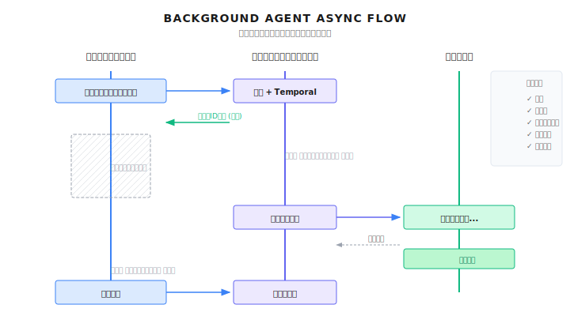

# 第 29 章：Background Agents

> **Background Agent（バックグラウンドエージェント）は、タスクをユーザーセッションから切り離して独立実行させる。定時スケジュール、継続監視、障害自動復旧。これはエージェントが「ツール」から「従業員」へ進化する決定的な一歩だ。ただし、リアルタイムの人間監視がなくなるので、設計段階で十分な安全策と予算制御を組み込んでおく必要がある。**

---

> **5分で核心をつかむ**
>
> 1. 核心価値：ユーザーセッションとタスク実行を分離し、長時間タスクと定時スケジュールに対応
> 2. Temporal 三点セット：Schedule（定時）、Workflow（ロジック）、Activity（実行）
> 3. 無人運転には必須：Token予算上限 + 実行時間上限 + アラート閾値
> 4. 状態確認：Queryでリアルタイム進捗確認、Signalで動的に挙動を調整
> 5. 失敗復旧：RetryPolicyで指数バックオフ + 最大リトライ回数 + 人手介入をフォールバックに
>
> **10分コース**：29.1-29.3 → 29.5 → Shannon Lab

---

ユーザーがこう言ったとしよう。「毎朝9時にAI業界のニュースダイジェストを作ってくれない？」

従来のやり方だと、アラームをセットして毎日ウェブページを開いて手動でトリガーしてね、と伝えるしかなかった。あるいはcron jobを書くか。でもそれにはサーバーが必要だし、失敗時のリトライやログ監視も自分で実装しないといけない...

Background Agentはこのゲームを変える。ユーザーは一言言うだけで、システムが：
1. 定時スケジュールタスクを作成
2. 毎朝9時に自動でエージェントを起動
3. タスク完了後に通知を送信
4. 失敗したら自動リトライしてアラート
5. ユーザーはいつでも一時停止、再開、履歴確認が可能

これは単なる定時スクリプトじゃない。継続的に動くエージェントで、想定外の状況にも自律的に対処し、コンテキストを記憶し、フィードバックに応じて行動を調整できる。

ただし、これは最も危険なエージェント形態でもある。ユーザーがオフラインのとき、誰が監視する？8時間動いてTokenが爆発したらどうする？タスクがスタックしたとき、どうやって自動復旧する？

この章では、ShannonがTemporalを使ってどのように信頼性の高いBackground Agentを実装しているか見ていこう。

---

## 29.1 なぜ Background Agent が必要なのか

### 同期実行の限界

従来のエージェントとのやりとりは同期的だ。ユーザーがリクエストを送り、結果を待ち、レスポンスを受け取る。短いタスクなら問題ないけど、以下のようなシナリオでは行き詰まる：

| シナリオ | 実行時間 | なぜ同期ではダメか |
|----------|----------|-------------------|
| 深堀りリサーチレポート | 30分〜2時間 | HTTPタイムアウト、接続切断 |
| データ分析タスク | 数時間 | ブラウザを閉じる、ネットワーク不安定 |
| 定期監視 | 24/7継続 | ユーザーがずっとオンラインなわけがない |
| バッチ処理 | 数時間〜数日 | 中断からの再開が必要 |

同期実行の問題を図で見てみよう：

```
ユーザーセッション              タスク実行
    |                           |
    |──────タスク開始─────────>|
    |                           |── 実行中...
    |                           |── 実行中...
    |<──────待機中...           |
    |                           |── 実行中...
    X 接続切断                  |── 続行する？
                                |── 結果が消失！
```

### Background Agent の核心特性

Background Agentは、ユーザーセッションとタスク実行の紐付けを断ち切る：



核心となる特性：

1. **分離**：ユーザーセッションとタスク実行が完全に独立
2. **永続化**：タスク状態をデータベース/ワークフローエンジンに保存
3. **スケジューリング**：Cron式での定時トリガーに対応
4. **可観測性**：タスク状態、進捗、結果をいつでも照会可能
5. **耐障害性**：失敗時の自動リトライ、中断からの再開

---

## 29.2 アーキテクチャ設計：Temporal + Schedule Manager

ShannonのBackground AgentはTemporalワークフローエンジンをベースにしている。Temporalを選んだ理由は：

- ネイティブのスケジューリング機能（Schedule）
- 永続化されたワークフロー状態
- 自動リトライと障害復旧
- 可観測性と監査ログ

### コアコンポーネント

```
+-----------------------------------------------------------+
|                    Orchestrator (Go)                       |
|                                                           |
|  +-----------------------------------------------------+  |
|  |              Schedule Manager                        |  |
|  |  - CreateSchedule()  定時タスク作成                   |  |
|  |  - PauseSchedule()   タスク一時停止                  |  |
|  |  - ResumeSchedule()  タスク再開                      |  |
|  |  - DeleteSchedule()  タスク削除                      |  |
|  |  - ListSchedules()   タスク一覧                      |  |
|  +-------------------------+---------------------------+  |
+-----------------------------|-----------------------------+
                              |
           +------------------+------------------+
           v                  v                  v
    +------------+     +------------+     +------------+
    | PostgreSQL |     |  Temporal  |     |   Worker   |
    | (メタデータ) |     | (スケジューラ)|     | (実行器)   |
    +------------+     +------------+     +------------+
```

**Schedule Manager**：スケジュールタスクのライフサイクルを管理し、ビジネスルール（クォータ、予算、最小間隔）を強制適用。

**PostgreSQL**：スケジュールのメタデータ、実行履歴、ユーザー設定を保存。

**Temporal**：実際のスケジューリングエンジン。Cron式に従ってワークフローをトリガー。

**Worker**：具体的なエージェントタスクを実行。

### なぜ2層のストレージが必要？

こう思うかもしれない。Temporalがすでにスケジュール情報を保存してるなら、なぜPostgreSQLも必要なの？

それぞれ担当が違うからだ：

| ストレージ層 | 担当内容 | クエリ用途 |
|-------------|----------|-----------|
| **Temporal** | ワークフロー状態、スケジュールトリガー | Temporal内部で使用 |
| **PostgreSQL** | ビジネスメタデータ、ユーザー設定、実行履歴 | ユーザーUI、分析レポート、監査 |

例えば、「あるユーザーの全スケジュールタスクを取得」みたいな操作は、Temporalを全部走査するよりPostgreSQLに直接クエリした方がずっと速い。

---

## 29.3 定時タスクの作成

スケジュールタスクの作成には多重のバリデーションが必要だ。Shannonの実装を見てみよう：

```go
// go/orchestrator/internal/schedules/manager.go より抜粋

// CreateSchedule 新しい定時タスクを作成
func (m *Manager) CreateSchedule(ctx context.Context, req *CreateScheduleInput) (*Schedule, error) {
    // 1. Cron式のバリデーション
    schedule, err := m.cronParser.Parse(req.CronExpression)
    if err != nil {
        return nil, fmt.Errorf("%w: %v", ErrInvalidCronExpression, err)
    }

    // 2. 最小間隔の強制
    if !m.validateMinInterval(req.CronExpression) {
        return nil, fmt.Errorf("%w: must be at least %d minutes",
            ErrIntervalTooShort, m.config.MinCronIntervalMins)
    }

    // 3. ユーザークォータのチェック
    count, err := m.dbOps.CountSchedulesByUser(ctx, req.UserID, req.TenantID)
    if err != nil {
        return nil, fmt.Errorf("failed to check schedule limit: %w", err)
    }
    if count >= m.config.MaxPerUser {
        return nil, fmt.Errorf("%w: %d/%d schedules",
            ErrScheduleLimitReached, count, m.config.MaxPerUser)
    }

    // 4. 予算制限のバリデーション
    if req.MaxBudgetPerRunUSD < 0 {
        return nil, fmt.Errorf("budget cannot be negative: $%.2f", req.MaxBudgetPerRunUSD)
    }
    if req.MaxBudgetPerRunUSD > m.config.MaxBudgetPerRunUSD {
        return nil, fmt.Errorf("%w: $%.2f > $%.2f", ErrBudgetExceeded,
            req.MaxBudgetPerRunUSD, m.config.MaxBudgetPerRunUSD)
    }

    // 5. タイムゾーンのバリデーション
    timezone := req.Timezone
    if timezone == "" {
        timezone = "UTC"
    }
    tz, err := time.LoadLocation(timezone)
    if err != nil {
        return nil, fmt.Errorf("%w: %s", ErrInvalidTimezone, timezone)
    }

    // 6. ID生成
    scheduleID := uuid.New()
    temporalScheduleID := fmt.Sprintf("schedule-%s", scheduleID.String())

    // 7. Temporalでスケジュール作成
    _, err = m.temporalClient.ScheduleClient().Create(ctx, client.ScheduleOptions{
        ID: temporalScheduleID,
        Spec: client.ScheduleSpec{
            CronExpressions: []string{req.CronExpression},
            TimeZoneName:    timezone,
        },
        Action: &client.ScheduleWorkflowAction{
            Workflow:           "ScheduledTaskWorkflow",
            TaskQueue:          "shannon-tasks",
            WorkflowRunTimeout: time.Duration(req.TimeoutSeconds) * time.Second,
            Args: []interface{}{
                ScheduledTaskInput{
                    ScheduleID:         scheduleID.String(),
                    TaskQuery:          req.TaskQuery,
                    TaskContext:        req.TaskContext,
                    MaxBudgetPerRunUSD: req.MaxBudgetPerRunUSD,
                    UserID:             req.UserID.String(),
                    TenantID:           req.TenantID.String(),
                },
            },
        },
        Paused: false,
    })
    if err != nil {
        return nil, fmt.Errorf("failed to create Temporal schedule: %w", err)
    }

    // 8. 次回実行時刻を計算
    nextRun := schedule.Next(time.Now().In(tz))

    // 9. データベースに永続化
    dbSchedule := &Schedule{
        ID:                 scheduleID,
        UserID:             req.UserID,
        TenantID:           req.TenantID,
        Name:               req.Name,
        CronExpression:     req.CronExpression,
        Timezone:           timezone,
        TaskQuery:          req.TaskQuery,
        MaxBudgetPerRunUSD: req.MaxBudgetPerRunUSD,
        TemporalScheduleID: temporalScheduleID,
        Status:             ScheduleStatusActive,
        NextRunAt:          &nextRun,
    }

    if err := m.dbOps.CreateSchedule(ctx, dbSchedule); err != nil {
        // ロールバック：Temporalスケジュールを削除
        _ = m.temporalClient.ScheduleClient().GetHandle(ctx, temporalScheduleID).Delete(ctx)
        return nil, fmt.Errorf("failed to persist schedule: %w", err)
    }

    return dbSchedule, nil
}
```

### 設計のポイント

1. **Temporal先、データベース後**：データベース書き込みが失敗したら、Temporalスケジュールをロールバック。逆だとロールバックが難しくなる。

2. **多重バリデーション**：Cron構文、最小間隔、ユーザークォータ、予算制限、タイムゾーン有効性——全て作成時に検証。

3. **次回実行時刻の事前計算**：UI表示用。毎回Temporalに問い合わせる必要がなくなる。

### 最小間隔のバリデーション

ユーザーが頻繁すぎるスケジュール（例：毎分実行）を作成するのを防ぐ。リソースと予算を食い潰すからね：

```go
// validateMinInterval Cron式が最小間隔を満たすかチェック
func (m *Manager) validateMinInterval(cronExpression string) bool {
    if m.config.MinCronIntervalMins <= 0 {
        return true // 制限なし
    }

    schedule, err := m.cronParser.Parse(cronExpression)
    if err != nil {
        return false
    }

    // 次の2回の実行時刻を計算
    now := time.Now().In(time.UTC)
    next1 := schedule.Next(now)
    next2 := schedule.Next(next1)

    // 間隔が最小要件を満たすかチェック
    intervalMinutes := next2.Sub(next1).Minutes()
    return intervalMinutes >= float64(m.config.MinCronIntervalMins)
}
```

---

## 29.4 一時停止と再開

ユーザーがスケジュールを一時的に止めたい場合がある（出張中はレポート不要、とか）。後で再開できるようにしておく。

### 一時停止

```go
// PauseSchedule スケジュールタスクを一時停止
func (m *Manager) PauseSchedule(ctx context.Context, scheduleID uuid.UUID, reason string) error {
    // 1. スケジュールを取得
    dbSchedule, err := m.dbOps.GetSchedule(ctx, scheduleID)
    if err != nil {
        return fmt.Errorf("schedule not found: %w", err)
    }

    if dbSchedule.Status == ScheduleStatusPaused {
        return nil // すでに停止中、冪等
    }

    // 2. Temporalで一時停止
    handle := m.temporalClient.ScheduleClient().GetHandle(ctx, dbSchedule.TemporalScheduleID)
    if err := handle.Pause(ctx, client.SchedulePauseOptions{
        Note: reason,
    }); err != nil {
        return fmt.Errorf("failed to pause Temporal schedule: %w", err)
    }

    // 3. データベースの状態を更新
    if err := m.dbOps.UpdateScheduleStatus(ctx, scheduleID, ScheduleStatusPaused); err != nil {
        return fmt.Errorf("failed to update schedule status: %w", err)
    }

    m.logger.Info("Schedule paused",
        zap.String("schedule_id", scheduleID.String()),
        zap.String("reason", reason),
    )

    return nil
}
```

### 再開

```go
// ResumeSchedule 一時停止中のスケジュールタスクを再開
func (m *Manager) ResumeSchedule(ctx context.Context, scheduleID uuid.UUID, reason string) (*time.Time, error) {
    // 1. スケジュールを取得
    dbSchedule, err := m.dbOps.GetSchedule(ctx, scheduleID)
    if err != nil {
        return nil, fmt.Errorf("schedule not found: %w", err)
    }

    if dbSchedule.Status == ScheduleStatusActive {
        return dbSchedule.NextRunAt, nil // すでにアクティブ、次回実行時刻を返す
    }

    // 2. Temporalで再開
    handle := m.temporalClient.ScheduleClient().GetHandle(ctx, dbSchedule.TemporalScheduleID)
    if err := handle.Unpause(ctx, client.ScheduleUnpauseOptions{
        Note: reason,
    }); err != nil {
        return nil, fmt.Errorf("failed to unpause Temporal schedule: %w", err)
    }

    // 3. 新しい次回実行時刻を計算
    schedule, _ := m.cronParser.Parse(dbSchedule.CronExpression)
    tz, _ := time.LoadLocation(dbSchedule.Timezone)
    nextRun := schedule.Next(time.Now().In(tz))

    // 4. データベースを更新
    m.dbOps.UpdateScheduleStatus(ctx, scheduleID, ScheduleStatusActive)
    m.dbOps.UpdateScheduleNextRun(ctx, scheduleID, nextRun)

    return &nextRun, nil
}
```

### 冪等性

両方のメソッドが冪等になっているのに注目：
- すでに停止中のスケジュールを停止しても、成功を返す
- すでにアクティブなスケジュールを再開しても、次回実行時刻を返す

呼び出し側は状態を先に確認してから操作する必要がない。

---

## 29.5 Cron式の詳解

Cronは定時スケジューリングの標準言語だ。Shannonは標準の5フィールド形式を使う：

```
+------------- 分 (0 - 59)
| +----------- 時 (0 - 23)
| | +--------- 日 (1 - 31)
| | | +------- 月 (1 - 12)
| | | | +----- 曜日 (0 - 6, 0=日曜)
| | | | |
* * * * *
```

### よく使う例

| 式 | 意味 |
|----|------|
| `0 9 * * *` | 毎日朝9時 |
| `0 9 * * 1-5` | 月曜〜金曜の朝9時 |
| `0 */4 * * *` | 4時間ごとの正時 |
| `0 0 1 * *` | 毎月1日の0時 |
| `30 8 * * 1` | 毎週月曜の朝8:30 |
| `0 9,18 * * *` | 毎日9時と18時 |

### タイムゾーン対応

タイムゾーンはBackground Agentの重要な機能だ。ユーザーが「毎日9時」と言ったら、それはユーザーの地元時間の9時であって、UTCの9時じゃない。

```go
// Temporalスケジュールはタイムゾーン対応
_, err = m.temporalClient.ScheduleClient().Create(ctx, client.ScheduleOptions{
    Spec: client.ScheduleSpec{
        CronExpressions: []string{"0 9 * * *"},
        TimeZoneName:    "Asia/Tokyo",  // 東京時間の9時
    },
})
```

標準のIANAタイムゾーン名に対応：`America/New_York`、`Europe/London`、`Asia/Shanghai`など。

---

## 29.6 予算とコスト管理

Background Agentはユーザー不在時に動く。だからこそコスト管理がより重要になる。

### 3層の予算制御

1. **システムレベル制限**：1回の実行あたりの最大予算（管理者が設定）
2. **ユーザーレベル予算**：ユーザーが設定する1回の実行予算
3. **累積予算**：あるスケジュールの総消費上限（オプション）

```go
// システム設定
type Config struct {
    MaxPerUser          int     // ユーザーあたり最大スケジュール数 (デフォルト: 50)
    MinCronIntervalMins int     // 最小実行間隔 (デフォルト: 60分)
    MaxBudgetPerRunUSD  float64 // 1回の実行の最大予算 (デフォルト: $10)
}

// 作成時にバリデーション
if req.MaxBudgetPerRunUSD > m.config.MaxBudgetPerRunUSD {
    return nil, fmt.Errorf("%w: $%.2f > $%.2f", ErrBudgetExceeded,
        req.MaxBudgetPerRunUSD, m.config.MaxBudgetPerRunUSD)
}
```

### 予算をワークフローに注入

```go
// ScheduledTaskWorkflow に予算を注入
if input.MaxBudgetPerRunUSD > 0 {
    if taskInput.Context == nil {
        taskInput.Context = make(map[string]interface{})
    }
    taskInput.Context["max_budget_usd"] = input.MaxBudgetPerRunUSD
}
```

メインワークフローがこの予算をチェックして、超過時に実行を停止する。

### コスト追跡

実行ごとにコストを記録して、分析やアラートに活用：

```go
// 実行完了後に記録
workflow.ExecuteActivity(activityCtx, "RecordScheduleExecutionComplete",
    RecordScheduleExecutionCompleteInput{
        ScheduleID: scheduleID,
        TaskID:     childWorkflowID,
        Status:     status,
        TotalCost:  totalCost,  // 子ワークフローから抽出
        ErrorMsg:   errorMsg,
    },
).Get(ctx, nil)
```

---

## 29.7 孤児検出とクリーンアップ

データベースとTemporalの状態が不整合になることがある。例えば：
- 誰かがTemporal UIで直接スケジュールを削除した
- データベースマイグレーション時にデータが消失
- ネットワーク問題で作成フローが中断

定期的な検出とクリーンアップが必要だ：

```go
// VerifyScheduleExists スケジュールがTemporalに存在するか確認
func (m *Manager) VerifyScheduleExists(ctx context.Context, schedule *Schedule) (bool, error) {
    if schedule.Status != ScheduleStatusActive && schedule.Status != ScheduleStatusPaused {
        return true, nil // アクティブ/停止中のスケジュールのみ検証
    }

    handle := m.temporalClient.ScheduleClient().GetHandle(ctx, schedule.TemporalScheduleID)
    _, err := handle.Describe(ctx)
    if err != nil {
        if strings.Contains(err.Error(), "not found") {
            m.logger.Warn("Detected orphaned schedule - Temporal schedule not found",
                zap.String("schedule_id", schedule.ID.String()),
                zap.String("temporal_id", schedule.TemporalScheduleID),
            )
            // データベースで削除済みとしてマーク
            m.dbOps.UpdateScheduleStatus(ctx, schedule.ID, ScheduleStatusDeleted)
            return false, nil
        }
        // その他のエラーは状態不明、存在すると仮定
        return true, nil
    }
    return true, nil
}

// DetectAndCleanOrphanedSchedules 孤児スケジュールを一括検出
func (m *Manager) DetectAndCleanOrphanedSchedules(ctx context.Context) ([]uuid.UUID, error) {
    schedules, err := m.dbOps.GetAllActiveSchedules(ctx)
    if err != nil {
        return nil, fmt.Errorf("failed to get active schedules: %w", err)
    }

    var orphanedIDs []uuid.UUID
    for _, schedule := range schedules {
        exists, err := m.VerifyScheduleExists(ctx, schedule)
        if err != nil {
            continue
        }
        if !exists {
            orphanedIDs = append(orphanedIDs, schedule.ID)
        }
    }

    if len(orphanedIDs) > 0 {
        m.logger.Info("Cleaned up orphaned schedules",
            zap.Int("count", len(orphanedIDs)),
        )
    }

    return orphanedIDs, nil
}
```

別の定時タスクで毎日1回、孤児検出を実行することをお勧めする。

---

## 29.8 セキュリティの考慮事項

Background Agentはユーザー不在時に動く。セキュリティリスクはより高い。

### リスクマトリクス

| リスク | 説明 | 緩和策 |
|--------|------|--------|
| **予算暴走** | バックグラウンドタスクが大量のTokenを消費 | 実行ごとの予算制限 |
| **無限ループ** | エージェントがリトライループにハマる | 最大リトライ回数、実行タイムアウト |
| **権限悪用** | 定時タスクが機密操作を実行 | 操作監査、最小権限の原則 |
| **リソース枯渇** | 多すぎるスケジュールが同時実行 | ユーザークォータ、最小間隔 |
| **状態不整合** | データベースとTemporalの同期ズレ | 孤児検出、状態検証 |

### 操作監査

実行ごとに完全な監査レコードを残すべき：

```go
type ScheduleExecution struct {
    ID          uuid.UUID
    ScheduleID  uuid.UUID
    StartedAt   time.Time
    CompletedAt *time.Time
    Status      string    // RUNNING, COMPLETED, FAILED
    TotalCost   float64
    ErrorMsg    *string
    Metadata    map[string]interface{}
}
```

### 機密操作の制限

バックグラウンドタスクは特定の機密操作を実行すべきではない（少なくとも追加の承認なしには）：

```python
# 概念例：バックグラウンドタスクの操作制限

BACKGROUND_RESTRICTED_OPERATIONS = [
    "delete_data",        # データ削除
    "send_email",         # メール送信（スパムになりうる）
    "make_purchase",      # 購入操作
    "modify_permissions", # 権限変更
]

def check_background_operation(operation: str, is_background: bool) -> bool:
    if is_background and operation in BACKGROUND_RESTRICTED_OPERATIONS:
        raise BackgroundOperationRestricted(
            f"Operation '{operation}' is not allowed in background tasks. "
            f"Please trigger manually with user confirmation."
        )
    return True
```

---

## 29.9 実践例

### 例1：デイリーニュースダイジェスト

```python
# 概念例：デイリーニュースダイジェストの作成

async def create_daily_news_schedule(
    topic: str,
    user_id: str,
    timezone: str = "UTC",
) -> dict:
    """デイリーニュースダイジェストの定時タスクを作成"""

    request = {
        "name": f"Daily News: {topic}",
        "cron_expression": "0 9 * * *",  # 毎日9時
        "timezone": timezone,
        "task_query": f"""
Generate a daily news digest about {topic}.

Include:
1. Top 5 news from the past 24 hours
2. Key insights and trends
3. Notable quotes or data points
4. Links to original sources

Format: Markdown, suitable for email newsletter.
""",
        "task_context": {
            "output_format": "markdown",
            "max_sources": 10,
        },
        "max_budget_per_run_usd": 2.0,
        "timeout_seconds": 600,
        "user_id": user_id,
    }

    return await schedule_client.create(request)
```

### 例2：競合モニタリング

```python
# 概念例：競合サイトのモニタリング

async def create_competitor_monitor(
    competitor_urls: List[str],
    user_id: str,
) -> dict:
    """競合モニタリングの定時タスクを作成"""

    request = {
        "name": "Competitor Price Monitor",
        "cron_expression": "0 */6 * * *",  # 6時間ごと
        "timezone": "UTC",
        "task_query": f"""
Monitor these competitor websites for changes:
{chr(10).join(competitor_urls)}

Report:
1. Any price changes detected
2. New products or features
3. Marketing message changes
4. Compare with previous check

If significant changes detected, flag as ALERT.
""",
        "task_context": {
            "previous_state_key": "competitor_state",  # 状態永続化
            "alert_threshold": "significant",
        },
        "max_budget_per_run_usd": 3.0,
        "timeout_seconds": 900,
        "user_id": user_id,
    }

    return await schedule_client.create(request)
```

### 例3：週次サマリーレポート

```python
# 概念例：週次サマリー

async def create_weekly_summary(
    topics: List[str],
    user_id: str,
) -> dict:
    """週次サマリーレポートを作成"""

    request = {
        "name": "Weekly AI Industry Summary",
        "cron_expression": "0 9 * * 1",  # 毎週月曜9時
        "timezone": "America/New_York",
        "task_query": f"""
Generate a comprehensive weekly summary for:
{', '.join(topics)}

Include:
1. Major announcements and releases
2. Funding and acquisitions
3. Research paper highlights
4. Industry trends analysis
5. Predictions for next week
""",
        "max_budget_per_run_usd": 5.0,
        "timeout_seconds": 1800,
        "user_id": user_id,
    }

    return await schedule_client.create(request)
```

---

## 29.10 よくある落とし穴

### 落とし穴1：タイムゾーンの混乱

ユーザーが「毎日9時」と言ったのに、システムがUTCで実行してしまう。

```go
// 間違い：デフォルトUTC、ユーザーは知らない
cron := "0 9 * * *"  // ユーザーはローカル9時だと思ってる、実際はUTC 9時

// 正解：タイムゾーンを明示的に要求し、レスポンスで明確に表示
if req.Timezone == "" {
    req.Timezone = "UTC"
}
response.Timezone = req.Timezone
response.NextRunAt = schedule.Next(time.Now().In(tz))
response.NextRunLocal = response.NextRunAt.Format("2006-01-02 15:04 MST")
```

### 落とし穴2：ロールバック忘れ

スケジュール作成時、データベース書き込みが失敗しても、作成済みのTemporalスケジュールを削除し忘れる。

```go
// 間違い：ロールバックなし
_, err = m.temporalClient.ScheduleClient().Create(ctx, ...)
// ... Temporal作成成功

err = m.dbOps.CreateSchedule(ctx, dbSchedule)
if err != nil {
    return nil, err  // Temporalスケジュールが孤児に！
}

// 正解：失敗時にロールバック
if err := m.dbOps.CreateSchedule(ctx, dbSchedule); err != nil {
    _ = m.temporalClient.ScheduleClient().GetHandle(ctx, temporalScheduleID).Delete(ctx)
    return nil, fmt.Errorf("failed to persist schedule: %w", err)
}
```

### 落とし穴3：削除がデータベースだけ

```go
// 間違い：データベースのレコードだけ削除
m.dbOps.DeleteSchedule(ctx, scheduleID)
// Temporalスケジュールは動き続ける、孤児に！

// 正解：先にTemporalを削除、それからデータベースを更新
handle := m.temporalClient.ScheduleClient().GetHandle(ctx, dbSchedule.TemporalScheduleID)
handle.Delete(ctx)
m.dbOps.UpdateScheduleStatus(ctx, scheduleID, ScheduleStatusDeleted)
```

### 落とし穴4：予算制限なし

```go
// 間違い：ユーザーが任意の予算を設定できる
request.MaxBudgetPerRunUSD = 1000.0  // 1回の実行で$1000消費

// 正解：システム上限を強制
if req.MaxBudgetPerRunUSD > m.config.MaxBudgetPerRunUSD {
    return nil, fmt.Errorf("%w: $%.2f > $%.2f", ErrBudgetExceeded,
        req.MaxBudgetPerRunUSD, m.config.MaxBudgetPerRunUSD)
}
```

---

## 29.11 まとめ

1. **Background Agentの定義**：タスクがユーザーセッションから独立して実行、定時スケジュールや一時停止/再開に対応
2. **2層ストレージ**：Temporalがスケジュール実行を担当、PostgreSQLがビジネスクエリを担当
3. **多重バリデーション**：Cron構文、最小間隔、ユーザークォータ、予算制限
4. **タイムゾーン対応**：ユーザーはローカル時間を期待している、明示的なタイムゾーン処理が必須
5. **孤児クリーンアップ**：データベースとTemporalの不整合状態を定期的に検出

---

## Shannon Lab（10分でハンズオン）

このセクションでは、本章の概念をShannonのソースコードに対応させる。

### 必読（1ファイル）

- `go/orchestrator/internal/schedules/manager.go`：Schedule Managerの完全な実装。作成、一時停止、再開、削除を含む

### 選読（興味に応じて2つ選択）

- `go/orchestrator/internal/workflows/scheduled/scheduled_task_workflow.go`：スケジュールトリガー時に実行されるワークフローラッパー
- `config/models.yaml`の予算設定：システムレベルのリソース制限の設定方法を理解

---

## 演習

### 演習1：アラートスケジュールの設計

監視アラートシステムを設計せよ：
1. 5分ごとにシステム状態をチェック
2. 異常を検出したらアラート通知を送信
3. アラート後は「クールダウン期間」に入り、重複アラートを防止
4. 異常が回復したら回復通知を送信

### 演習2：実行履歴クエリの実装

実行履歴のAPIとストレージを設計せよ：
1. 各実行の開始時刻、終了時刻、ステータス、コストを保存
2. スケジュールIDでの履歴クエリに対応
3. 時間範囲でのフィルタリングに対応
4. あるスケジュールの累積コストを計算

### 演習3（発展）：カスケード一時停止

あるスケジュールが連続3回失敗した場合に以下を行うシステムを設計せよ：
1. そのスケジュールを自動的に一時停止
2. ユーザーに通知を送信
3. 一時停止理由を記録
4. ユーザーが再開する際、失敗原因が解決されたかを確認

---

## 参考資料

- **Temporal Schedules** - https://docs.temporal.io/workflows#schedule
- **Cron Expression** - https://crontab.guru/
- **IANA Time Zone Database** - https://www.iana.org/time-zones

---

## 次章の予告

Background Agentはスケジュールに従ってタスクを実行する。でも、毎回どのモデルを使う？全部高価な大規模モデル？それじゃコストがかさみすぎる。

次章では**階層型モデル戦略**を扱う——賢いモデル選択で50-70%のコスト削減を実現する方法だ。

基本的な考え方はシンプル：簡単なタスクには小さいモデル、複雑なタスクには大きいモデル。でも実装はそう単純じゃない：
- タスクの複雑さをどう判断する？
- 小さいモデルが失敗したら大きいモデルにアップグレードすべき？
- タスクの種類ごとにどのモデルが適切？

次章では、Shannonの階層型モデルルーティング戦略を見ていこう。
