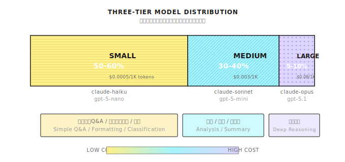

# 第 30 章：階層型モデル戦略

> **「階層ルーティングで 80% コスト削減」——ただし、タスクの複雑度を正しく判断できればの話。これ、聞こえるほど簡単じゃない。**

---

> **5 分で要点掴む**
>
> 1. 三層モデル：Small（50%）→ Medium（40%）→ Large（10%）
> 2. 複雑度判断：ルール優先（キーワード/長さ）、LLM がセーフティネット（曖昧なタスク）
> 3. アップグレード機構：Small の出力品質が低ければ Medium/Large に自動昇格
> 4. コスト監視：層ごとにトークン消費を集計。Large が 20% 超えたら調査
> 5. キャッシュ優先：同じクエリはキャッシュから返す。モデル階層より節約効果高い
>
> **10 分パス**：30.1-30.3 → 30.5 → Shannon Lab

---

## 30.1 ある請求書から始まる話

君の AI エージェントシステムが本番稼働して3ヶ月。上司に呼び出された：

「今月の LLM 請求書、$15,000 だって。予算の10倍だよ。」

使用ログを引っ張り出してみる。問題は一目瞭然：

```
[2025-01-10 09:15:22] ユーザーの質問: "今日何曜日？"
                       モデル: claude-opus-4-1
                       消費: 0.12 USD

[2025-01-10 09:15:45] ユーザーの質問: "この200ページの決算報告書の主要リスクを分析して"
                       モデル: claude-opus-4-1
                       消費: 0.35 USD
```

2つのタスクで同じ最高級モデルを使ってる。「今日何曜日？」に $0.12——この金額で Haiku なら 200 回答えられる。

**問題の本質**：システムが「過剰サービス」してる——出前にロールスロイス使って、蚊をロケットランチャーで撃ってる状態。

この章で解決する課題は一つ：**適切なタスクに適切なモデルを使う**こと。

---

## 30.2 三層モデルアーキテクチャ

### なぜ三層なのか？

| 層 | 適用シナリオ | 代表モデル | 相対コスト |
|------|----------|----------|----------|
| **Small** | シンプルな Q&A、フォーマット変換、分類 | claude-haiku, gpt-5-nano | 1x |
| **Medium** | 標準的な分析、要約、コード補助 | claude-sonnet, gpt-5-mini | 3-5x |
| **Large** | 複雑な推論、クリエイティブライティング、深い分析 | claude-opus, gpt-5.1 | 50-150x |

三層設計は実践の観察から来てる——本番トラフィックの大半はこの3つのバケットに分類できる：



**目標分布**：50% Small / 40% Medium / 10% Large。

これは強制的なクォータじゃない——参考基準だ。実際の分布はビジネスシナリオ次第。ただ、Large が 20% を超えてるなら、複雑度判断に問題がある可能性が高い。

### 設定構造

**実装参考 (Shannon)**: [`config/models.yaml`](https://github.com/Kocoro-lab/Shannon/blob/main/config/models.yaml) - model_tiers 設定

```yaml
# Shannon 三層モデル設定
model_tiers:
  small:
    # 目標割合: 50% - 高速低コスト、基本タスク処理
    providers:
      - provider: anthropic
        model: claude-haiku-4-5-20251015
        priority: 1  # 第一選択
      - provider: openai
        model: gpt-5-nano-2025-08-07
        priority: 2  # 代替
      - provider: xai
        model: grok-3-mini
        priority: 3
      - provider: google
        model: gemini-2.5-flash-lite
        priority: 4

  medium:
    # 目標割合: 40% - 能力/コストのバランス
    providers:
      - provider: anthropic
        model: claude-sonnet-4-5-20250929
        priority: 1
      - provider: openai
        model: gpt-5-mini-2025-08-07
        priority: 2
      - provider: xai
        model: grok-4-fast-non-reasoning
        priority: 3
      - provider: google
        model: gemini-2.5-flash
        priority: 4

  large:
    # 目標割合: 10% - 深い推論タスク
    providers:
      - provider: openai
        model: gpt-5.1
        priority: 1
      - provider: anthropic
        model: claude-opus-4-1-20250805
        priority: 2
      - provider: xai
        model: grok-4-fast-reasoning
        priority: 3
      - provider: google
        model: gemini-2.5-pro
        priority: 4
```

**優先度の説明**：数字が小さいほど優先度が高い。同じ層内で優先順に試行——第一選択が使えないときは自動的に代替に切り替わる。

---

## 30.3 コストと能力の数学

### 実際の価格比較

> **鮮度注意** (2026-01): モデル価格と能力リストは頻繁に変わる。以下は参考値なので、各ベンダーの公式サイトで最新価格を確認してほしい：[OpenAI Pricing](https://openai.com/pricing) | [Anthropic Pricing](https://www.anthropic.com/pricing) | [Google AI Pricing](https://ai.google.dev/pricing)

| モデル | Input/1K tokens | Output/1K tokens | 相対コスト |
|------|-----------------|------------------|----------|
| claude-haiku-4-5 | $0.0001 | $0.0005 | 1x |
| gpt-5-nano | $0.00005 | $0.0004 | ~0.75x |
| claude-sonnet-4-5 | $0.0003 | $0.0015 | 3x |
| gpt-5-mini | $0.00025 | $0.002 | 3.5x |
| claude-opus-4-1 | $0.015 | $0.075 | 150x |
| gpt-5.1 | $0.00125 | $0.01 | 20x |

**重要な洞察**：Opus の1回あたりコストは Haiku の **150 倍**。

### コスト削減計算

月間 100 万回の API 呼び出し、平均 1000 トークンと仮定：

**シナリオ A：全部 Large モデル**
```
1M * 1K tokens * ($0.015 + $0.075) / 1K = $90,000/月
```

**シナリオ B：スマート階層化 (50/40/10)**
```
Small:  500K * 1K * ($0.0001 + $0.0005) / 1K = $300
Medium: 400K * 1K * ($0.0003 + $0.0015) / 1K = $720
Large:  100K * 1K * ($0.015 + $0.075) / 1K   = $9,000
合計: $10,020/月
```

**削減額**: $90,000 - $10,020 = **$79,980/月 (89% 削減)**

これが階層戦略の威力だ。ただし前提として——どのタスクにどの層を使うべきか、正確に判断できなきゃいけない。

---

## 30.4 複雑度分析：ルーティングの核心

### 複雑度閾値設定

```yaml
# 複雑度→層マッピング
workflows:
  complexity:
    simple_threshold: 0.3   # complexity < 0.3 → small
    medium_threshold: 0.5   # 0.3 ≤ complexity < 0.5 → medium
                            # complexity ≥ 0.5 → large
```

### ヒューリスティックな複雑度計算

**実装参考 (Shannon)**: [`llm_service/api/complexity.py`](https://github.com/Kocoro-lab/Shannon/blob/main/python/llm-service/llm_service/api/complexity.py) - _heuristic_analysis 関数

```python
def calculate_complexity(query: str, context: Dict) -> float:
    """
    タスク複雑度スコアを計算 (0.0 - 1.0)

    ヒューリスティックルール、LLM 呼び出し不要——高速ルーティング判断用。
    """
    score = 0.0
    query_lower = query.lower()

    # 1. クエリ長（長いクエリは通常より複雑）
    word_count = len(query.split())
    if word_count > 100:
        score += 0.2
    elif word_count > 50:
        score += 0.1

    # 2. キーワード検出
    complex_keywords = [
        "analyze", "compare", "evaluate", "synthesize",
        "design", "architect", "optimize", "debug",
        "explain why", "trade-offs", "implications",
    ]
    simple_keywords = [
        "what is", "define", "list", "format",
        "convert", "translate", "summarize",
    ]

    for kw in complex_keywords:
        if kw in query_lower:
            score += 0.15

    for kw in simple_keywords:
        if kw in query_lower:
            score -= 0.1

    # 3. コンテキスト情報
    if context.get("requires_reasoning"):
        score += 0.3
    if context.get("requires_code_generation"):
        score += 0.2
    if context.get("multi_step"):
        score += 0.2
    if context.get("available_tools") and len(context["available_tools"]) > 5:
        score += 0.1  # 多ツールシナリオは通常より複雑

    return max(0.0, min(1.0, score))


def select_tier(complexity: float, config: Dict) -> str:
    """複雑度に基づいてモデル層を選択"""
    simple_threshold = config.get("simple_threshold", 0.3)
    medium_threshold = config.get("medium_threshold", 0.5)

    if complexity < simple_threshold:
        return "small"
    elif complexity < medium_threshold:
        return "medium"
    else:
        return "large"
```

### モデルベースの複雑度分析

ヒューリスティックルールは速いけど精度が足りない。重要な判断には小さいモデルで先に複雑度を判断させる：

```python
async def model_based_complexity(query: str, providers) -> Dict:
    """小さいモデルで複雑度を分析、コスト約 $0.0001"""

    sys_prompt = (
        "You classify tasks into simple, standard, or complex. "
        "IMPORTANT: Tasks requiring calculations or tool usage "
        "must be 'standard' mode (not 'simple'). "
        "Simple mode is ONLY for direct Q&A without tools. "
        'Respond with JSON: {"recommended_mode": ..., '
        '"complexity_score": 0..1, "reasoning": ...}'
    )

    result = await providers.generate_completion(
        messages=[
            {"role": "system", "content": sys_prompt},
            {"role": "user", "content": f"Query: {query}"},
        ],
        tier=ModelTier.SMALL,  # 小さいモデルで判断
        max_tokens=256,
        temperature=0.0,
        response_format={"type": "json_object"},
    )

    return json.loads(result.get("output_text", "{}"))
```

**コストのトレードオフ**：モデル判断の方が精度は高いけど、毎回 ~$0.0001 余計にかかる。Large モデル（$0.09/回）の場合、誤判断を1回避けるだけで 900 回分の判断コストをカバーできる。

---

## 30.5 LLM Manager：統一ルーティング層

### コアアーキテクチャ

**実装参考 (Shannon)**: [`llm_provider/manager.py`](https://github.com/Kocoro-lab/Shannon/blob/main/python/llm-service/llm_provider/manager.py) - LLMManager クラス

```python
class LLMManager:
    """
    統一 LLM 管理：
    - Provider 登録とルーティング
    - モデル階層化と選択
    - キャッシュとレート制限
    - トークン予算管理
    - 使用量追跡
    """

    def __init__(self, config_path: Optional[str] = None):
        self.registry = LLMProviderRegistry()
        self.cache = CacheManager(max_size=1000)
        self.rate_limiters: Dict[str, RateLimiter] = {}
        self._breakers: Dict[str, _CircuitBreaker] = {}

        # トークン使用量追跡
        self.session_usage: Dict[str, TokenUsage] = {}
        self.task_usage: Dict[str, TokenUsage] = {}

        # 層別ルーティング設定
        self.tier_preferences: Dict[str, List[str]] = {}

        # 設定読み込み
        if config_path:
            self.load_config(config_path)
```

### Provider 選択ロジック

```python
def _select_provider(self, request: CompletionRequest) -> tuple[str, LLMProvider]:
    """リクエストに最適な provider を選択"""

    # 1. 明示的な provider 指定（最優先）
    if request.provider_override:
        provider_name = request.provider_override
        if provider_name not in self.registry.providers:
            raise ValueError(f"Invalid provider_override: {provider_name}")
        if self._is_breaker_open(provider_name):
            raise RuntimeError(f"Provider '{provider_name}' circuit breaker is open")
        return provider_name, self.registry.providers[provider_name]

    # 2. 明示的なモデル指定、対応する provider を探す
    if request.model:
        for pname, pprovider in self.registry.providers.items():
            if self._is_breaker_open(pname):
                continue
            if request.model in pprovider.models:
                return pname, pprovider
        # 見つからなければクリア、層選択にフォールバック
        request.model = None

    # 3. 層別の優先順位で選択
    tier_prefs = self.tier_preferences.get(request.model_tier.value, [])

    for pref in tier_prefs:
        if ":" in pref:
            provider_name, model_id = pref.split(":", 1)
            if provider_name in self.registry.providers:
                if self._is_breaker_open(provider_name):
                    continue
                provider = self.registry.providers[provider_name]
                if model_id in provider.models:
                    request.model = model_id  # モデルをロック
                    return provider_name, provider

    # 4. registry のデフォルト選択にフォールバック
    return self.registry.select_provider_for_request(request)
```

**設計のポイント**：
1. **Override 最優先**：呼び出し側が強制的に provider/model を指定可能
2. **Circuit Breaker 認識**：不健全な provider はスキップ
3. **層別ルーティング**：同層内の複数選択肢を優先順に試行
4. **グレースフルデグレード**：完全マッチがなければ fallback あり

---

## 30.6 Fallback と熔断

### Circuit Breaker パターン

ある provider が連続失敗したら、自動的に熔断して代替に切り替え：

```python
class _CircuitBreaker:
    """
    状態機械：closed → open → half-open → closed

    - closed: 正常動作、失敗回数を記録
    - open: 熔断状態、全リクエスト拒否
    - half-open: クールダウン後、探査リクエストを許可
    """

    def __init__(
        self,
        name: str,
        failure_threshold: int = 5,      # 連続 N 回失敗で熔断発動
        recovery_timeout: float = 60.0,  # 熔断クールダウン時間（秒）
    ):
        self.name = name
        self.failure_threshold = max(1, failure_threshold)
        self.recovery_timeout = recovery_timeout
        self.failures = 0
        self.state = "closed"
        self.opened_at = 0.0

    def allow(self) -> bool:
        if self.state == "closed":
            return True
        if self.state == "open":
            # クールダウン後に half-open へ、サンダーリングハード防止のジッター追加
            jitter = self.recovery_timeout * random.uniform(-0.1, 0.1)
            if (time.time() - self.opened_at) >= (self.recovery_timeout + jitter):
                self.state = "half-open"
                return True  # 1回の探査を許可
            return False
        return True  # half-open は探査許可

    def on_success(self):
        if self.state in ("open", "half-open"):
            self._close()
        self.failures = 0

    def on_failure(self, transient: bool):
        if not transient:
            return  # 一時的でないエラーはカウントしない
        self.failures += 1
        if self.failures >= self.failure_threshold and self.state != "open":
            self._open()
```

### Fallback 選択

```python
def _get_fallback_provider(
    self, failed_provider: str, tier: ModelTier
) -> Optional[tuple[str, LLMProvider]]:
    """メイン provider 失敗時に代替を選択"""

    tier_prefs = self.tier_preferences.get(tier.value, [])

    for pref in tier_prefs:
        provider_name = pref.split(":")[0] if ":" in pref else pref
        if (
            provider_name != failed_provider
            and provider_name in self.registry.providers
            and not self._is_breaker_open(provider_name)
        ):
            return provider_name, self.registry.providers[provider_name]

    return None  # 使える代替なし
```

**重要な設計**：
- 同層内で優先順位に従って代替を選択
- 熔断済みの provider はスキップ
- None を返して上位層に別の層への降格を判断させる

---

## 30.7 モデル能力マトリクス

全てのモデルが全てをこなせるわけじゃない。視覚理解が必要なタスクもあれば、深い推論が必要なタスクもある。

### 能力タグ

**実装参考 (Shannon)**: [`config/models.yaml`](https://github.com/Kocoro-lab/Shannon/blob/main/config/models.yaml) - model_capabilities 設定

```yaml
model_capabilities:
  # 画像入力対応モデル
  multimodal_models:
    - gpt-5.1
    - gpt-5-pro-2025-08-07
    - claude-sonnet-4-5-20250929
    - gemini-2.5-flash
    - gemini-2.0-flash

  # 深い推論/thinking 対応モデル
  thinking_models:
    - gpt-5-pro-2025-08-07
    - gpt-5.1
    - claude-opus-4-1-20250805
    - gemini-2.5-pro
    - deepseek-r1
    - grok-4-fast-reasoning

  # プログラミング能力が高いモデル
  coding_specialists:
    - codestral-22b-v0.1
    - deepseek-v3.2
    - claude-sonnet-4-5-20250929
    - gpt-5.1

  # 超長コンテキスト対応モデル
  long_context_models:
    - llama-4-scout-17b-16e-instruct  # 10M tokens
    - gemini-2.5-flash               # 1M tokens
    - claude-sonnet-4-5-20250929     # 200K tokens
```

### 能力認識ルーティング

```python
def select_model_by_capability(
    requirement: str,
    capabilities: Dict[str, List[str]],
    tier_preferences: Dict[str, List[str]],
) -> str:
    """タスク要件に基づいて適切なモデルを選択"""

    # 要件を検出
    needs_vision = "image" in requirement.lower() or "screenshot" in requirement.lower()
    needs_reasoning = any(
        kw in requirement.lower()
        for kw in ["analyze", "evaluate", "trade-off", "why"]
    )
    needs_coding = any(
        kw in requirement.lower()
        for kw in ["code", "implement", "debug", "function"]
    )
    needs_long_context = len(requirement) > 50000

    # 要件を満たすモデルをフィルタ
    candidates = set()

    if needs_vision:
        candidates.update(capabilities.get("multimodal_models", []))
    if needs_reasoning:
        candidates.update(capabilities.get("thinking_models", []))
    if needs_coding:
        candidates.update(capabilities.get("coding_specialists", []))
    if needs_long_context:
        candidates.update(capabilities.get("long_context_models", []))

    if not candidates:
        # デフォルトで medium の第一選択を返す
        return tier_preferences.get("medium", [])[0].split(":")[1]

    # 候補から最も経済的なものを選択（層の低い順）
    for tier in ["small", "medium", "large"]:
        for pref in tier_preferences.get(tier, []):
            model = pref.split(":")[1] if ":" in pref else pref
            if model in candidates:
                return model

    return list(candidates)[0]
```

**コアロジック**：能力マッチ > コスト最適化。まずモデルがそのタスクをこなせることを確認して、それからコストを考える。

---

## 30.8 レート制限

### 層別の差異化制限

```yaml
rate_limits:
  default_rpm: 60    # デフォルト毎分リクエスト数
  default_tpm: 100000  # デフォルト毎分トークン数

  tier_overrides:
    small:
      rpm: 120        # 高速モデルはより高頻度を許可
      tpm: 200000
    medium:
      rpm: 60
      tpm: 100000
    large:
      rpm: 30         # 複雑モデルは頻度を制限
      tpm: 50000
```

**設計思想**：
- Small モデルは高速で安いから、アグレッシブでいい
- Large モデルは遅くて高いから、頻度制限で請求書の暴走を防ぐ

### Token Bucket レート制限器

```python
class RateLimiter:
    """Token bucket レート制限器"""

    def __init__(self, requests_per_minute: int):
        self.requests_per_minute = requests_per_minute
        self.tokens = requests_per_minute
        self.last_refill = time.time()
        self._lock = asyncio.Lock()

    async def acquire(self):
        async with self._lock:
            now = time.time()
            elapsed = now - self.last_refill

            # トークン補充（経過時間に応じて）
            refill_amount = elapsed * (self.requests_per_minute / 60.0)
            self.tokens = min(self.requests_per_minute, self.tokens + refill_amount)
            self.last_refill = now

            if self.tokens >= 1:
                self.tokens -= 1
                return True

            # 十分なトークンを待つ
            wait_time = (1 - self.tokens) / (self.requests_per_minute / 60.0)
            await asyncio.sleep(wait_time)
            self.tokens = 0
            return True
```

---

## 30.9 集中型価格管理

### 価格設定

```yaml
# 集中型モデル価格設定（USD per 1K tokens）
# コスト追跡と予算管理用
pricing:
  defaults:
    combined_per_1k: 0.005  # 不明モデルのデフォルト値

  models:
    openai:
      gpt-5-nano-2025-08-07:
        input_per_1k: 0.00005
        output_per_1k: 0.00040
      gpt-5-mini-2025-08-07:
        input_per_1k: 0.00025
        output_per_1k: 0.00200
      gpt-5.1:
        input_per_1k: 0.00125
        output_per_1k: 0.01000

    anthropic:
      claude-haiku-4-5-20251015:
        input_per_1k: 0.00010
        output_per_1k: 0.00050
      claude-sonnet-4-5-20250929:
        input_per_1k: 0.00030
        output_per_1k: 0.00150
      claude-opus-4-1-20250805:
        input_per_1k: 0.0150
        output_per_1k: 0.0750
```

### コスト追跡

```python
def _update_usage_tracking(
    self, request: CompletionRequest, response: CompletionResponse
):
    """使用量追跡を更新"""

    # セッション別追跡
    if request.session_id:
        if request.session_id not in self.session_usage:
            self.session_usage[request.session_id] = TokenUsage(0, 0, 0, 0.0)
        self.session_usage[request.session_id] += response.usage

    # タスク別追跡
    if request.task_id:
        if request.task_id not in self.task_usage:
            self.task_usage[request.task_id] = TokenUsage(0, 0, 0, 0.0)
        self.task_usage[request.task_id] += response.usage
```

### オブザーバビリティ統合

```python
# Prometheus メトリクス
LLM_MANAGER_COST = Counter(
    "llm_manager_cost_usd_total",
    "Accumulated cost tracked by manager (USD)",
    labelnames=("provider", "model"),
)

# 呼び出しごとに記録
if _METRICS_ENABLED:
    LLM_MANAGER_COST.labels(
        response.provider, response.model
    ).inc(max(0.0, float(response.usage.estimated_cost)))
```

層分布の監視：`llm_requests_total{tier="small|medium|large"}`

---

## 30.10 よくある落とし穴

### 落とし穴 1：複雑度推定への過度な依存

複雑度推定が不正確だとモデル選択を誤る：

```python
# 間違い：複雑度だけで、結果を検証しない
tier = select_tier_by_complexity(query)
response = await llm.complete(query, tier=tier)

# 正解：検証とアップグレード機構を追加
tier = select_tier_by_complexity(query)
response = await llm.complete(query, tier=tier)
if response.confidence < 0.7 or response.quality_score < threshold:
    # より大きいモデルにアップグレードしてリトライ
    tier = upgrade_tier(tier)
    response = await llm.complete(query, tier=tier)
```

**経験値**：重要なタスクには 10-20% の「アップグレード予算」を確保しておく。

### 落とし穴 2：モデル能力差異の無視

特定のタスクは特定のモデルじゃないとうまくいかない：

```python
# 間違い：コストだけ見る
tier = "small"  # 一番安い

# 正解：能力マッチをチェック
if has_image_input(query):
    model = select_from_multimodal_models()
elif needs_deep_reasoning(query):
    model = select_from_thinking_models()
elif is_coding_task(query):
    model = select_from_coding_specialists()
else:
    tier = select_tier_by_complexity(query)
```

### 落とし穴 3：Fallback の欠如

第一選択の provider が使えないとタスク失敗：

```python
# 間違い：1つの provider だけ使う
response = await anthropic.complete(query)

# 正解：自動 fallback
try:
    response = await manager.complete(query, tier="medium")
    # 自動的に優先順位で複数 provider を試行
except AllProvidersUnavailable:
    # 別の層に降格
    response = await manager.complete(query, tier="small")
```

### 落とし穴 4：静的な複雑度判断

ユーザーの質問は予想を超えることが多い：

```python
# 間違い：一度だけ判断
tier = classify_once(query)

# 正解：動的に調整
tier = initial_classification(query)
response = await llm.complete(query, tier=tier)

# 結果の品質に基づいて調整
if needs_more_capability(response, query):
    tier = upgrade_tier(tier)
    response = await llm.complete(query, tier=tier)
```

### 落とし穴 5：プロンプトキャッシュの無視

繰り返しプロンプトはお金の無駄：

```yaml
# プロンプトキャッシュ有効化
prompt_cache:
  enabled: true
  similarity_threshold: 0.95
  ttl_seconds: 3600
  max_cache_size_mb: 2048
```

System Prompt が変わらないシナリオでは、キャッシュで入力コストの 50%+ を節約できる。

---

## 30.11 フレームワーク比較

| 特性 | Shannon | LangChain | LlamaIndex |
|------|---------|-----------|------------|
| マルチ Provider 対応 | ネイティブで 9+ | インテグレーション経由 | インテグレーション経由 |
| 階層ルーティング | 設定駆動 | 自前構築が必要 | 自前構築が必要 |
| Circuit Breaker | 組み込み | 追加ライブラリ必要 | 追加ライブラリ必要 |
| コスト追跡 | Prometheus ネイティブ | Callbacks | Callbacks |
| 能力マトリクス | YAML 設定 | コード定義 | コード定義 |
| Fallback | 自動 | 手動 | 手動 |

---

## まとめ

1. **三層アーキテクチャ**：Small (50%) / Medium (40%) / Large (10%) がゴールデン分布
2. **複雑度ルーティング**：ヒューリスティックで高速判断 + オプションでモデル検証
3. **能力マトリクス**：まず能力をマッチ、次にコストを最適化
4. **レジリエンス設計**：Circuit Breaker + 自動 Fallback
5. **オブザーバビリティ**：層分布を追跡、コスト異常を発見

---

## Shannon Lab（10分で始める）

このセクションで本章のコンセプトを Shannon ソースコードにマッピングする。

### 必読（1ファイル）

- `config/models.yaml`：三層モデル設定 + 能力マトリクス + 価格設定、「階層戦略」が実際に実装されている場所

### 選読（2つ、興味に応じて）

- `python/llm-service/llm_provider/manager.py`：LLMManager がどうルーティング、熔断、Fallback してるか
- `python/llm-service/llm_service/api/complexity.py`：複雑度分析 API（「タスクの難易度を判断する」方がルーティング書くより難しいことに気づくはず）

---

## 演習

### 演習 1：複雑度分析器

以下のクエリの層を区別できる複雑度分析器を実装：
- 「今日何曜日？」 → Small
- 「この 2000 字の記事を要約して」 → Medium
- 「この決算報告書のリスクポイントを分析して投資アドバイスして」 → Large

要件：
1. キーワードと長さに基づくヒューリスティックルール
2. 複雑度スコア (0-1) と推奨層を出力
3. 精度を検証するテストケースを作成

### 演習 2：コスト追跡ダッシュボード

Prometheus メトリクスに基づいてコスト追跡ダッシュボードを設計：
- 層別のリクエスト分布を表示
- provider 別のコストトレンドを表示
- コスト超過アラートを設定 (daily_budget_usd)

### 演習 3：動的アップグレード戦略

「探索的ルーティング」戦略を実装：
1. 最初は Small モデルで試す
2. レスポンス品質が基準未満（例：confidence < 0.7）なら Medium にアップグレード
3. それでも未達なら Large にアップグレード
4. アップグレード回数を記録、初期判断の最適化に活用

---

## 参考資料

- トークン予算管理 - 第 23 章参照
- オブザーバビリティとモニタリング - 第 22 章参照
- Provider 設定プラクティス - Shannon config/models.yaml 参照

---

## Part 9 まとめ

Part 9 では AI エージェントの最先端実践を探った：

| 章 | テーマ | コア能力 |
|------|------|----------|
| Ch27 | Computer Use | 視覚理解 + UI 操作 |
| Ch28 | Agentic Coding | コード生成 + サンドボックス実行 |
| Ch29 | Background Agents | Temporal スケジューリング + 永続化 |
| Ch30 | 階層型モデル戦略 | スマートルーティング + コスト最適化 |

これらの能力と企業級インフラ（Part 7-8）を組み合わせて、完全な本番級 AI エージェントプラットフォームを構成する。

単体エージェントから企業級マルチエージェントシステムまで、コアの課題は変わらない：**能力、コスト、信頼性のバランスをどう取るか**。階層型モデル戦略はこのバランスの重要なレバー——適切なモデルで適切なことをする。これは技術の問題でもあり、アーキテクチャ哲学でもある。
