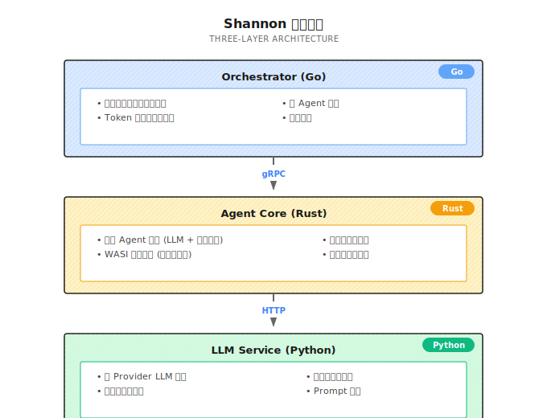

# 第 1 章：Agent 的本质

> **Agent 是能自主完成任务的 AI 系统，核心在于"自己做决定"而不是"你说一句它动一句"。**

---

你跟 ChatGPT 聊过天吗？

它很聪明，几乎什么都能答。但有个问题：**你说一句，它回一句**。你得不停地追问、引导、复制粘贴。

我第一次意识到这个问题，是想让它帮我订机票。

我说："帮我订一张明天去上海的机票。"

它回："好的，这是一些航班信息，您可以去携程预订。"

然后就没了。

说实话，这也不全怪它。

订机票是一个有“副作用”的动作：要登录、要选航班、要填乘机人、要付款、还得确认退改规则。任何一步搞错，都是你买单。

所以在没有工具、没有权限、也没有“关键步骤要我确认”的机制时，它只能给你信息，没法替你下单。

真正的 Agent 的区别也在这里：不是更会聊天，而是系统让它能**安全地做事**——能用工具、能拿到授权、关键节点会停下来问你确认、全过程可追溯。

这才是 Chatbot 和 Agent 的分水岭。

---

## 1.1 Agent 到底是什么？

### 一句话定义

Agent 就是一个**能自己干活的 AI**。

更工程一点：你给它一个目标、一个工具箱和一套边界（预算 / 权限 / 审批 / 沙箱），它在循环里推进任务，直到完成或停下。

不是你喂一句它答一句，而是你告诉它一个目标，它自己想办法完成：
- 需要查资料？它自己去查
- 需要写代码？它自己去写
- 需要调 API？它自己去调
- 中间出错了？它自己修

### 四个核心组件

听起来像科幻片？其实没那么玄乎。核心就四样东西：

```
Agent = 大脑 + 手脚 + 记忆 + 主见
       (LLM)  (Tools) (Memory) (Autonomy)
```


**大脑（LLM）**：负责思考，决定下一步干什么。这是 Agent 的核心引擎。没有 LLM，Agent 就是个死板的脚本。

**手脚（Tools）**：负责执行，比如搜索网页、读写文件、调用 API、操作浏览器。LLM 只会"想"，Tools 让它能"做"。

**记忆（Memory）**：负责记住之前发生了什么。短期记忆是当前对话的上下文，长期记忆是跨会话的知识积累。没有记忆，Agent 每次都从零开始，效率极低。

**主见（Autonomy）**：这个最关键——它得自己做决定，不是你说一步它动一步。自主性是 Agent 和普通 Chatbot 的根本区别。

补一句我自己的偏见：在生产系统里，你还需要一层“护栏（Guardrails）”。它不是 Agent 的组件，但它决定 Agent 能不能上线：预算、权限、审批、审计、沙箱。没有护栏的 Agent，迟早从“自己干活”变成“自己闯祸”。

### 与传统软件的区别

传统软件是**确定性**的：给定输入 A，必然产出 B。你写一个 `if-else`，它永远按这个逻辑走。

Agent 是**概率性**的：给定输入 A，它会"思考"该怎么做，可能产出 B，也可能产出 C。每次运行的路径可能不同。

这带来了灵活性，也带来了不确定性。生产环境中，如何控制这种不确定性，是 Agent 系统设计的核心挑战之一。

```
传统软件:  输入 → 固定逻辑 → 输出
Agent:    输入 → LLM思考 → 工具调用 → 观察结果 → 继续思考 → ... → 输出
```


---

## 1.2 一个真实的例子

假设你让 Agent 做这件事：

> "帮我研究一下字节跳动，写一份分析报告。"

### Chatbot 的做法

ChatGPT 会给你一段它训练数据里的信息，然后说："如果需要最新信息，请自行搜索。"

完了。你得自己去搜索、整理、写报告。

### Agent 的做法

一个真正的 Agent 会这样：

**第一步：任务分解**

```
用户目标: 研究字节跳动，写分析报告
子任务拆解:
├── 1. 搜索公司背景
├── 2. 查产品线和业务结构
├── 3. 分析竞争对手
├── 4. 查财务/融资信息
└── 5. 综合写报告
```

**第二步：逐个执行**

```
[执行子任务1]
思考: 需要搜索字节跳动的背景信息
行动: 调用搜索工具，query="ByteDance company background history"
观察: 返回10条结果，包含创始人、成立时间、发展历程
思考: 信息足够，存入记忆，继续下一个任务

[执行子任务2]
思考: 需要了解产品线
行动: 调用搜索工具，query="ByteDance products TikTok Douyin"
观察: 返回产品列表和市场数据
思考: 需要更多细节
行动: 再次搜索，query="ByteDance revenue breakdown by product 2024"
观察: 找到财报分析文章
...
```

**第三步：自我检查**

```
检查清单:
✓ 公司背景 - 已收集
✓ 产品线 - 已收集
✓ 竞争对手 - 已收集
✗ 财务信息 - 不够详细，需要补充
```

**第四步：综合输出**

把所有信息整理成结构化报告，交给你。

整个过程，你只说了一句话。剩下的，它自己搞定。

**这就是 Agent。**

如果你觉得“研究公司”太像咨询，我给你换个更工程味的任务：

> “打开 Shannon 仓库，找到 ReAct 循环的停止条件，并解释每个条件在防什么事故。”

Chatbot 往往会给你一堆“应该有的”答案；Agent 会真的打开文件、定位函数、把设计动机讲清楚。

---

## 1.3 Agent 的自主性等级

Agent 不是非黑即白的概念，而是一个**谱系**。我把它分成六个等级：

说明一下：下面这个 L0-L5 分级是我为了讨论方便画的一把尺子（不是学术标准）。你先用它建立直觉，后面我们会用 Shannon 的实现把每一档“落到代码上”。

| 等级 | 名称 | 你说 | 它做 | 典型例子 |
|------|------|------|------|----------|
| **L0** | Chatbot | 问一句 | 答一句 | ChatGPT 基础对话 |
| **L1** | Tool Agent | 要查天气 | 调 API 返回结果 | GPTs 的 Actions |
| **L2** | ReAct Agent | 复杂问题 | 思考→行动→观察，循环 | LangChain ReAct |
| **L3** | Planning Agent | 大任务 | 先拆解计划，再逐个执行 | 本书重点 |
| **L4** | Multi-Agent | 更大任务 | 多个 Agent 分工协作 | Shannon Supervisor |
| **L5** | Autonomous | 模糊目标 | 长期自主运行，自我迭代 | Devin, Manus |

### 各等级详解

**L0 - Chatbot**：纯对话，没有工具调用能力。你问它天气，它只能说"我无法获取实时信息"。

**L1 - Tool Agent**：能调用工具，但只是简单的"你让我查，我就查"。没有多步推理。

**L2 - ReAct Agent**：能进行多轮"思考-行动-观察"循环。这是 Agent 的入门级形态，也是下一章的重点。

**L3 - Planning Agent**：能把复杂任务拆解成子任务，制定计划，然后执行。比 L2 多了"先想后做"的能力。

**L4 - Multi-Agent**：多个专业化的 Agent 协作。比如一个负责搜索，一个负责分析，一个负责写作。这是企业级应用的主流形态。

**L5 - Autonomous**：能长期自主运行，根据环境反馈调整策略，甚至自我改进。目前还没有真正可靠的 L5 Agent，Devin 和 Manus 在这个方向探索，但还不成熟。

### 本书覆盖范围

大多数人用的是 L0-L1。本书主要教你怎么构建 **L2-L4**。

L5？说实话，**现在还没有真正可靠的 L5 Agent**。谁说有，你可以持保留态度。

---

## 1.4 Agent 能做什么，不能做什么

我见过太多人把 Agent 捧得太高，好像它能干任何事。

**不是的。**

### Agent 擅长的场景

| 场景特征 | 例子 | 为什么适合 |
|----------|------|-----------|
| **目标明确** | "帮我总结这篇文章" | 有清晰的成功标准 |
| **步骤可拆解** | "按这个流程处理数据" | 可以分解成子任务 |
| **结果可验证** | "代码能跑就行" | 能判断是否完成 |
| **信息可获取** | "查一下这个公司的信息" | 有工具可以获取数据 |
| **重复性高** | "每天早上给我发简报" | 自动化价值高 |

### Agent 不擅长的场景

| 场景特征 | 例子 | 为什么不适合 |
|----------|------|-------------|
| **开放性创意** | "帮我想个颠覆性的商业模式" | 没有明确标准，难以迭代 |
| **主观判断** | "这个设计好不好看" | 需要人类审美和价值观 |
| **复杂人际** | "帮我搞定这个客户" | 涉及情商、关系、语境 |
| **高风险决策** | "帮我决定要不要投资" | 责任归属问题 |
| **不可逆副作用** | "帮我给全公司群发邮件/删掉生产库" | 一旦做错，损失不可逆 |
| **实时物理操作** | "帮我做饭" | 需要物理机器人 |

### 选对场景是关键

选对场景，Agent 能帮你省很多时间。选错场景，它就是个**烧 Token 的机器**。

很多事情不是“不能做”，而是“必须加确认点才敢做”：付款、发布、删除、群发邮件……默认都应该是人类确认，Agent 执行。

一个简单的判断方法：

> 如果这个任务你交给一个实习生，你能用文字清楚地告诉他怎么做，那大概率适合 Agent。
> 如果你自己都说不清楚"怎么算做好了"，那 Agent 也搞不定。

---

## 1.5 Agent 的技术演进

Agent 不是凭空出现的概念。它的演进有清晰的脉络：

### 2022 年之前：规则驱动

早期的"智能助手"（如 Siri、Alexa）本质是规则引擎 + 意图识别。用户说一句话，系统识别意图，匹配预设的规则，执行对应的动作。

```
用户: "明天早上7点叫我起床"
系统: 识别意图=设置闹钟，提取参数=7:00 AM，执行=创建闹钟
```

灵活性极低，超出预设意图就无法处理。

### 2023 年：LLM 成为大脑

GPT-4 等大模型的出现改变了游戏规则。LLM 可以：
- 理解复杂、模糊的自然语言指令
- 进行多步推理
- 生成结构化的输出（如 JSON）

这让"用 LLM 驱动工具调用"成为可能。

### 2023-2024 年：ReAct 与 Function Calling

两个关键突破：

1. **ReAct 论文**（2022）：提出"Reason + Act"的循环模式，让 LLM 边思考边行动
2. **Function Calling**（2023）：OpenAI 等厂商原生支持工具调用，LLM 可以输出结构化的函数调用请求

这两者结合，Agent 开始变得实用。

### 2024-2025 年：多 Agent 与生产化

单 Agent 能力有限，多 Agent 协作成为主流。同时，企业开始关注：
- 成本控制（Token 预算）
- 安全性（沙箱执行）
- 可靠性（持久化、重试）
- 可观测性（监控、追踪）

这就是本书关注的重点：**生产级 Agent 系统**。

---

## 1.6 Shannon 架构概览

本书以 [Shannon](https://github.com/Kocoro-lab/Shannon) 作为参考实现。Shannon 是一个三层架构的多 Agent 系统：



### 为什么是三层？

| 层级 | 语言 | 职责 | 为什么选这个语言 |
|------|------|------|------------------|
| Orchestrator | Go | 编排、调度 | 并发强，适合协调多个 Agent |
| Agent Core | Rust | 执行、隔离 | 性能好，内存安全，适合边界与沙箱 |
| LLM Service | Python | 模型与工具 | 生态丰富，SDK 与工具链齐全 |

### Shannon 覆盖的 Agent 等级

| 你想做的事 | Shannon 用什么模式 | 对应等级 |
|------------|-------------------|----------|
| 简单问答 + 工具调用 | SimpleTask | L1 |
| 思考-行动循环 | ReAct | L2 |
| 复杂任务拆解 | DAG | L3 |
| 多 Agent 协作 | Supervisor | L4 |

### 不只是 Shannon

Shannon 不是唯一选择。LangGraph、CrewAI、AutoGen 都能做类似的事。但本书选 Shannon 作为参考实现，因为：

1. **生产级设计**：带 Temporal 持久化、Token 预算控制、WASI 沙箱
2. **三层分离**：职责清晰，易于理解架构
3. **开源可读**：代码量适中，适合学习

本书的目标是教你**设计模式**，不是教你用 Shannon。你完全可以用其他框架实现同样的模式。

## Shannon Lab（10 分钟上手）

本节帮你在 10 分钟内把本章概念对应到 Shannon 源码。

### 必读（1 个文件）

- [`docs/multi-agent-workflow-architecture.md`](https://github.com/Kocoro-lab/Shannon/blob/main/docs/multi-agent-workflow-architecture.md)：先看全局图，抓住 "Router/Strategy/Pattern" 三层怎么分工

### 选读深挖（2 个，按兴趣挑）

- [`orchestrator_router.go`](https://github.com/Kocoro-lab/Shannon/blob/main/go/orchestrator/internal/workflows/orchestrator_router.go)：系统怎么决定"用 React / DAG / Supervisor"
- [`wasi_sandbox.rs`](https://github.com/Kocoro-lab/Shannon/blob/main/rust/agent-core/src/wasi_sandbox.rs)：看护栏长什么样——沙箱如何隔离工具执行

---

## 1.7 常见误区

### 误区一：Agent = ChatGPT + 插件

不完全对。插件只是"工具"，Agent 的核心是**自主决策循环**。有工具不代表是 Agent，能自己决定"什么时候用什么工具"才是。

### 误区二：Agent 能替代人类

不能，至少现在不能。Agent 是**增强工具**，不是替代品。它能帮你处理重复性、结构化的任务，但需要人类设定目标、监督过程、验收结果。

### 误区三：Agent 越自主越好

不一定。自主性越高，不确定性越大。生产环境中，往往需要在"自主性"和"可控性"之间找平衡。完全自主的 Agent 可能失控；完全受控的 Agent 又失去了意义。

### 误区四：用最强的模型就能做好 Agent

模型能力只是基础。Agent 系统的质量取决于：
- 工具设计是否合理
- Prompt 是否清晰
- 错误处理是否完善
- 架构是否支持扩展

用 GPT-4 跑一个糟糕的 Prompt，不如用 GPT-3.5 跑一个精心设计的系统。

---

## 1.8 本章要点回顾

1. **Agent 定义**：能自主完成任务的 AI 系统，核心是"自己做决定"
2. **四个组件**：大脑（LLM）+ 手脚（Tools）+ 记忆（Memory）+ 主见（Autonomy）
3. **自主性等级**：L0-L5，本书聚焦 L2-L4
4. **适用场景**：目标明确、步骤可拆解、结果可验证的任务
5. **Shannon 定位**：三层架构的生产级多 Agent 系统，作为本书参考实现

### 练习（建议做完再往下读）

1. 把“帮我订机票”改写成一个可执行的 Agent 目标：必须包含**成功标准**、**需要你确认的步骤**、以及“失败了怎么办”
2. 用一句话写出你自己的 Agent 定义，然后在 Shannon 里为这句话找 3 个“证据文件”（比如路由、执行、护栏）

---

## 1.9 延伸阅读

- **ReAct 论文**：[ReAct: Synergizing Reasoning and Acting in Language Models](https://arxiv.org/abs/2210.03629) - Agent 思考-行动循环的理论基础
- **Generative Agents**：[Generative Agents: Interactive Simulacra of Human Behavior](https://arxiv.org/abs/2304.03442) - 斯坦福的 Agent 小镇实验
- **OpenAI Function Calling**：[官方文档](https://platform.openai.com/docs/guides/function-calling) - 工具调用的技术实现

---

## 下一章预告

你可能会问：Agent 怎么"自己干活"的？具体是怎么思考、行动、再思考的？

这就是下一章的内容——**ReAct 循环**。

ReAct 是 Agent 的心脏。搞懂它，你就搞懂了 Agent 最核心的运行机制。

