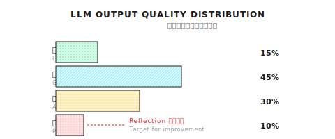

# 第 11 章：Reflection 模式

> **Reflection 不是让 Agent 变得完美，而是让它能发现自己的问题——发现问题是改进的第一步，但改进本身仍然需要护栏。**

---

## 11.1 为什么需要 Reflection？

Reflection 是一种让 Agent 自我检查、发现问题、迭代改进的模式。它的核心价值在于：**提高输出质量的下限，减少明显错误**。

LLM 单次输出的质量是不稳定的。同一个问题，问 10 次可能得到质量参差不齐的回答——有些很好，有些一般，有些明显有缺陷。Reflection 的作用是发现那些"明显有缺陷"的输出，给它一次改进的机会。

但我要先说清楚：**Reflection 不是万能药。** 它不能让烂回答变成好回答，它只能让"有明显问题"的回答变成"基本及格"。如果 LLM 本身能力不够、知识欠缺，Reflection 也救不了。

用途是什么？三个主要场景：

1. **高价值输出**：研究报告、技术文档——这些输出值得花 2 倍成本保证质量
2. **可客观评估的任务**：有明确评分标准的场景（完整性、准确性、格式规范）
3. **迭代改进**：初稿质量不够时，通过反馈引导改进

### LLM 的质量分布问题

### LLM 的单次输出质量不稳定

同一个问题，不同的随机种子可能产生差异很大的回答。我做过一个非正式实验：同一个研究问题问 10 次，质量分布大概是这样：



用户每次请求只能得到分布中的一个样本。如果恰好落在"较差"区域，体验就很差。

### Reflection 的作用

Reflection 模式的核心思想很简单：

1. 生成一个回答
2. 用另一个 LLM 调用评估这个回答的质量
3. 如果质量不达标，把评估反馈喂回去，重新生成
4. 重复，直到达标或达到最大重试次数


简单说就是：**让 Agent 学会自我检查。**

### 这不是万能药

在继续之前，我必须明确一点：Reflection 不能让一个差的回答变成好的回答。它能做的是：

1. **发现问题**：识别出回答的缺陷
2. **提供方向**：告诉重新生成时该注意什么
3. **提高概率**：增加获得好回答的概率

但它不能保证改进，也不能无限重试（成本会爆炸）。在生产环境里，Reflection 是一个"锦上添花"的优化，不是核心依赖。

---

## 11.2 Reflection 的核心组件

Reflection 模式有三个核心组件：

| 组件 | 职责 | 输出 |
|------|------|------|
| **质量评估** | 给回答打分 | Score (0.0 - 1.0) + Feedback |
| **反馈生成** | 指出具体问题 | 具体的改进建议 |
| **带反馈重生成** | 根据反馈改进 | 改进后的回答 |

### 质量评估

```go
type EvaluateResultInput struct {
    Query    string   // 原始问题
    Response string   // 待评估的回答
    Criteria []string // 评估标准
}

type EvaluateResultOutput struct {
    Score    float64 // 0.0 - 1.0
    Feedback string  // 改进建议
}
```

评估标准可以根据场景定制：

```go
// 通用标准
defaultCriteria := []string{
    "completeness",  // 是否覆盖了问题的所有方面
    "correctness",   // 信息是否准确
    "clarity",       // 表达是否清楚
}

// 研究场景
researchCriteria := []string{
    "completeness",
    "correctness",
    "clarity",
    "citation_coverage",  // 引用是否充分
    "source_quality",     // 信息源质量
}

// 代码生成场景
codeCriteria := []string{
    "correctness",    // 代码是否正确
    "efficiency",     // 效率是否合理
    "readability",    // 可读性
    "edge_cases",     // 边界情况处理
}
```

### 评估 Prompt

这是评估阶段的 Prompt 模板：

```
评估以下回答的质量。

问题: {query}
回答: {response}

评估标准：
- completeness: 是否覆盖所有方面
- correctness: 信息是否准确
- clarity: 表达是否清楚

对每个标准打分 0.0-1.0，然后给出加权平均分。
如果总分低于 0.7，给出具体改进建议。

输出 JSON:
{
  "overall_score": 0.75,
  "criteria_scores": {"completeness": 0.8, "correctness": 0.9, "clarity": 0.6},
  "feedback": "回答可以通过以下方式改进..."
}
```

---

## 11.3 Shannon 的 Reflection 实现

Shannon 的 Reflection 实现在 `patterns/reflection.go`，核心函数是 `ReflectOnResult`：

```go
type ReflectionConfig struct {
    Enabled             bool     // 是否启用
    MaxRetries          int      // 最大重试次数，通常 1-2
    ConfidenceThreshold float64  // 质量阈值，通常 0.7
    Criteria            []string // 评估标准
    TimeoutMs           int      // 超时时间
}
```

**实现参考 (Shannon)**: [`patterns/reflection.go`](https://github.com/Kocoro-lab/Shannon/blob/main/go/orchestrator/internal/workflows/patterns/reflection.go) - ReflectOnResult 函数

### 核心流程

```go
func ReflectOnResult(
    ctx workflow.Context,
    query string,
    initialResult string,
    agentResults []activities.AgentExecutionResult,
    baseContext map[string]interface{},
    config ReflectionConfig,
    opts Options,
) (string, float64, int, error) {

    finalResult := initialResult
    var totalTokens int
    var retryCount int
    var lastScore float64 = 0.5

    // 如果 Reflection 禁用，直接返回
    if !config.Enabled {
        return finalResult, lastScore, totalTokens, nil
    }

    for retryCount < config.MaxRetries {
        // 1. 评估当前结果
        evalResult := evaluateResult(ctx, query, finalResult, config.Criteria)
        lastScore = evalResult.Score

        // 2. 达标就返回
        if evalResult.Score >= config.ConfidenceThreshold {
            return finalResult, evalResult.Score, totalTokens, nil
        }

        // 3. 不达标，检查是否还能重试
        retryCount++
        if retryCount >= config.MaxRetries {
            // 达到最大重试次数，返回当前最好的结果
            return finalResult, evalResult.Score, totalTokens, nil
        }

        // 4. 构建带反馈的上下文
        reflectionContext := map[string]interface{}{
            "reflection_feedback": evalResult.Feedback,
            "previous_response":   finalResult,
            "improvement_needed":  true,
        }

        // 5. 带反馈重新生成
        improvedResult := synthesizeWithFeedback(ctx, query, reflectionContext)
        finalResult = improvedResult
        totalTokens += improvedResult.TokensUsed
    }

    return finalResult, lastScore, totalTokens, nil
}
```

### 关键设计决策

1. **MaxRetries 限制**：防止无限循环，通常设为 1-2 次
2. **ConfidenceThreshold**：0.7 是个合理起点，太高会导致频繁重试
3. **优雅降级**：如果评估或重生成失败，返回原始结果而不是报错

---

## 11.4 带反馈的重新生成

评估发现问题后，要把反馈传给重新生成的过程：

```go
// 构建带反馈的上下文
reflectionContext := map[string]interface{}{
    "reflection_feedback": "回答缺少以下内容：1) 融资历史 2) 创始团队",
    "previous_response":   previousResult,
    "improvement_needed":  true,
}
```

在 Synthesis（综合）阶段处理这个反馈：

```go
func SynthesizeWithFeedback(ctx context.Context, query string, context map[string]interface{}) string {
    var prompt strings.Builder

    // 检测是否有反馈
    if feedback, ok := context["reflection_feedback"].(string); ok && feedback != "" {
        prompt.WriteString("重要：之前的回答需要改进。\n")
        prompt.WriteString("反馈：" + feedback + "\n\n")
    }

    if prev, ok := context["previous_response"].(string); ok && prev != "" {
        prompt.WriteString("之前的回答（需要改进）：\n" + prev + "\n\n")
    }

    prompt.WriteString("请根据反馈改进回答：" + query)

    return callLLM(prompt.String())
}
```

这里有个重要的设计：**把之前的回答和反馈一起传给 LLM**。这样 LLM 可以：

1. 看到自己之前写了什么
2. 看到具体的问题在哪
3. 针对性地改进

---

## 11.5 成本权衡

Reflection 会增加 Token 消耗，这是它最大的缺点。

```
无 Reflection:
  - 输入: ~3000 tokens
  - 输出: ~5000 tokens
  - 总计: ~8000 tokens

有 Reflection (1 次迭代):
  - 初始: ~8000 tokens
  - 评估: ~1000 tokens
  - 重生成: ~8000 tokens
  - 总计: ~17000 tokens (+112%)
```

成本翻倍，所以要谨慎使用。

### 降低成本的策略

| 策略 | 说明 | 效果 |
|------|------|------|
| **只对高价值输出启用** | 研究报告用，简单问答不用 | 减少触发次数 |
| **评估用小模型** | 评估用 GPT-3.5，生成用 GPT-4 | 降低评估成本 |
| **限制重试次数** | MaxRetries = 1 通常够用 | 限制最坏情况 |
| **合理的阈值** | 0.7 而不是 0.95 | 减少不必要的重试 |

```go
// 成本敏感的配置
config := ReflectionConfig{
    Enabled:             true,
    MaxRetries:          1,        // 最多重试 1 次
    ConfidenceThreshold: 0.7,      // 合理的阈值
    Criteria:            []string{"completeness", "correctness"},
}
```

### Shannon 的做法

Shannon 在 DAG 工作流里是这样调用 Reflection 的：

```go
// 只在复杂任务且没有 synthesis subtask 时才 Reflect
if config.ReflectionEnabled &&
   shouldReflect(decomp.ComplexityScore, &config) &&
   !hasSynthesisSubtask {

    reflectionConfig := patterns.ReflectionConfig{
        Enabled:             true,
        MaxRetries:          config.ReflectionMaxRetries,
        ConfidenceThreshold: config.ReflectionConfidenceThreshold,
        Criteria:            config.ReflectionCriteria,
    }

    improvedResult, score, reflectionTokens, err := patterns.ReflectOnResult(...)
}
```

注意 `shouldReflect` 函数——不是所有任务都需要 Reflection，只有复杂度足够高的才值得花这个成本。

---

## 11.6 常见的坑

### 坑 1：阈值太高

**症状**：几乎每次都触发重试，Token 消耗很高。

**原因**：0.95 的阈值几乎不可能达到，LLM 评估自己很少给满分。

```go
// 阈值 0.95 几乎不可能达到
config := ReflectionConfig{
    ConfidenceThreshold: 0.95,
    MaxRetries:          5,  // 浪费 tokens
}

// 合理配置
config := ReflectionConfig{
    ConfidenceThreshold: 0.7,
    MaxRetries:          1,
}
```

### 坑 2：评估用贵模型

**症状**：Reflection 成本比生成成本还高。

**原因**：评估任务相对简单，用小模型就行。

```go
// 评估时指定 model_tier = "small"
// 使用 GPT-3.5 或类似的便宜模型
evalConfig := EvaluateConfig{
    ModelTier: "small",  // 不需要大模型
}
```

### 坑 3：反馈不具体

**症状**：重试后质量没有提升。

**原因**：反馈太模糊，LLM 不知道具体要改什么。

```go
// 模糊的反馈没用
feedback := "回答质量不够好，需要改进"

// 具体的反馈才有效
feedback := "回答缺少：1) 公司融资历史 2) 创始团队背景。" +
            "现有引用仅来自新闻网站，建议增加官方来源。"
```

这是评估 Prompt 设计的问题——要引导 LLM 给出具体的、可操作的反馈。

### 坑 4：Reflection 失败就报错

**症状**：偶发的评估失败导致整个任务失败。

**原因**：没有优雅降级机制。

```go
// 不好：Reflection 失败就让用户看到错误
if err != nil {
    return "", err
}

// 好：优雅降级，返回初始结果
if err != nil {
    log.Warn("Reflection failed, using initial result")
    return initialResult, nil
}
```

Reflection 是优化，不是核心功能。它失败了，用户应该拿到初始结果，而不是错误。

### 坑 5：无限循环

**症状**：评分在同一水平波动，永远达不到阈值。

**原因**：没有限制重试次数。

```go
// 危险：评分可能在同一水平波动
for score < 0.7 {
    improved = regenerate(feedback)
    score = evaluate(improved)
    // 可能永远达不到 0.7
}

// 安全：限制重试次数
for retryCount := 0; retryCount < config.MaxRetries; retryCount++ {
    if score >= config.ConfidenceThreshold {
        break
    }
    // ...
}
```

---

## 11.7 Reflection vs 其他质量保证手段

Reflection 不是唯一的质量保证手段。来看看不同方法的对比：

| 方法 | 成本 | 延迟 | 适用场景 |
|------|------|------|----------|
| **Reflection** | 高（2x+ tokens） | 高（2x+ 时间） | 高价值输出、报告生成 |
| **Self-Consistency** | 很高（3x+ tokens） | 高（并行或串行多次） | 数学推理、确定性答案 |
| **Human Review** | 人力成本 | 很高（等人） | 关键决策、合规要求 |
| **单次生成** | 最低 | 最低 | 简单任务、实时对话 |

### Self-Consistency 简介

Self-Consistency 是另一种质量保证方法：生成多个回答，然后投票选出最一致的那个。

```
生成 5 个回答：
  回答 1: 答案是 A
  回答 2: 答案是 A
  回答 3: 答案是 B
  回答 4: 答案是 A
  回答 5: 答案是 A

投票结果：A 获得 4 票，采用 A
```

适合有确定性答案的场景（数学题、逻辑推理），但不适合开放式生成（每个回答都不一样，没法投票）。

### 什么时候用 Reflection？

| 场景 | 用 Reflection？ | 原因 |
|------|---------------|------|
| 简单问答 | 否 | 成本不值 |
| 代码补全 | 否 | 可以直接运行测试 |
| 研究报告 | 是 | 输出价值高 |
| 文档生成 | 是 | 质量要求高 |
| 创意写作 | 视情况 | 可能有帮助，但主观性强 |
| 实时对话 | 否 | 延迟敏感 |

**经验法则**：

- 输出价值高 → 用
- 有客观评估标准 → 用
- 简单任务 → 不用
- 延迟敏感 → 不用
- 成本敏感 → 谨慎用

---

## 11.8 其他框架怎么做？

Reflection 是通用模式，各家都有实现：

| 框架 | 实现方式 | 特点 |
|------|----------|------|
| **LangGraph** | Reflection 节点 | 可视化，易于调试 |
| **Reflexion** | 论文实现 | 学术研究，强调语言反馈 |
| **Self-Refine** | 迭代改进 | 自我批评 + 改进循环 |
| **Constitutional AI** | 原则驱动 | Anthropic 的方法，强调安全 |

核心逻辑都一样：评估 → 反馈 → 重试。

差别在于：
- 评估的维度（质量、安全、格式）
- 反馈的粒度（模糊 vs 具体）
- 终止条件（阈值、次数、时间）

---

## 11.9 高级话题：评估的评估

这是一个有点 meta 的问题：我们怎么知道评估本身是准确的？

LLM 评估 LLM 的输出，这里面有几个问题：

1. **评估者偏见**：评估模型可能有自己的偏好
2. **评分校准**：不同模型的评分尺度不一样
3. **过度自信**：LLM 倾向于给自己的输出高分

### 缓解方法

```go
// 方法 1：使用不同模型评估
// 用 Claude 评估 GPT-4 的输出，或反过来
evalConfig := EvaluateConfig{
    Provider: "anthropic",  // 生成用 OpenAI，评估用 Anthropic
}

// 方法 2：加入确定性规则
if len(response) < 500 && evalResult.Score > 0.8 {
    // 太短的回答不应该得高分
    evalResult.Score = 0.5
    evalResult.Confidence = "low"
}

// 方法 3：多评估者投票（成本高）
scores := []float64{
    evaluate(response, "model_a"),
    evaluate(response, "model_b"),
    evaluate(response, "model_c"),
}
finalScore := average(scores)
```

在实践中，方法 2（确定性规则）最常用，因为成本可控。

---

## 划重点

1. **Reflection 核心**：评估输出 → 生成反馈 → 带反馈重试
2. **成本权衡**：Token 消耗翻倍，只对高价值输出启用
3. **关键配置**：MaxRetries = 1-2，ConfidenceThreshold = 0.7
4. **优雅降级**：Reflection 失败时返回原始结果，不报错
5. **具体反馈**：模糊反馈没用，要告诉 LLM 具体改什么

---

## Shannon Lab（10 分钟上手）

本节帮你在 10 分钟内把本章概念对应到 Shannon 源码。

### 必读（1 个文件）

- [`patterns/reflection.go`](https://github.com/Kocoro-lab/Shannon/blob/main/go/orchestrator/internal/workflows/patterns/reflection.go)：找 `ReflectOnResult` 函数，看它怎么循环检查重试次数、评估结果判断置信度、构建 `reflectionContext` 注入反馈

### 选读深挖（2 个，按兴趣挑）

- [`patterns/options.go`](https://github.com/Kocoro-lab/Shannon/blob/main/go/orchestrator/internal/workflows/patterns/options.go)：看 `ReflectionConfig` 结构，理解每个字段的作用
- [`strategies/dag.go`](https://github.com/Kocoro-lab/Shannon/blob/main/go/orchestrator/internal/workflows/strategies/dag.go)：搜索 `ReflectOnResult` 调用点，看 DAG 工作流怎么决定"要不要 Reflect"

---

## 练习

### 练习 1：设计评估标准

为以下场景设计评估标准（Criteria）：

1. **技术文档生成**：给开发者写 API 文档
2. **客服回复**：回答用户的产品问题
3. **竞争分析**：研究竞争对手的产品策略

每个场景列出 3-5 个评估维度，并解释为什么选这些维度。

### 练习 2：源码阅读

读 `patterns/reflection.go` 里的 `ReflectOnResult` 函数：

1. 如果 `config.Enabled = false`，会发生什么？
2. 如果评估活动失败（返回 error），函数怎么处理？
3. `totalTokens` 是怎么累积的？包含哪些调用的 token？

### 练习 3（进阶）：设计确定性护栏

为 Reflection 评估设计 3 个确定性护栏规则：

- 规则 1：防止"短回答高分"（回答太短不应该得高分）
- 规则 2：防止"无来源高分"（研究报告没有引用不应该得高分）
- 规则 3：防止"格式错误高分"（JSON 格式错误不应该得高分）

写出每个规则的伪代码。

---

## 想深入？

- [Self-Refine: Iterative Refinement with Self-Feedback](https://arxiv.org/abs/2303.17651) - 自我改进的原始论文
- [Reflexion: Language Agents with Verbal Reinforcement Learning](https://arxiv.org/abs/2303.11366) - 用语言反馈做强化学习
- [Constitutional AI](https://arxiv.org/abs/2212.08073) - Anthropic 的安全对齐方法，用原则驱动的自我批评

---

## 下一章预告

到这里，Agent 已经会规划、会执行、会反思了。但还有一个问题：它是怎么"推理"的？

你有没有发现，LLM 有时候会"跳步"？直接给你一个答案，但你不知道它是怎么想的。

下一章我们来聊 **Chain-of-Thought (CoT)**：怎么让 LLM 把推理过程外显出来，一步一步思考，减少跳跃性错误。

下一章见。
