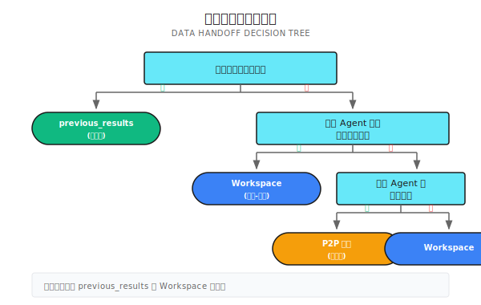

# 第 16 章：Handoff 机制

> **Handoff 让 Agent 之间能精确传递数据和状态——从简单的上下文注入到复杂的 P2P 消息协议，选择合适的机制比追求功能完整更重要。**

> **注意**：Handoff 机制需要根据实际协作复杂度选择。简单链式依赖用上下文注入就够了，不要为了"架构完整"而引入不必要的 Workspace 或 P2P 消息系统。

---

> **⏱️ 快速通道**（5 分钟掌握核心）
>
> 1. 三层交接：previous_results（简单）→ Workspace（共享）→ P2P（协商）
> 2. Plan IO 声明 Produces/Consumes，让编排器理解数据依赖
> 3. 依赖等待用增量超时检查，平衡响应速度与资源消耗
> 4. 向工作空间写数据时用 workflow.Now() 保证确定性
> 5. 大部分场景用前两层就够，P2P 是给真正需要双向通信的场景
>
> **10 分钟路径**：16.1-16.3 → 16.5 → Shannon Lab

---

## 开篇场景：财报分析的数据流动

你让 Agent A 搜集特斯拉的财报数据，Agent B 基于这些数据计算增长率，Agent C 计算利润率，最后 Agent D 综合分析三者的结果。

问题来了：
- B 怎么拿到 A 的结果？
- C 和 B 能不能并行跑？
- D 怎么知道 B 和 C 都完成了？

简单场景下，把 A 的输出塞进 B 的上下文就行。但如果是更复杂的多 Agent 协作——数据在多个 Agent 之间流转，有些还需要等待、有些要并行、有些要相互协商——你需要一套系统化的交接机制。

**Handoff 就是解决这个问题的——让 Agent 之间能精确可靠地传递数据和状态。**

---

## 16.1 三种交接方式

从简单到复杂，有三个层次：

| 层次 | 机制 | 适用场景 | 复杂度 |
|------|------|----------|--------|
| 依赖注入 | `previous_results` 上下文 | 简单链式依赖 | 低 |
| 工作空间 | `Workspace` + `Topic` | 主题驱动的数据共享 | 中 |
| P2P 消息 | `Mailbox` + 协议 | 复杂 Agent 间协调 | 高 |

大部分场景用前两种就够了。P2P 消息是给真正复杂的协调场景准备的——比如 Agent 之间需要协商、竞标、或者动态委托任务。

### 选择原则



---

## 16.2 Plan IO：声明数据流

在任务分解阶段，可以声明每个子任务「产出什么」和「需要什么」。这让编排器能理解数据流向，做出正确的调度决策。

### 数据结构与示例

```go
// Subtask 定义了任务的数据流依赖
type Subtask struct {
    ID           string
    Description  string
    Dependencies []string  // 任务级依赖：必须等待的前置任务（如 "必须等 A 跑完再跑 B"）
    Produces     []string  // 产出的数据主题
    Consumes     []string  // 需要的数据主题（如 "B 需要 A 产出的数据"）
}

// 示例：财报分析任务分解
// fetch_data: produces=["financial_data"], consumes=[]
// calc_growth: produces=["growth_metrics"], consumes=["financial_data"], dependencies=["fetch_data"]
// calc_margin: produces=["margin_metrics"], consumes=["financial_data"], dependencies=["fetch_data"]
// synthesis:   produces=[], consumes=["growth_metrics","margin_metrics"], dependencies=["calc_growth","calc_margin"]
```

**Dependencies vs Consumes**：通常两者一起用，但也有分开的场景。比如：A 产出数据后，B 和 C 可以并行消费（无顺序依赖），但都依赖 A 的数据（有数据依赖）。

### 数据流图


编排器看到这个 Plan 就知道：
1. `fetch_data` 可以立即执行
2. `calc_growth` 和 `calc_margin` 可以并行，都等 `fetch_data` 完成
3. `synthesis` 等前两者都完成

---

## 16.3 前序结果注入（最简单的 Handoff）

最直接的交接方式：把前面 Agent 的结果直接塞进后续 Agent 的上下文。

### 代码参考

以下代码展示了 Shannon 中如何实现前序结果注入。核心设计点：自动提取数值结果，方便后续计算任务。

```go
// 构建前序结果
if len(childResults) > 0 {
    previousResults := make(map[string]interface{})
    for j, prevResult := range childResults {
        if j < i {
            resultMap := map[string]interface{}{
                "response":      prevResult.Response,
                "tokens":        prevResult.TokensUsed,
                "success":       prevResult.Success,
                "tools_used":    prevResult.ToolsUsed,
            }

            // 自动提取数值结果（方便计算类任务）
            if numVal, ok := ParseNumericValue(prevResult.Response); ok {
                resultMap["numeric_value"] = numVal
            }

            previousResults[decomp.Subtasks[j].ID] = resultMap
        }
    }
    childCtx["previous_results"] = previousResults
}
```

### Agent 收到的上下文

```json
{
  "role": "analyst",
  "task_id": "synthesis",
  "previous_results": {
    "fetch_data": {
      "response": "特斯拉 2024 年收入 1234 亿美元，净利润 89 亿美元...",
      "tokens": 500,
      "success": true
    },
    "calc_growth": {
      "response": "收入增长率为 15.3%",
      "tokens": 200,
      "success": true,
      "numeric_value": 15.3
    },
    "calc_margin": {
      "response": "净利润率为 7.2%",
      "tokens": 180,
      "success": true,
      "numeric_value": 7.2
    }
  }
}
```

后续 Agent 可以直接用 `previous_results` 中的数据。`numeric_value` 字段特别有用——计算类任务可以直接拿到数字，不需要再解析文本。

### 适用场景

| 场景 | 是否适合 | 原因 |
|------|----------|------|
| 线性链式任务 | 适合 | A → B → C，数据流向清晰 |
| 扇出并行 | 适合 | A → [B, C, D]，B/C/D 都能拿到 A 的结果 |
| 扇入汇聚 | 适合 | [A, B, C] → D，D 能拿到所有前序结果 |
| 动态数据共享 | 不适合 | 任务运行中产生新数据需要共享 |
| Agent 间协商 | 不适合 | 需要双向通信 |

---

## 16.4 工作空间系统（Workspace）

当数据流更复杂时——比如多个 Agent 产出数据、多个 Agent 消费数据、或者需要在任务运行中动态共享数据——用工作空间。

### 核心概念

工作空间是一个基于 Redis 的发布-订阅系统：
- **Topic（主题）**：数据的逻辑分类，如 `financial_data`、`growth_metrics`
- **Entry（条目）**：写入主题的一条数据
- **Seq（序列号）**：全局递增，用于增量读取


### 读写操作

以下代码来自 Shannon 的 `p2p.go`，展示了工作空间的读写实现：

```go
// ========== 写入数据 ==========
type WorkspaceAppendInput struct {
    WorkflowID string
    Topic      string                 // 主题名称
    Entry      map[string]interface{} // 数据条目（限制 1MB）
    Timestamp  time.Time              // 工作流时间戳（确保确定性重放）
}

func (a *Activities) WorkspaceAppend(ctx context.Context, in WorkspaceAppendInput) (WorkspaceAppendResult, error) {
    rc := a.sessionManager.RedisWrapper().GetClient()

    // 全局序列号（跨主题递增）
    seqKey := fmt.Sprintf("wf:%s:ws:seq", in.WorkflowID)
    seq := rc.Incr(ctx, seqKey).Val()

    // 写入主题列表，设置 48 小时 TTL
    listKey := fmt.Sprintf("wf:%s:ws:%s", in.WorkflowID, in.Topic)
    entry := map[string]interface{}{"seq": seq, "topic": in.Topic, "entry": in.Entry, "ts": in.Timestamp.UnixNano()}
    rc.RPush(ctx, listKey, mustMarshal(entry))
    rc.Expire(ctx, listKey, 48*time.Hour)

    return WorkspaceAppendResult{Seq: uint64(seq)}, nil
}

// ========== 读取数据（支持增量） ==========
type WorkspaceListInput struct {
    WorkflowID string
    Topic      string
    SinceSeq   uint64  // 只返回此序列号之后的条目（支持增量读取）
    Limit      int64   // 默认 200
}

func (a *Activities) WorkspaceList(ctx context.Context, in WorkspaceListInput) ([]WorkspaceEntry, error) {
    rc := a.sessionManager.RedisWrapper().GetClient()
    vals, _ := rc.LRange(ctx, fmt.Sprintf("wf:%s:ws:%s", in.WorkflowID, in.Topic), -in.Limit, -1).Result()

    out := make([]WorkspaceEntry, 0)
    for _, v := range vals {
        var e WorkspaceEntry
        if json.Unmarshal([]byte(v), &e) == nil && e.Seq > in.SinceSeq {
            out = append(out, e)  // 增量过滤
        }
    }
    return out, nil
}
```

### SinceSeq 的作用

`SinceSeq` 支持增量读取——Agent 只获取它上次读取之后的新数据：

```
时间线：
  T1: Agent A 写入 seq=1
  T2: Agent B 读取 (SinceSeq=0) → 得到 seq=1
  T3: Agent A 写入 seq=2
  T4: Agent B 读取 (SinceSeq=1) → 只得到 seq=2（增量）
```

这对长时间运行的协作很有用——Agent 可以持续轮询新数据，而不是每次都拿全量。

---

## 16.5 P2P 依赖同步

当 Agent B 需要等待 Agent A 的数据时，用 **指数退避轮询**。

### 为什么不用固定间隔？

| 策略 | 问题 |
|------|------|
| 固定 1 秒 | 高频轮询产生大量无效查询，浪费资源 |
| 固定 30 秒 | 响应慢，用户等待时间长 |
| 事件驱动 | 需要额外的消息队列，增加复杂度 |

**指数退避是折中方案**：开始快速检查，逐渐放慢，既不浪费资源，又能在数据就绪后较快响应。

### 实现代码

以下代码展示了 Shannon 中 Hybrid 执行模式的依赖等待逻辑：

```go
// waitForDependencies 等待所有依赖完成，使用增量超时
func waitForDependencies(
    ctx workflow.Context,
    dependencies []string,
    completedTasks map[string]bool,
    timeout time.Duration,
    checkInterval time.Duration,
) bool {
    logger := workflow.GetLogger(ctx)

    // 默认检查间隔：30 秒
    if checkInterval == 0 {
        checkInterval = 30 * time.Second
    }

    startTime := workflow.Now(ctx)
    deadline := startTime.Add(timeout)

    for workflow.Now(ctx).Before(deadline) {
        // 计算等待时间：取检查间隔和剩余时间的较小值
        remaining := deadline.Sub(workflow.Now(ctx))
        waitTime := checkInterval
        if remaining < waitTime {
            waitTime = remaining
        }

        // Temporal 的 AwaitWithTimeout：等待条件满足或超时
        ok, err := workflow.AwaitWithTimeout(ctx, waitTime, func() bool {
            for _, depID := range dependencies {
                if !completedTasks[depID] {
                    return false
                }
            }
            return true
        })

        if err != nil {
            logger.Debug("Context cancelled during dependency wait")
            return false
        }

        if ok {
            return true  // 依赖满足
        }

        // 继续下一轮检查
        logger.Debug("Dependency check iteration",
            "dependencies", dependencies,
            "elapsed", workflow.Now(ctx).Sub(startTime),
        )
    }

    logger.Warn("Dependency wait timeout", "dependencies", dependencies)
    return false
}
```

### 退避时间序列

Shannon 的实现使用固定间隔（30 秒），但经典的指数退避是这样的：

```
尝试 1: 等待 1 秒
尝试 2: 等待 2 秒
尝试 3: 等待 4 秒
尝试 4: 等待 8 秒
尝试 5: 等待 16 秒
尝试 6+: 等待 30 秒（上限）

总等待时间（6 分钟超时）：
  快速检查期（前 30 秒）：约 5 次
  稳定期（剩余 5.5 分钟）：约 11 次
```

### 产出数据

Agent 完成后，把结果写入工作空间供其他 Agent 消费：

```go
// 产出结果到工作空间
if len(subtask.Produces) > 0 {
    for _, topic := range subtask.Produces {
        WorkspaceAppend(ctx, WorkspaceAppendInput{
            WorkflowID: workflowID,
            Topic:      topic,
            Entry: map[string]interface{}{
                "subtask_id": subtask.ID,
                "summary":    result.Response,
            },
            Timestamp: workflow.Now(ctx),
        })

        // 通知等待此主题的 Agent（非阻塞通道）
        if ch, ok := topicChans[topic]; ok {
            select {
            case ch <- true:
            default:  // 通道已满或无人监听，跳过
            }
        }
    }
}
```

---

## 16.6 P2P 消息系统

有时候 Agent 之间需要更灵活的通信，不只是「等数据」。比如：
- 任务请求："谁能处理这个数据分析？"
- 提议响应："我可以，预计 2 分钟完成"
- 接受确认："好，交给你了"

### P2P 消息系统实现

以下代码来自 Shannon 的 `p2p.go`，展示了 Agent 间消息发送和协商协议：

```go
// ========== 消息类型定义 ==========
type MessageType string
const (
    MessageTypeRequest    MessageType = "request"     // 任务请求
    MessageTypeOffer      MessageType = "offer"       // 提议响应
    MessageTypeAccept     MessageType = "accept"      // 接受确认
    MessageTypeDelegation MessageType = "delegation"  // 委托
    MessageTypeInfo       MessageType = "info"        // 信息通知
)

// ========== 消息发送 ==========
type SendAgentMessageInput struct {
    WorkflowID string
    From, To   string              // 发送者/接收者 Agent ID
    Type       MessageType
    Payload    map[string]interface{}  // 限制 1MB
    Timestamp  time.Time               // 工作流时间戳
}

func (a *Activities) SendAgentMessage(ctx context.Context, in SendAgentMessageInput) (SendAgentMessageResult, error) {
    rc := a.sessionManager.RedisWrapper().GetClient()

    // 接收者的消息队列（邮箱）
    listKey := fmt.Sprintf("wf:%s:mbox:%s:msgs", in.WorkflowID, in.To)
    seq := rc.Incr(ctx, fmt.Sprintf("wf:%s:mbox:%s:seq", in.WorkflowID, in.To)).Val()

    msg := map[string]interface{}{"seq": seq, "from": in.From, "to": in.To, "type": string(in.Type), "payload": in.Payload}
    rc.RPush(ctx, listKey, mustMarshal(msg))
    rc.Expire(ctx, listKey, 48*time.Hour)

    return SendAgentMessageResult{Seq: uint64(seq)}, nil
}

// ========== 任务协商协议（进阶示例） ==========
type TaskRequest struct {  // Supervisor 广播请求
    TaskID, Description string
    Skills              []string  // 需要的技能
}
type TaskOffer struct {    // Agent 响应提议
    RequestID, AgentID string
    Confidence         float64   // 完成置信度
}
type TaskAccept struct {   // Supervisor 确认委派
    RequestID, AgentID string
}
```

### 协商流程图


### 何时用 P2P 消息？

| 场景 | 用 Workspace | 用 P2P 消息 |
|------|--------------|-------------|
| 数据共享 | 适合 | 过度设计 |
| 等待依赖 | 适合 | 过度设计 |
| 任务协商 | 不适合 | 适合 |
| 动态委托 | 不适合 | 适合 |
| 状态同步 | 视情况 | 视情况 |

**大部分场景用不到 P2P 消息**。只有当 Agent 需要双向交互（不只是数据流动）时才考虑。

---

## 16.7 Hybrid 执行与依赖传递

Shannon 的 Hybrid 执行模式结合了并行和依赖管理，自动处理数据交接。

### HybridConfig 与依赖结果传递

```go
type HybridConfig struct {
    MaxConcurrency          int           // 最大并发
    DependencyWaitTimeout   time.Duration // 依赖等待超时
    DependencyCheckInterval time.Duration // 检查间隔（默认 30s）
    PassDependencyResults   bool          // 是否传递依赖结果
}

// 当 PassDependencyResults=true 时，自动注入依赖任务结果
if config.PassDependencyResults && len(task.Dependencies) > 0 {
    depResults := make(map[string]interface{})
    for _, depID := range task.Dependencies {
        if result, ok := taskResults[depID]; ok {
            depResults[depID] = map[string]interface{}{
                "response": result.Response, "tokens": result.TokensUsed, "success": result.Success,
            }
        }
    }
    taskContext["dependency_results"] = depResults
}
// 后续任务收到：{"dependency_results": {"calc_growth": {"response": "...", "tokens": 200}}}
```

---

## 16.8 生产者集合验证

一个容易出问题的地方：Agent 声明要消费某个主题，但没有任何 Agent 产出这个主题。

### 问题场景

```json
{
  "subtasks": [
    {"id": "A", "produces": ["data_a"]},
    {"id": "B", "consumes": ["missing_data"]}  // 没人产出这个！
  ]
}
```

如果不检查，B 会无限等待 `missing_data`，最终超时失败。

### 解决方案：数据流验证

预先构建生产者集合，在任务分解阶段就做验证，避免运行时才发现问题：

```go
func ValidateDataFlow(subtasks []Subtask) error {
    // 方案 A：运行时检查（宽松）—— 跳过不存在的主题
    producesSet := make(map[string]struct{})
    for _, s := range subtasks {
        for _, t := range s.Produces {
            producesSet[t] = struct{}{}
        }
    }
    // 等待时：if _, ok := producesSet[topic]; !ok { logger.Warn("跳过"); continue }

    // 方案 B：启动前验证（严格）—— 有问题直接报错
    consumesSet := make(map[string][]string)  // topic -> consumer IDs
    for _, s := range subtasks {
        for _, t := range s.Consumes {
            consumesSet[t] = append(consumesSet[t], s.ID)
        }
    }
    var errs []string
    for topic, consumers := range consumesSet {
        if _, ok := producesSet[topic]; !ok {
            errs = append(errs, fmt.Sprintf("Topic '%s' consumed by [%s] but no producer", topic, strings.Join(consumers, ", ")))
        }
    }
    if len(errs) > 0 {
        return fmt.Errorf("data flow validation failed:\n%s", strings.Join(errs, "\n"))
    }
    return nil
}
```

---

## 16.9 常见的坑

### 常见问题与解决方案

```go
// ========== 坑 1：循环依赖（A 等 B，B 等 A）==========
// 解决：用 Kahn 算法检测循环
func DetectCycle(subtasks []Subtask) error {
    inDegree := make(map[string]int)
    for _, s := range subtasks {
        for _, dep := range s.Dependencies { inDegree[dep]++ }
    }
    queue := []string{}
    for _, s := range subtasks {
        if inDegree[s.ID] == 0 { queue = append(queue, s.ID) }
    }
    // 拓扑排序，如果 visited != len(subtasks) 则有环
    // ...
}

// ========== 坑 2：主题名称不一致（大小写敏感）==========
// 解决：规范化主题名称
func NormalizeTopic(topic string) string {
    return strings.ReplaceAll(strings.ToLower(strings.TrimSpace(topic)), " ", "_")
}

// ========== 坑 3：条目太大（超过 1MB）==========
// 错误：Entry: map[string]interface{}{"full_report": veryLongReport}
// 正确：存 S3，只传引用
// Entry: map[string]interface{}{"report_ref": "s3://bucket/reports/12345.json"}

// ========== 坑 4：非确定性时间戳 ==========
// 错误：time.Now().UnixNano()          // 破坏 Temporal 确定性重放
// 正确：workflow.Now(ctx).UnixNano()   // 确定性

// ========== 坑 5：忘记设置超时 ==========
// 解决：总是设置超时
deadline := workflow.Now(ctx).Add(6 * time.Minute)
for workflow.Now(ctx).Before(deadline) {
    if checkDependency() { break }
    workflow.Sleep(ctx, 30*time.Second)
}
```

---

## 16.10 配置

P2P 协调通过配置控制：

```yaml
# config/shannon.yaml
workflows:
  p2p:
    enabled: true          # 默认关闭（大部分场景不需要）
    timeout_seconds: 360   # 超时要合理：太短易失败，太长浪费
  hybrid:
    dependency_timeout: 360
    max_concurrency: 5
    pass_dependency_results: true
  sequential:
    pass_results: true
    extract_numeric: true  # 自动提取数值，方便计算类任务
```

**配置原则**：根据实际需求开启功能，不要"全都要"。

---

## 16.11 框架对比

| 特性 | Shannon | LangGraph | AutoGen | CrewAI |
|------|---------|-----------|---------|--------|
| 依赖注入 | `previous_results` | State 传递 | Message History | Task Context |
| 主题工作空间 | Redis Pub/Sub | 无内置 | 无内置 | 无内置 |
| P2P 消息 | Mailbox 系统 | Channel | GroupChat | 无内置 |
| 依赖等待 | AwaitWithTimeout | 手动实现 | 手动实现 | Sequential 模式 |
| 数据大小限制 | 1MB | 无限制 | 无限制 | 无限制 |
| 确定性时间戳 | workflow.Now | 无 | 无 | 无 |

**选择建议**：
- **简单场景**：任何框架都够用，选熟悉的
- **复杂数据流**：Shannon 的 Workspace 系统最完整
- **Agent 协商**：Shannon 的 P2P 消息或 AutoGen 的 GroupChat
- **生产级可靠性**：Shannon + Temporal 提供最强的保证

---

## 小结

1. **三层机制**：previous_results（简单）→ Workspace（中等）→ P2P 消息（复杂），按需选择
2. **Plan IO**：通过 Produces/Consumes 声明数据流，让编排器理解依赖关系
3. **指数退避**：依赖等待使用指数退避或固定间隔轮询，平衡响应速度和资源消耗
4. **生产者验证**：预先检查数据流完整性，避免等待不存在的主题
5. **确定性原则**：使用 workflow.Now() 而非 time.Now()，保证 Temporal 重放正确性

---

## Shannon Lab（10 分钟上手）

本节帮你在 10 分钟内把本章概念对应到 Shannon 源码。

### 必读（1 个文件）

- [`execution/hybrid.go`](https://github.com/Kocoro-lab/Shannon/blob/main/go/orchestrator/internal/workflows/patterns/execution/hybrid.go)：看 `ExecuteHybrid` 函数，理解 `waitForDependencies` 如何实现依赖等待、`PassDependencyResults` 如何传递结果、并发控制使用 Semaphore 而非 Mutex

### 选读深挖（2 个，按兴趣挑）

- [`activities/p2p.go`](https://github.com/Kocoro-lab/Shannon/blob/main/go/orchestrator/internal/activities/p2p.go)：看 SendAgentMessage、WorkspaceAppend 函数，理解 Redis 数据结构设计（List + 全局序列号）和 TTL 设置
- [`strategies/dag.go`](https://github.com/Kocoro-lab/Shannon/blob/main/go/orchestrator/internal/workflows/strategies/dag.go)：看 DAGWorkflow，理解如何根据 `ExecutionStrategy` 选择执行模式、如何检测是否有依赖

---

## 练习

### 练习 1：设计数据流

场景：用户问"比较苹果和微软的 2024 年财务表现"

设计 Plan，包含：
- 哪些子任务？
- 每个任务的 Produces/Consumes？
- 哪些可以并行？

提示：考虑数据获取、指标计算、对比分析三个阶段。

### 练习 2：实现循环检测

用 Go 或你熟悉的语言实现：
1. 从 JSON Plan 解析子任务列表
2. 构建依赖图
3. 检测是否有循环依赖

测试用例：
```json
// 无循环
[{"id": "A", "dependencies": []}, {"id": "B", "dependencies": ["A"]}]

// 有循环
[{"id": "A", "dependencies": ["B"]}, {"id": "B", "dependencies": ["A"]}]
```

### 练习 3：设计工作空间 Schema

为"竞品分析"场景设计 Workspace Topic 结构：
- 哪些数据主题？
- 每个主题的 Entry 结构？
- 如何支持增量更新？

提示：考虑竞品列表、各竞品详情、对比矩阵、最终报告等。

---

## 想深入？

- [Redis Pub/Sub](https://redis.io/topics/pubsub) - Workspace 底层实现
- [Temporal Signals & Queries](https://docs.temporal.io/develop/go/message-passing) - P2P 消息的工作流层实现
- [DAG Scheduling Algorithms](https://en.wikipedia.org/wiki/Directed_acyclic_graph) - 依赖调度的理论基础
- [Contract Net Protocol](https://en.wikipedia.org/wiki/Contract_Net_Protocol) - 任务协商协议的学术背景

---

## Part 5 总结

四章内容，完整学习了多 Agent 编排：

| 章节 | 核心概念 | Shannon 对应 |
|------|----------|--------------|
| Ch13 编排基础 | Orchestrator 四职责、路由决策 | orchestrator_router.go |
| Ch14 DAG 工作流 | Parallel/Sequential/Hybrid 三种模式 | strategies/dag.go |
| Ch15 Supervisor | 邮箱系统、动态团队、智能容错 | supervisor_workflow.go |
| Ch16 Handoff | 数据流声明、工作空间、P2P 协调 | activities/p2p.go |

这四个组件一起工作：

```
用户请求
    │
    ▼
┌─────────────────┐
│   Orchestrator  │  ← 路由决策：选择执行模式
└────────┬────────┘
         │
    ┌────┴────┐
    ▼         ▼
┌───────┐  ┌──────────┐
│  DAG  │  │Supervisor│  ← 执行引擎
└───┬───┘  └────┬─────┘
    │           │
    └─────┬─────┘
          ▼
    ┌──────────┐
    │ Handoff  │  ← 任务交接：数据流转
    └──────────┘
          │
          ▼
    ┌──────────┐
    │ Synthesis│  ← 结果综合
    └──────────┘
```

---

## 下一章预告

Part 6 进入**高级推理模式**：

- **第 17 章：Tree-of-Thoughts**——当线性思考不够时，如何探索多个推理路径
- **第 18 章：Debate 模式**——让 Agent 互相挑战，通过辩论提升答案质量
- **第 19 章：Research Synthesis**——如何综合多源信息，生成高质量研究报告

从"多 Agent 做事"进阶到"多 Agent 思考"。

