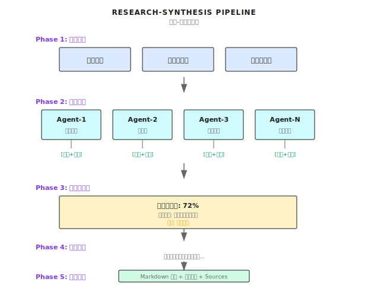

# 第 19 章：Research Synthesis

> **Research Synthesis 把多源并行研究、覆盖率评估、迭代补充整合成高质量的综合报告——关键不是"搜完就算"，而是"评估信息够不够、缺什么、补什么"。**

---

> **⏱️ 快速通道**（5 分钟掌握核心）
>
> 1. 系统研究 vs 简单搜索：多源并行 + 覆盖评估 + 迭代补充
> 2. 五阶段流程：规划 → 并行研究 → 覆盖评估 → 迭代补充 → 综合报告
> 3. 覆盖率阈值：低于 80% 继续迭代，最多 3 轮防止无限循环
> 4. 交叉验证：同一事实多源确认，冲突时标注置信度
> 5. 输出标准：结构化 Markdown + 内联引用 + Sources 列表
>
> **10 分钟路径**：19.1-19.3 → 19.5 → Shannon Lab

---

你让 Agent 研究一家公司：

> "帮我研究一下 Anthropic，写一份分析报告。"

它搜索了一下，返回前 3 个结果的摘要：

```
Anthropic 是一家 AI 安全公司，由前 OpenAI 成员创立...
主要产品是 Claude...
最近完成了一轮融资...
```

这够吗？

**不够。**

问题不是"搜到了"，而是：
- 信息不全面（产品线？团队？竞争对手？）
- 没有交叉验证（融资金额各家报道不一样）
- 缺少结构化组织（一堆碎片，不是报告）
- 无法识别信息缺口（不知道还缺什么）

我第一次意识到这个问题的严重性，是在帮一个投资机构做尽调。Agent 给出的"研究报告"看起来挺像样，但仔细一看，很多关键信息都是"据报道"、"有消息称"——没有实锤。

**Research Synthesis 就是把"简单搜索"升级为"系统研究"——并行调研多个维度、评估信息覆盖率、识别缺口并补充、最后综合成结构化报告。**

这是 ToT、Debate 等模式的实战应用场景——真正把高级推理用到生产中。

---

## 19.1 简单搜索 vs 系统研究

先看区别：

| 维度 | 简单搜索 | 系统研究 |
|------|----------|----------|
| **信息来源** | 搜索前 3 个结果 | 多源并行（官网、新闻、财报、社交...）|
| **覆盖评估** | 搜完就算 | 评估覆盖率，识别缺口 |
| **信息验证** | 直接用 | 交叉验证，标注置信度 |
| **迭代补充** | 无 | 针对缺口定向搜索 |
| **输出格式** | 碎片摘要 | 结构化报告 + 引用 |

系统研究的完整流程：



---

## 19.2 覆盖率评估：这是核心

这是 Research Synthesis 最关键的设计——不是"搜完就算"，而是"评估信息够不够"。

### 数据结构

Shannon 的覆盖率评估定义在 [`activities/coverage_evaluator.go`](https://github.com/Kocoro-lab/Shannon/blob/main/go/orchestrator/internal/activities/coverage_evaluator.go)：

```go
type CoverageEvaluationInput struct {
    Query               string              // 研究问题
    ResearchDimensions  []ResearchDimension // 研究维度
    CurrentSynthesis    string              // 当前综合结果
    CoveredAreas        []string            // 已覆盖领域
    KeyFindings         []string            // 关键发现
    Iteration           int                 // 当前迭代次数
    MaxIterations       int                 // 最大迭代次数
}

type CoverageEvaluationResult struct {
    OverallCoverage    float64            // 总体覆盖率 0.0-1.0
    DimensionCoverage  map[string]float64 // 各维度覆盖率
    CriticalGaps       []CoverageGap      // 必填缺口
    OptionalGaps       []CoverageGap      // 可选缺口
    RecommendedAction  string             // "continue"/"complete"
    ShouldContinue     bool               // 是否继续迭代
    ConfidenceLevel    string             // "high"/"medium"/"low"
    Reasoning          string             // 决策理由
}

type CoverageGap struct {
    Area        string   // 缺失领域
    Importance  string   // "critical"/"important"/"minor"
    Questions   []string // 待回答问题
    SourceTypes []string // 建议来源类型
}
```

### 区分真实覆盖 vs 承认缺口

这是覆盖率评估的核心挑战：区分真正的信息和承认的缺失。

```go
func buildCoverageEvaluationPrompt(input CoverageEvaluationInput) string {
    return `## CRITICAL: 区分真实覆盖和承认的缺口

**真实覆盖** 意味着找到了实质信息：
- 具体的事实、数字、日期、名字
- 有证据支持的验证过的声明
- 关于目标实体的具体细节

**不是真实覆盖**（应该算作缺口）：
- "我们无法找到关于 X 的信息"
- "Y 没有可用数据"
- "这仍未被验证/未知"
- 用竞品/行业信息替代目标信息
- 没有目标特定数据的通用市场背景

重要：如果综合报告说"我们不知道 [目标] 的 X，
但这是竞品怎么做的"——那是缺口，不是覆盖。

## 评估标准：
- CRITICAL 缺口: 缺少主要实体信息（成立日期、产品、团队）
- IMPORTANT 缺口: 缺少显著改善理解的上下文
- MINOR 缺口: 完整性需要的锦上添花信息

## 决策逻辑：
- coverage >= 0.85 + 无关键缺口 + 有实质信息 → "complete"
- 如果综合报告主要是"我们不知道"的陈述 → 覆盖率应该低（<0.4）
- coverage < 0.6 + 多个缺口 → "continue"
- 达到最大迭代次数 → 无论如何 "complete"
`
}
```

我见过最常见的问题是"覆盖率虚高"：Agent 说"我查了这个话题"，但实际上只是说了"我没找到相关信息"。那不叫覆盖，那叫确认缺口。

---

## 19.3 确定性护栏：保证工作流一致性

这是 Shannon 的一个关键设计。

LLM 的判断可能不一致（同样的输入，不同时间可能给出不同的 `ShouldContinue`）。但 Temporal 工作流需要**确定性重放**——相同输入必须产生相同输出。

所以用确定性护栏覆盖 LLM 判断：

```go
func EvaluateCoverage(ctx context.Context, input CoverageEvaluationInput) (*CoverageEvaluationResult, error) {
    // ... LLM 评估 ...

    // === 确定性护栏 ===
    // 用确定性规则覆盖 LLM 判断，保证重放一致性

    // 规则 1: 首次迭代 + 低覆盖率 → 必须继续
    if input.Iteration == 1 && result.OverallCoverage < 0.5 {
        result.ShouldContinue = true
        result.RecommendedAction = "continue"
    }

    // 规则 2: 存在关键缺口 + 还有迭代次数 → 必须继续
    if len(result.CriticalGaps) > 0 && input.Iteration < input.MaxIterations {
        result.ShouldContinue = true
        result.RecommendedAction = "continue"
    }

    // 规则 3: 非常低的覆盖率 → 必须继续
    if result.OverallCoverage < 0.3 && input.Iteration < input.MaxIterations {
        result.ShouldContinue = true
        result.RecommendedAction = "continue"
    }

    // 规则 4: 综合报告太短却声称高覆盖 → 降低置信度
    if len(input.CurrentSynthesis) < 500 && result.OverallCoverage > 0.7 {
        result.ConfidenceLevel = "low"
    }

    // 规则 5: 达到最大迭代次数 → 必须停止（最高优先级）
    if input.Iteration >= input.MaxIterations {
        result.ShouldContinue = false
        result.RecommendedAction = "complete"
    }

    return result, nil
}
```

护栏优先级（从高到低）：

1. **最大迭代次数** → 强制停止（兜底）
2. **首次迭代低覆盖** → 强制继续
3. **存在关键缺口** → 强制继续
4. **覆盖率极低** → 强制继续
5. **报告太短声称高覆盖** → 标记低置信度

这个设计保证了：不管 LLM 怎么"抽风"，工作流的行为都是可预测的。

---

## 19.4 实体相关性过滤

### 问题场景

当研究特定公司时，搜索结果可能包含大量无关引用：

```
查询："研究 Anthropic 公司"

搜索结果：
  [1] anthropic.com/company ← 高度相关（官网）
  [2] TechCrunch: Anthropic raises $4B ← 高度相关
  [3] "AI 公司估值研究" ← 可能相关（提到多家公司）
  [4] "深度学习入门教程" ← 不相关
  [5] "OpenAI 最新动态" ← 竞品，间接相关
```

如果把所有结果都喂给 LLM 做综合，会产生两个问题：
1. Token 浪费在无关内容上
2. 综合报告可能混入无关信息

### 实体过滤器

Shannon 用评分系统过滤引用（[`strategies/research.go`](https://github.com/Kocoro-lab/Shannon/blob/main/go/orchestrator/internal/workflows/strategies/research.go)）：

```go
// 评分系统（OR 逻辑，不是 AND）：
//   - 官方域名匹配: +0.6 分
//   - URL 包含别名: +0.4 分
//   - 标题/摘要/来源包含别名: +0.4 分
//   - 阈值: 0.3（任何单一匹配都能通过）
//
// 过滤策略：
//  1. 始终保留所有官方域名引用（绕过阈值）
//  2. 保留得分 >= 阈值的非官方引用
//  3. 回填到 minKeep (10) 使用 quality×credibility+entity_score

func FilterCitationsByEntity(
    citations []Citation,
    canonicalName string,
    aliases []string,
    officialDomains []string,
) []Citation {

    const (
        threshold = 0.3  // 标题/片段匹配(0.4)可通过
        minKeep   = 10   // 深度研究最少保留 10 个
    )

    // 规范化名称和别名
    canonical := strings.ToLower(canonicalName)
    aliasSet := make(map[string]bool)
    aliasSet[canonical] = true
    for _, a := range aliases {
        aliasSet[strings.ToLower(a)] = true
    }

    var officialSites []scoredCitation
    var scored []scoredCitation

    for _, c := range citations {
        score := 0.0
        isOfficial := false
        urlLower := strings.ToLower(c.URL)

        // Check 1: 官方域名匹配 (+0.6)
        for domain := range domainSet {
            if strings.Contains(urlLower, domain) {
                score += 0.6
                isOfficial = true
                break
            }
        }

        // Check 2: URL 包含别名 (+0.4)
        if !isOfficial {
            for alias := range aliasSet {
                if len(alias) >= 5 && strings.Contains(urlLower, alias) {
                    score += 0.4
                    break
                }
            }
        }

        // Check 3: 标题/摘要包含别名 (+0.4)
        combined := strings.ToLower(c.Title + " " + c.Snippet)
        for alias := range aliasSet {
            if strings.Contains(combined, alias) {
                score += 0.4
                break
            }
        }

        scored = append(scored, scoredCitation{citation: c, score: score, isOfficial: isOfficial})
        if isOfficial {
            officialSites = append(officialSites, sc)
        }
    }

    // Step 1: 官方域名全部保留
    var filtered []Citation
    for _, sc := range officialSites {
        filtered = append(filtered, sc.citation)
    }

    // Step 2: 非官方但通过阈值的引用
    for _, sc := range scored {
        if !sc.isOfficial && sc.score >= threshold {
            filtered = append(filtered, sc.citation)
        }
    }

    // Step 3: 安全底线回填
    if len(filtered) < minKeep {
        // 按 quality×credibility+entity_score 排序回填
        // ...
    }

    return filtered
}
```

### 词边界匹配

防止短别名误匹配（如 "mind" 匹配 "minders.io"）：

```go
func containsAsWord(text, term string) bool {
    if term == "" {
        return false
    }
    idx := strings.Index(text, term)
    if idx < 0 {
        return false
    }

    // 检查左边界
    if idx > 0 {
        prev := text[idx-1]
        if (prev >= 'a' && prev <= 'z') || (prev >= '0' && prev <= '9') {
            // 前一个字符是字母数字，不是词边界
            rest := text[idx+len(term):]
            return containsAsWord(rest, term)  // 递归查找下一个
        }
    }

    // 检查右边界
    endIdx := idx + len(term)
    if endIdx < len(text) {
        next := text[endIdx]
        if (next >= 'a' && next <= 'z') || (next >= '0' && next <= '9') {
            rest := text[idx+len(term):]
            return containsAsWord(rest, term)
        }
    }

    return true
}
```

这个细节很重要。我见过一个案例：搜索 "Mind" 公司，结果包含了一堆 "remind"、"minding" 的内容，把报告搞得乱七八糟。

---

## 19.5 综合报告生成

### Agent 结果预处理

在综合之前，先对 Agent 结果做预处理：

```go
func preprocessAgentResults(results []AgentExecutionResult) []AgentExecutionResult {
    // Step 1: 精确去重（基于 hash）
    exact := deduplicateExact(results)

    // Step 2: 相似度去重（Jaccard 相似度 > 0.85）
    near := deduplicateSimilar(exact, 0.85)

    // Step 3: 过滤低质量结果
    filtered := filterLowQuality(near)

    return filtered
}

// 低质量过滤器
var noInfoPatterns = []string{
    // 英文：访问失败
    "unfortunately, i cannot access",
    "unable to retrieve",
    "network connection error",

    // 中文：访问失败
    "不幸的是，我无法访问",
    "无法连接到",
    "网络连接错误",

    // 英文：未找到信息
    "i couldn't find",
    "no information available",
    "no results found",

    // 中文：未找到信息
    "没有找到相关",
    "未找到",
}

func filterLowQuality(results []AgentExecutionResult) []AgentExecutionResult {
    var filtered []AgentExecutionResult
    for _, r := range results {
        resp := strings.TrimSpace(r.Response)
        if !r.Success || resp == "" {
            continue
        }
        if containsNoInfoPatterns(resp) {
            continue  // 过滤错误提示
        }
        filtered = append(filtered, r)
    }
    return filtered
}
```

这个预处理解决三个问题：
1. **精确重复**：同一个 Agent 可能被调用多次
2. **相似重复**：不同 Agent 可能返回几乎相同的内容
3. **无效结果**：访问失败、未找到信息的结果

### Synthesis 活动

```go
func SynthesizeResultsLLM(ctx context.Context, input SynthesisInput) (SynthesisResult, error) {
    // 预处理
    input.AgentResults = preprocessAgentResults(input.AgentResults)

    // 计算目标字数
    targetWords := 1200
    if len(areas) > 0 {
        targetWords = len(areas) * 400  // 每领域 400 字
    }
    if targetWords < 1800 {
        targetWords = 1800  // 最低保障
    }

    // 构建综合 Prompt
    prompt := fmt.Sprintf(`# Synthesis Requirements:

## Coverage Checklist (所有都满足才能停止):
- 每个研究领域有专门的小节
- 每个小节至少 250-400 字
- Executive Summary 包含关键洞察 (250-400 字)
- 回复使用和查询相同的语言

## Output Format:
## Executive Summary
## Detailed Findings
## Limitations and Uncertainties (仅当有显著缺口时)

## Citation Integration:
- 使用内联引用 [1], [2] 标注所有事实声明
- 至少 %d 个内联引用
- 不要包含 "## Sources" 部分；系统会自动添加
`, minCitations)

    // 添加 Agent 结果
    for _, r := range input.AgentResults {
        sanitized := sanitizeAgentOutput(r.Response)
        prompt += fmt.Sprintf("=== Agent %s ===\n%s\n\n", r.AgentID, sanitized)
    }

    // 调用 LLM
    response := callLLM(prompt, maxTokens)

    return SynthesisResult{
        FinalResult: response,
        TokensUsed:  tokensUsed,
    }, nil
}
```

### 综合续写机制

当 LLM 生成的报告被截断时（Token 限制），自动续写：

```go
func looksComplete(s string, style string) bool {
    txt := strings.TrimSpace(s)
    if txt == "" {
        return false
    }
    runes := []rune(txt)
    last := runes[len(runes)-1]

    // 检查句尾标点（ASCII + CJK）
    if last == '.' || last == '!' || last == '?' ||
       last == '。' || last == '！' || last == '？' {
        // 检查是否有未完成的短语
        tail := strings.ToLower(txt)
        if len(tail) > 40 {
            tail = tail[len(tail)-40:]
        }
        bad := []string{" and", " or", " with", " to", "、", "と", "や"}
        for _, b := range bad {
            if strings.HasSuffix(tail, b) {
                return false
            }
        }

        // 最小长度检查
        minLength := 1000
        if style == "comprehensive" {
            minLength = 3000
        }
        if len(runes) < minLength {
            return false
        }

        return true
    }

    return false
}

// 触发续写
if finishReason == "stop" && !looksComplete(finalResponse, style) {
    // 提取最后 2000 字符作为上下文
    excerpt := string(runes[max(0, len(runes)-2000):])

    contQuery := "Continue the previous synthesis in the SAME language.\n" +
        "- Continue from the last sentence; do NOT repeat\n" +
        "- Maintain same headings and citation style\n" +
        "Previous excerpt:\n" + excerpt

    // 调用 LLM 续写
    contResult := callLLM(contQuery, maxTokens/2)

    // 拼接
    finalResponse = strings.TrimRight(finalResponse, "\n") + "\n\n" +
        strings.TrimSpace(contResult.Response)
}
```

---

## 19.6 完整的研究工作流

把上面的组件串起来：

```go
func executeResearch(query string) (*ResearchResult, error) {
    // Phase 1: 研究规划
    dimensions := []ResearchDimension{
        {Dimension: "公司概况", Priority: "high"},
        {Dimension: "产品服务", Priority: "high"},
        {Dimension: "融资历史", Priority: "medium"},
        {Dimension: "团队背景", Priority: "medium"},
        {Dimension: "市场竞争", Priority: "low"},
    }

    // Phase 2: 并行研究
    var agentResults []AgentExecutionResult
    for _, dim := range dimensions {
        result := executeAgent(ctx, AgentInput{
            Query:   fmt.Sprintf("Research %s: %s", dim.Dimension, query),
            AgentID: fmt.Sprintf("researcher-%s", dim.Dimension),
            Mode:    "research",
        })
        agentResults = append(agentResults, result)
    }

    // Phase 3-4: 覆盖率评估 + 迭代补充
    var coverageResult *CoverageEvaluationResult
    for iteration := 1; iteration <= 3; iteration++ {
        coverageResult = EvaluateCoverage(ctx, CoverageEvaluationInput{
            Query:              query,
            ResearchDimensions: dimensions,
            CurrentSynthesis:   currentSynthesis,
            CoveredAreas:       extractCoveredAreas(agentResults),
            KeyFindings:        extractKeyFindings(agentResults),
            Iteration:          iteration,
            MaxIterations:      3,
        })

        if !coverageResult.ShouldContinue {
            break
        }

        // 迭代补充关键缺口
        for _, gap := range coverageResult.CriticalGaps {
            additionalResult := executeAgent(ctx, AgentInput{
                Query:   gap.Questions[0],
                AgentID: fmt.Sprintf("gap-filler-%s", gap.Area),
            })
            agentResults = append(agentResults, additionalResult)
        }
    }

    // Phase 5: 综合报告
    synthesis := SynthesizeResultsLLM(ctx, SynthesisInput{
        Query:        query,
        AgentResults: agentResults,
        Context: map[string]interface{}{
            "synthesis_style": "comprehensive",
            "research_areas":  dimensionNames(dimensions),
        },
    })

    return &ResearchResult{
        Report:     synthesis.FinalResult,
        TokensUsed: synthesis.TokensUsed,
        Coverage:   coverageResult.OverallCoverage,
    }, nil
}
```

---

## 19.7 示例输出

研究 "Anthropic 公司" 的最终报告：

```markdown
## Executive Summary

Anthropic 是一家成立于 2021 年的 AI 安全公司，由前 OpenAI 成员 Dario Amodei 和 Daniela Amodei 创立 [1]。
公司核心产品是 Claude 大型语言模型系列，目前已发展到第三代 [2]。
截至 2024 年，公司已累计融资超过 70 亿美元，估值约 184 亿美元 [3]。

## Detailed Findings

### 公司概况
Anthropic 成立于 2021 年，总部位于旧金山 [1]。公司的核心使命是 AI 安全研究，
专注于开发可控、可解释的 AI 系统。创始团队包括多名前 OpenAI 核心研究人员 [4]...

### 产品服务
主要产品是 Claude 系列大型语言模型。2024 年发布的 Claude 3 系列包括三个版本：
Opus（最强）、Sonnet（均衡）、Haiku（最快）[2]。Claude 强调安全性和对齐...

### 融资历史
累计融资超过 70 亿美元 [3]。主要投资者包括 Google（20 亿美元）、
Salesforce、Zoom 等 [5]。2024 年追加融资使估值达到 184 亿美元...

### 团队背景
CEO Dario Amodei 和 President Daniela Amodei 均为前 OpenAI 高管 [4]。
核心研究团队包括多名 AI 安全领域的知名学者...

## Limitations and Uncertainties

- 最新一轮融资的具体条款尚未公开披露
- 商业化进展（收入、客户数）缺少官方数据

## Sources
[1] https://www.anthropic.com/company
[2] https://www.anthropic.com/claude
[3] https://www.crunchbase.com/organization/anthropic
[4] https://www.linkedin.com/company/anthropic
[5] https://www.theverge.com/2024/01/...
```

---

## 19.8 常见的坑

### 坑 1：覆盖率虚高

```go
// 错误：把"未找到"算作覆盖
if strings.Contains(synthesis, "company") {
    coverage = 0.9  // 虚高！
}

// 正确：区分实质信息 vs 承认缺失
if containsSubstantiveInfo(synthesis) && !isAcknowledgedGap(synthesis) {
    coverage = calculateActualCoverage(synthesis)
}
```

### 坑 2：无限迭代

```go
// 错误：没有强制终止条件
for coverageResult.ShouldContinue {
    // 可能永远不停止
}

// 正确：确定性护栏
if input.Iteration >= input.MaxIterations {
    result.ShouldContinue = false  // 强制终止
}
```

### 坑 3：引用过滤过度

```go
// 错误：阈值太高，丢失有用信息
threshold = 0.8
// 结果：只剩官网，没有新闻、分析等外部视角

// 正确：宽松阈值 + 安全底线
threshold = 0.3
minKeep = 10  // 至少保留 10 个
```

### 坑 4：Token 爆炸

```go
// 错误：全部 Agent 结果直接拼接
for _, r := range results {
    prompt += r.Response  // 可能超过上下文窗口
}

// 正确：限制每个 Agent 的长度
const maxPerAgentChars = 4000
for _, r := range results[:maxAgents] {
    if len(r.Response) > maxPerAgentChars {
        r.Response = r.Response[:maxPerAgentChars] + "..."
    }
}
```

---

## 19.9 Research Synthesis vs 其他模式

| 模式 | 目标 | 适用场景 | 输出 |
|------|------|----------|------|
| **Research Synthesis** | 全面调研 + 综合报告 | 尽调、行业分析、竞品研究 | 结构化报告 |
| **ToT** | 探索解决路径 | 有多种可能方案的问题 | 最优方案 |
| **Debate** | 多视角综合 | 争议性话题 | 综合立场 |
| **ReAct** | 问题解决 | 需要工具调用的任务 | 任务结果 |

**Research Synthesis 的独特之处**：

1. **迭代性**：不是一次搜索完事，而是评估 → 补充 → 再评估
2. **结构化**：输出是有章节、有引用的报告，不是碎片
3. **覆盖意识**：知道自己"不知道什么"，主动识别缺口

---

## 这章说了什么

核心就一句话：**Research Synthesis 通过覆盖率评估、迭代补充、实体过滤，把多源研究整合成高质量的综合报告**。

关键不是"搜完就算"，而是"评估够不够、缺什么、补什么"。

要点：

1. **覆盖率评估**：区分真实信息 vs 承认的缺口
2. **确定性护栏**：保证 Temporal 工作流重放一致性
3. **实体过滤**：只保留和目标实体相关的引用
4. **迭代补充**：针对关键缺口发起定向搜索
5. **综合续写**：自动处理被截断的报告

---

## Shannon Lab（10 分钟上手）

本节帮你在 10 分钟内把本章概念对应到 Shannon 源码。

### 必读（1 个文件）

- [`activities/coverage_evaluator.go`](https://github.com/Kocoro-lab/Shannon/blob/main/go/orchestrator/internal/activities/coverage_evaluator.go)：找 `EvaluateCoverage` 函数，看确定性护栏怎么覆盖 LLM 判断；找 `buildCoverageEvaluationPrompt` 看怎么区分真实覆盖和承认缺口

### 选读深挖（2 个，按兴趣挑）

- [`strategies/research.go`](https://github.com/Kocoro-lab/Shannon/blob/main/go/orchestrator/internal/workflows/strategies/research.go)：理解完整的研究工作流怎么串联各个阶段，找 `FilterCitationsByEntity` 看实体过滤逻辑
- [`activities/synthesis.go`](https://github.com/Kocoro-lab/Shannon/blob/main/go/orchestrator/internal/activities/synthesis.go)：理解 Agent 结果预处理和综合报告生成，找 `preprocessAgentResults` 看去重和过滤逻辑

---

## 练习

### 练习 1：覆盖率评估

给定以下综合报告片段，评估其覆盖率（0-1）并识别关键缺口：

```
关于 XYZ 公司，我们找到以下信息：
- 成立于 2020 年，总部位于北京
- 主要产品是一个 SaaS 平台（具体功能未找到详细说明）
- 融资情况：据报道完成了 A 轮融资，金额未披露
- 团队：创始人背景未知
- 竞争对手：市场上有多家类似公司，但我们没有找到直接比较数据
```

### 练习 2：护栏设计

如果你要设计一个更严格的覆盖率护栏，你会增加哪些规则？考虑：

1. 报告长度 vs 声称覆盖率的关系
2. 引用数量 vs 信息可信度的关系
3. 如何处理"查不到信息"和"信息不存在"的区别

### 练习 3（进阶）：多语言研究

研究一家日本公司时，可能需要查日文资料。设计一个方案：

1. 如何识别需要多语言搜索？
2. 如何处理多语言结果的综合？
3. 如何保证综合报告的语言一致性？

---

## 想深入？

- 系统性文献综述方法论（Systematic Literature Review）
- 元分析方法（Meta-analysis）
- 相关章节：Ch10 Planning 模式、Ch13 编排基础、Ch14 DAG 工作流

---

## Part 6 结语

这是 Part 6 高级推理的最后一章。

三个模式覆盖了三种高级推理需求：

| 模式 | 核心问题 | 适用场景 |
|------|----------|----------|
| **Tree-of-Thoughts** | 多条路怎么选？ | 需要探索多种解决方案 |
| **Debate** | 多视角怎么综合？ | 争议性话题、需要多角度 |
| **Research Synthesis** | 多源信息怎么整合？ | 系统性研究、尽调、分析报告 |

从 Part 7 开始，我们进入**生产架构**领域——第 20 章讲三层架构设计，看 Go/Rust/Python 怎么分工协作。

