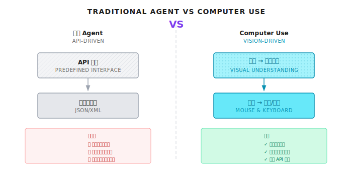
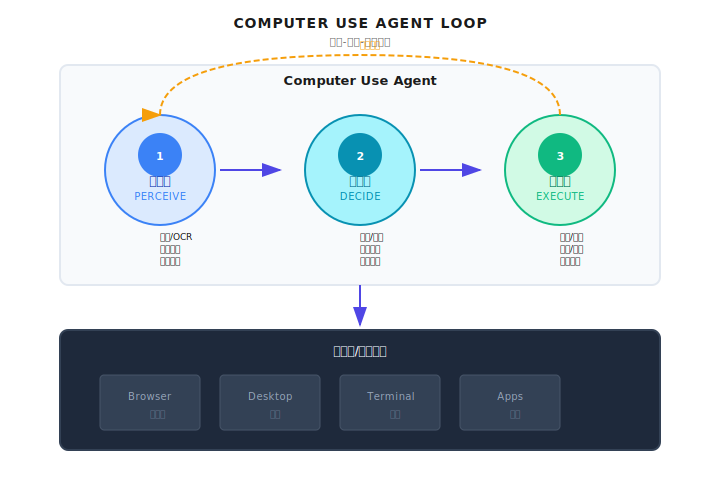

# 第 27 章：Computer Use

> **Computer Use 让 Agent 获得"眼睛"和"手"，像人一样看屏幕、点鼠标、敲键盘。这是突破 API 边界的终极武器——但也是最容易失控的能力，生产环境必须加沙箱和人工确认点。**

---

你的 Agent 需要帮用户填一个内部报销表单。

问题是——这个表单在一个十年前的老 OA 系统里，没有 API，只有网页界面。开发团队早就离职了，没人敢碰后端代码。

传统 Agent 遇到这种情况只能说："抱歉，我无法帮您操作这个系统。"

但 Computer Use 改变了游戏规则。它让 Agent 能像人一样：打开浏览器、看到界面、找到输入框、填入数据、点击提交。

我第一次见到这个能力时，有点震惊。Agent 真的在"看"屏幕——它能识别出登录按钮在哪、输入框在哪、下拉菜单怎么操作。这已经不是调 API 了，这是在"使用电脑"。

当然，这也是我见过最危险的 Agent 能力。你想想：一个能随意点击任何按钮的 Agent，如果判断错误，点了"删除所有数据"怎么办？所以这一章我们不仅讲怎么实现，更要讲怎么控制。

---

## 27.1 什么是 Computer Use

### 从 API 调用到界面操作

传统 Agent 通过预定义的 API 与外部系统交互：调用搜索接口、读取数据库、发送消息。每一个操作都有明确的输入输出格式，结果可预测。

但现实世界中，大量应用没有开放 API：

| 场景 | 例子 | 为什么没有 API |
|------|------|---------------|
| 企业老旧系统 | 10年前的 OA/ERP | 开发团队已离职，没人敢改 |
| 桌面软件 | Excel、Photoshop | 设计时就不是给程序调用的 |
| 第三方网站 | 竞品官网、政府网站 | 人家不想让你自动化 |
| 内部工具 | 公司自建的小工具 | 没预算做 API |

Computer Use 的本质是：**把界面操作这件事，从"人类专属"变成"Agent 也能做"**。

```
传统Agent                     Computer Use Agent
    |                              |
    v                              v
+----------+                 +--------------+
| API调用  |                 | 截屏->理解界面|
| 预定义接口|                 | 坐标->点击/输入|
| 结构化响应|                 | 反馈->验证结果|
+----------+                 +--------------+
```



### 核心能力分解

Computer Use 不是单一能力，而是四个能力的组合：

| 能力 | 描述 | 技术实现 | 典型失败场景 |
|------|------|----------|-------------|
| **视觉理解** | 解析屏幕截图，识别 UI 元素 | 多模态 LLM | 界面元素太小、颜色对比度低 |
| **坐标定位** | 确定点击/输入的精确位置 | 边界框检测 | 分辨率/缩放不一致 |
| **键鼠操作** | 模拟用户的输入行为 | 浏览器自动化 | 页面加载慢、元素位置变化 |
| **状态验证** | 确认操作结果是否正确 | 截屏对比 | 异步加载、动画效果 |

说白了，Computer Use 就是让 Agent 具备"眼手协调"能力。看到什么，决定做什么，做完再看结果。

### 和传统自动化的区别

你可能会问：这不就是 Selenium/Playwright 嘛？

不完全一样。传统自动化是"脚本驱动"——你写死了"点击 id=submit-button"。如果按钮 ID 变了，脚本就挂了。

Computer Use 是"视觉驱动"——Agent 看到屏幕上有个蓝色的"提交"按钮，它就去点。按钮换了位置、换了样式，只要还长得像"提交"按钮，它还能找到。

| 特性 | 传统自动化 (Selenium) | Computer Use |
|------|----------------------|--------------|
| 定位方式 | CSS/XPath 选择器 | 视觉识别 |
| 脚本依赖 | 必须提前编写 | Agent 自主决策 |
| 界面变化 | 脚本失效 | 自动适应 |
| 适用范围 | 只能操作 DOM | 任何可见界面 |
| 成本 | 低（本地计算） | 高（每帧视觉模型调用） |

当然，这种灵活性是有代价的：每一次"看屏幕"都是一次多模态模型调用，成本比 Selenium 高两个数量级。

---

## 27.2 架构设计

### 感知-决策-执行循环

Computer Use 的核心是一个持续的循环，和 ReAct 模式很像，只不过"观察"变成了"看屏幕"：

```
+-----------------------------------------------------------+
|                    Computer Use Agent                      |
+-----------------------------------------------------------+
|  +-----------+    +-----------+    +-----------+          |
|  |   感知层  |--->|   决策层  |--->|   执行层  |          |
|  |  Perceive |    |   Decide  |    |   Execute |          |
|  +-----------+    +-----------+    +-----------+          |
|        |               |               |                   |
|    截屏/OCR         规划/推理       点击/输入              |
|    元素识别        坐标计算        键盘/鼠标              |
|    状态理解        错误处理        结果验证              |
|        ▲               |               |                   |
|        |               |               |                   |
|        +---------------+---------------+                   |
|                   循环继续                                  |
+-----------------------------------------------------------+
                             |
                             v
+-----------------------------------------------------------+
|                    浏览器/桌面环境                          |
|  +--------+  +--------+  +--------+  +--------+           |
|  | Browser|  | Desktop|  |Terminal|  |  Apps  |           |
|  +--------+  +--------+  +--------+  +--------+           |
+-----------------------------------------------------------+
```



### 三层解耦

在生产系统中，我建议把 Computer Use 分成三层：

**Agent 层**：负责理解任务、做决策。这是"大脑"。

```
用户: "帮我在 OA 系统提交报销申请"
Agent:
1. 打开 OA 系统
2. 登录（可能需要用户确认）
3. 导航到"报销申请"
4. 填写表单
5. 提交并验证
```

**工具层**：提供基础的浏览器操作能力。这是"手脚"。

```python
# 工具定义
tools = [
    screenshot(),    # 截取当前屏幕
    click(x, y),     # 点击指定坐标
    type(text),      # 输入文本
    scroll(dir),     # 滚动页面
    wait(seconds),   # 等待
]
```

**沙箱层**：隔离执行环境，防止越权操作。这是"护栏"。

```
执行环境:
- 独立的浏览器实例
- 网络隔离（只能访问白名单域名）
- 文件系统隔离
- 超时和资源限制
```

### 在多 Agent 系统中的定位

Computer Use 通常作为一个专门的"浏览器 Agent"存在，由 Orchestrator 调度：

```
+-----------------------------------------------------------+
|              Orchestrator                                  |
|                                                           |
|  任务: "提交报销申请"                                       |
|      |                                                    |
|      v                                                    |
|  +----------------+  +----------------+  +----------------+|
|  | Research Agent |  | Browser Agent  |  | Summary Agent ||
|  | (搜索信息)      |  | (Computer Use) |  | (生成报告)    ||
|  +----------------+  +----------------+  +----------------+|
|                            |                               |
+----------------------------|-------------------------------+
                             | gRPC/HTTP
+--------------------------v---------------------------------+
|           Browser Automation Service                       |
|  (Playwright / CDP / Puppeteer)                           |
+-----------------------------------------------------------+
```


---

## 27.3 多模态模型集成

### 模型能力要求

Computer Use 需要多模态模型——既能理解图像，又能输出结构化指令。不是所有模型都能做这个。

在 Shannon 的模型配置中，我们标记了哪些模型支持视觉：

```yaml
# 摘自 config/models.yaml
model_capabilities:
  multimodal_models:
    - gpt-5.1
    - gpt-5-pro-2025-08-07
    - claude-sonnet-4-5-20250929
    - gemini-2.5-flash
    - gemini-2.0-flash
```

> 时效性提示 (2026-01): 多模态模型能力变化很快。上面的列表基于 2025 年底的情况，请查阅各厂商官方文档获取最新支持信息。

### 视觉理解工具设计

工具定义需要包含截屏、点击、输入等基本操作。以下是概念示例：

```python
# 概念示例：Computer Use 工具定义

class ScreenshotTool(Tool):
    """截取当前屏幕或浏览器窗口"""

    def _get_metadata(self) -> ToolMetadata:
        return ToolMetadata(
            name="screenshot",
            description="Capture current screen or browser window",
            category="computer_use",
            requires_auth=True,
            rate_limit=30,  # 每分钟最多30次截屏
            timeout_seconds=5,
            dangerous=False,
            cost_per_use=0.01,  # 视觉模型调用成本
        )


class ClickTool(Tool):
    """在指定坐标执行鼠标点击"""

    def _get_metadata(self) -> ToolMetadata:
        return ToolMetadata(
            name="click",
            description="Click at specified coordinates",
            category="computer_use",
            requires_auth=True,
            rate_limit=60,
            timeout_seconds=2,
            dangerous=True,  # 可能触发不可逆操作
            cost_per_use=0.0,
        )
```

注意 `dangerous=True` 标记——点击操作可能触发不可逆的副作用，需要额外的安全检查。

### 视觉理解的提示词设计

让多模态模型理解屏幕并输出操作指令，需要精心设计的提示词：

```python
# 概念示例：视觉理解提示词

COMPUTER_USE_PROMPT = """
你正在帮助用户完成一个界面操作任务。

当前任务: {task}
历史操作: {history}

请分析当前屏幕截图，决定下一步操作。

输出格式 (JSON):
{
    "observation": "对当前屏幕状态的描述",
    "reasoning": "为什么选择这个操作",
    "action": {
        "type": "click|type|scroll|wait|done",
        "x": 100,  // 如果是 click
        "y": 200,  // 如果是 click
        "text": "要输入的内容",  // 如果是 type
        "direction": "up|down",  // 如果是 scroll
    },
    "confidence": 0.9,  // 对这个操作的信心 (0-1)
    "needs_confirmation": false  // 是否需要用户确认
}

注意:
- 如果看到登录页面，设置 needs_confirmation=true
- 如果看到"删除"、"提交"、"付款"等关键按钮，设置 needs_confirmation=true
- 如果对操作位置不确定，设置 confidence 较低值
"""
```

---

## 27.4 浏览器自动化实现

### Playwright + Vision LLM 实战

这是一个完整的浏览器自动化循环。注意：这是概念示例，展示核心思路：

```python
# 概念示例：视觉驱动的浏览器自动化

from playwright.async_api import async_playwright
import base64

async def browser_agent(task: str, client, max_iterations: int = 20):
    """视觉驱动的浏览器自动化 Agent"""

    history = []

    async with async_playwright() as p:
        browser = await p.chromium.launch(headless=False)
        page = await browser.new_page()

        for iteration in range(max_iterations):
            # 1. 截图并转换为 base64
            screenshot_bytes = await page.screenshot()
            screenshot_b64 = base64.b64encode(screenshot_bytes).decode("utf-8")

            # 2. 发送给 Vision LLM
            response = await client.messages.create(
                model="claude-sonnet-4-5-20250929",  # 支持视觉的模型
                max_tokens=1024,
                messages=[
                    {
                        "role": "user",
                        "content": [
                            {
                                "type": "image",
                                "source": {
                                    "type": "base64",
                                    "media_type": "image/png",
                                    "data": screenshot_b64,
                                }
                            },
                            {
                                "type": "text",
                                "text": COMPUTER_USE_PROMPT.format(
                                    task=task,
                                    history=history[-5:]  # 只保留最近5步
                                )
                            }
                        ]
                    }
                ]
            )

            # 3. 解析并执行动作
            action = parse_action(response)
            history.append(action)

            # 4. 检查是否需要人工确认
            if action.needs_confirmation:
                confirmed = await request_human_confirmation(action)
                if not confirmed:
                    continue

            # 5. 执行动作
            if action.type == "done":
                break
            elif action.type == "click":
                await page.mouse.click(action.x, action.y)
            elif action.type == "type":
                await page.keyboard.type(action.text)
            elif action.type == "scroll":
                await page.mouse.wheel(0, 300 if action.direction == "down" else -300)
            elif action.type == "wait":
                await asyncio.sleep(action.seconds)

            # 6. 等待页面稳定
            await page.wait_for_load_state("networkidle")
            await asyncio.sleep(0.5)  # 额外等待动画

        await browser.close()
```

### 坐标校准：一个被忽视的大坑

不同设备的分辨率和 DPI 缩放不同。模型看到的是 1920x1080 的截图，但实际屏幕可能是 2880x1620（Retina 显示器）。

我见过太多项目在这里翻车：Agent 明明"看到"按钮在 (500, 300)，点下去却点到了旁边。

```python
# 概念示例：坐标校准

class CoordinateCalibrator:
    """处理不同分辨率和缩放比例"""

    def __init__(self, screen_width: int, screen_height: int, scale: float = 1.0):
        self.screen_width = screen_width
        self.screen_height = screen_height
        self.scale = scale  # DPI 缩放

    def normalize(self, x: int, y: int) -> tuple[float, float]:
        """归一化坐标 (0-1)"""
        return (x / self.screen_width, y / self.screen_height)

    def to_screen(self, norm_x: float, norm_y: float) -> tuple[int, int]:
        """归一化坐标转实际屏幕坐标"""
        x = int(norm_x * self.screen_width * self.scale)
        y = int(norm_y * self.screen_height * self.scale)
        return (x, y)
```

最佳实践：**总是使用归一化坐标 (0-1) 在 Agent 和执行层之间传递位置信息**。实际的像素坐标只在执行层计算。

---

## 27.5 安全与风险控制

这是整章最重要的部分。Computer Use 赋予 Agent 巨大的能力，也带来巨大的风险。

### 风险矩阵

| 风险类型 | 描述 | 后果 | 缓解措施 |
|----------|------|------|----------|
| **误操作** | 点击错误按钮 | 删除数据、发送错误邮件 | 关键操作人工确认 |
| **信息泄露** | 截图包含敏感信息 | 密码、个人信息被记录 | 敏感区域遮盖 |
| **注入攻击** | 恶意网页诱导 Agent | 执行危险操作 | 沙箱隔离、白名单 |
| **失控循环** | Agent 陷入无限重试 | 资源耗尽、成本失控 | 最大迭代限制 |
| **越权访问** | 访问未授权的系统 | 安全审计问题 | 域名白名单 |

### 关键操作需要人工确认

在 Shannon 的设计理念里，有些操作 Agent 不应该自动执行：

```python
# 概念示例：需要人工确认的操作

DANGEROUS_PATTERNS = [
    "delete", "删除", "remove",
    "submit", "提交", "confirm",
    "pay", "付款", "purchase",
    "send", "发送", "email",
    "logout", "登出", "sign out",
]

def needs_confirmation(action: dict, page_text: str) -> bool:
    """判断操作是否需要人工确认"""

    # 1. 模型自己说需要确认
    if action.get("needs_confirmation"):
        return True

    # 2. 点击操作在危险区域
    if action["type"] == "click":
        # 检查点击目标周围的文本
        target_text = extract_text_around(action["x"], action["y"])
        for pattern in DANGEROUS_PATTERNS:
            if pattern in target_text.lower():
                return True

    # 3. 输入敏感信息
    if action["type"] == "type":
        if looks_like_password(action["text"]):
            return True

    return False
```

### OPA 策略保护

可以用 OPA 策略限制 Computer Use 的行为。这是 Shannon 风格的安全边界：

```rego
# computer_use.rego

package computer_use

# 禁止的危险区域 (屏幕坐标百分比)
dangerous_zones := [
    {"name": "system_tray", "x_min": 0.9, "y_min": 0.0, "y_max": 0.05},
    {"name": "start_menu", "x_min": 0.0, "x_max": 0.05, "y_min": 0.95},
]

# 禁止的文本输入模式
dangerous_inputs := [
    "sudo", "rm -rf", "format", "DELETE FROM", "DROP TABLE",
]

# 点击坐标检查
deny[msg] {
    input.action == "click"
    zone := dangerous_zones[_]
    in_zone(input.x, input.y, zone)
    msg := sprintf("Click blocked: in dangerous zone '%s'", [zone.name])
}

# 输入内容检查
deny[msg] {
    input.action == "type_text"
    pattern := dangerous_inputs[_]
    contains(lower(input.text), pattern)
    msg := sprintf("Input blocked: dangerous pattern '%s'", [pattern])
}

# 域名白名单
allow[msg] {
    input.action == "navigate"
    input.url == allowed_domains[_]
    msg := "Navigation allowed"
}
```

---

## 27.6 错误恢复与验证

Computer Use 操作可能失败——页面没加载、元素不见了、点错地方了。健壮的系统需要验证循环。

### 视觉验证循环

```python
# 概念示例：带验证的操作执行

class ComputerUseAgent:
    """带验证的 Computer Use Agent"""

    async def execute_with_verification(
        self,
        action: dict,
        expected_result: str,
        max_retries: int = 3,
    ) -> bool:
        """执行操作并验证结果"""

        for attempt in range(max_retries):
            # 1. 截屏获取当前状态
            before_screenshot = await self.take_screenshot()

            # 2. 执行操作
            await self.execute_action(action)

            # 3. 等待页面响应
            await asyncio.sleep(1.0)
            await self.page.wait_for_load_state("networkidle")

            # 4. 截屏验证结果
            after_screenshot = await self.take_screenshot()

            # 5. 使用视觉模型验证
            verification = await self.verify_action(
                before=before_screenshot,
                after=after_screenshot,
                expected=expected_result,
            )

            if verification["success"]:
                return True

            # 6. 失败则分析原因并尝试恢复
            if attempt < max_retries - 1:
                recovery_action = await self.plan_recovery(
                    verification["error"],
                    before_screenshot,
                    after_screenshot,
                )
                if recovery_action:
                    await self.execute_action(recovery_action)

        return False
```

### 常见失败模式和恢复策略

| 失败模式 | 检测方法 | 恢复策略 |
|----------|----------|----------|
| 元素未加载 | 截图对比无变化 | 等待更长时间 |
| 点击位置偏移 | 预期元素未响应 | 重新定位元素 |
| 弹窗遮挡 | 识别到弹窗 | 先关闭弹窗 |
| 页面跳转 | URL 变化 | 导航回正确页面 |
| 超时 | 操作未完成 | 减少并发、重试 |

---

## 27.7 成本控制

Computer Use 的成本主要来自视觉模型调用。每一帧截图都是一次 API 调用。

### 成本估算

假设一个简单的表单填写任务，需要 15 步操作，每步都需要截屏分析：

```
每次截屏分析:
- 输入: ~2000 tokens (图片编码)
- 输出: ~200 tokens (决策)
- 成本: ~$0.01 (使用 claude-sonnet)

15 步操作:
- 截屏分析: 15 * $0.01 = $0.15
- 验证截屏: 15 * $0.01 = $0.15 (如果每步都验证)
- 总计: ~$0.30 per task

对比传统自动化:
- Selenium: 几乎免费 (本地计算)
```

### 优化策略

1. **减少截屏频率**：不是每个动作都需要截屏。输入连续文本时，可以一次输入完再截屏验证。

2. **使用更便宜的模型**：简单的元素定位可以用小模型，复杂的决策才用大模型。

3. **缓存界面状态**：如果界面没变化，不需要重新分析。

4. **批量操作**：把多个简单操作合并成一次决策。

---

## 27.8 实现方案对比

市面上有几种 Computer Use 实现方式：

| 特性 | Vision LLM + Playwright | 专用 Computer Use API | 传统 DOM 自动化 |
|------|------------------------|---------------------|----------------|
| 视觉理解 | 通用多模态模型 | 专门优化 | 无（依赖选择器） |
| 自主性 | 高（Agent 决策） | 高 | 低（脚本驱动） |
| 元素定位 | 视觉坐标 | 视觉坐标 | CSS/XPath |
| 复杂页面 | 任意可见界面 | 任意可见界面 | 需要 DOM 访问 |
| 成本 | 高 | 中 | 低 |
| 维护性 | 无需更新脚本 | 无需更新脚本 | 界面变化需更新 |

### 混合方案

实际生产中，我建议混合使用：

- **已知稳定的界面**：用传统 DOM 自动化，快速可靠
- **未知或变化的界面**：用 Computer Use，灵活适应
- **关键操作**：无论哪种方式，都要人工确认

---

## 27.9 常见的坑

### 坑 1：坐标偏移

不同分辨率/缩放下坐标失效。

```python
# 错误：硬编码坐标
await click(890, 62)  # 在其他屏幕上可能偏移

# 正确：使用归一化坐标
normalized = {"x": 0.9, "y": 0.05}
x, y = calibrator.to_screen(normalized["x"], normalized["y"])
await click(x, y)
```

### 坑 2：页面加载时机

操作时页面尚未加载完成。

```python
# 错误：点击后立即截图
await click(x, y)
screenshot = await page.screenshot()  # 可能还是旧界面

# 正确：等待页面稳定
await click(x, y)
await asyncio.sleep(0.5)  # 等待动画
await page.wait_for_load_state("networkidle")
screenshot = await page.screenshot()
```

### 坑 3：无限重试

错误状态下无限重试消耗大量资源。

```python
# 错误：无退出条件
while not success:
    success = await execute_action()

# 正确：限制重试次数
for attempt in range(3):
    success = await execute_action()
    if success:
        break
    if attempt == 2:
        raise ComputerUseError("Max retries exceeded")
```

### 坑 4：敏感信息泄露

截图被发送到 LLM API，可能包含密码等敏感信息。

```python
# 解决方案：敏感区域遮盖
async def safe_screenshot():
    screenshot = await page.screenshot()

    # 检测并遮盖密码输入框
    password_fields = await page.query_selector_all('input[type="password"]')
    for field in password_fields:
        box = await field.bounding_box()
        if box:
            screenshot = cover_area(screenshot, box)

    return screenshot
```

---

## 27.10 回顾

1. **Computer Use 定义**：让 Agent 具备视觉理解和界面操作能力，突破 API 边界
2. **核心循环**：感知（截屏）-> 决策（LLM）-> 执行（点击/输入）-> 验证
3. **坐标校准**：使用归一化坐标，处理分辨率和 DPI 差异
4. **安全防护**：危险操作人工确认、OPA 策略限制、域名白名单
5. **成本意识**：每帧视觉调用都有成本，合理控制截屏频率

---

## Shannon Lab（10 分钟上手）

本节帮你在 10 分钟内把本章概念对应到 Shannon 源码。Shannon 目前没有完整的 Computer Use 模块，但相关的工具设计模式可以参考。

### 必读（1 个文件）

- `config/models.yaml` 中的 `model_capabilities.multimodal_models`：了解哪些模型支持视觉理解

### 选读深挖（2 个，按兴趣挑）

- `python/llm-service/llm_service/tools/builtin/file_ops.py`：参考 `dangerous=True` 和 `requires_auth=True` 的安全标记设计
- `docs/pattern-usage-guide.md`：了解如何在 Shannon 中配置新的工具类型

---

## 练习

### 练习 1：设计安全边界

设计一个 Computer Use 的 OPA 策略，要求：
- 禁止点击屏幕右上角 5% 区域（通常是关闭/设置按钮）
- 禁止输入包含 "password" 或 "secret" 的文本
- 只允许访问指定的 3 个域名

### 练习 2：故障恢复

设计一个操作失败的检测和恢复流程：
1. 如何判断"点击没生效"？
2. 如何区分"页面还在加载"和"操作失败"？
3. 设计 3 种不同失败场景的恢复策略

### 练习 3（进阶）：成本优化

假设你要用 Computer Use 自动化一个 10 步的表单填写任务，当前每次执行成本 $0.50。设计优化方案，目标是将成本降到 $0.20 以下，同时保持可靠性。

---

## 进一步阅读

- **Playwright 官方文档** - https://playwright.dev/
- **Chrome DevTools Protocol** - https://chromedevtools.github.io/devtools-protocol/
- **Anthropic Computer Use** - https://docs.anthropic.com/en/docs/computer-use

---

## 下一章预告

Computer Use 让 Agent 能操作界面，但写代码是另一个更复杂的场景。

下一章讲 **Agentic Coding**——让 Agent 理解代码库、编写代码、运行测试、修复 bug。这不是代码补全，而是自主编程。

代码是有结构的：函数调用函数、模块依赖模块。Agent 不仅要会写代码，还要理解代码库的整体架构。

而且，生成的代码必须在沙箱中执行——你不会想让 Agent 在你的生产服务器上 `rm -rf /` 的。

下一章我们继续。
